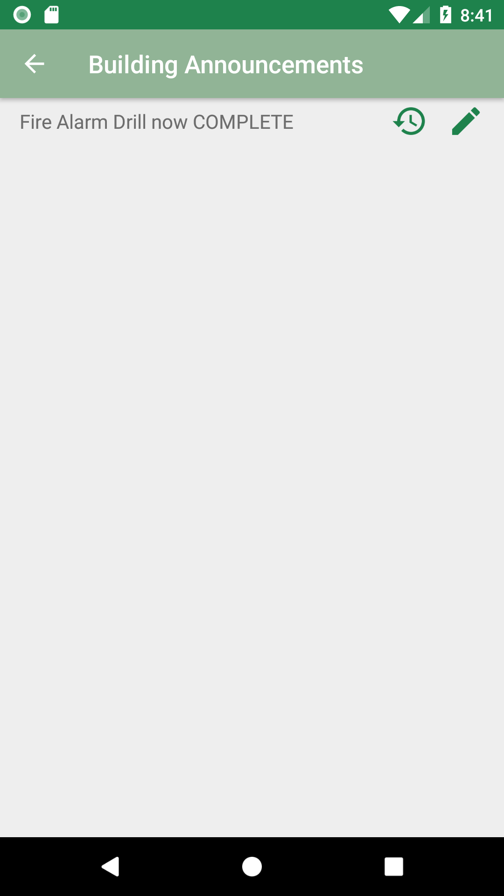
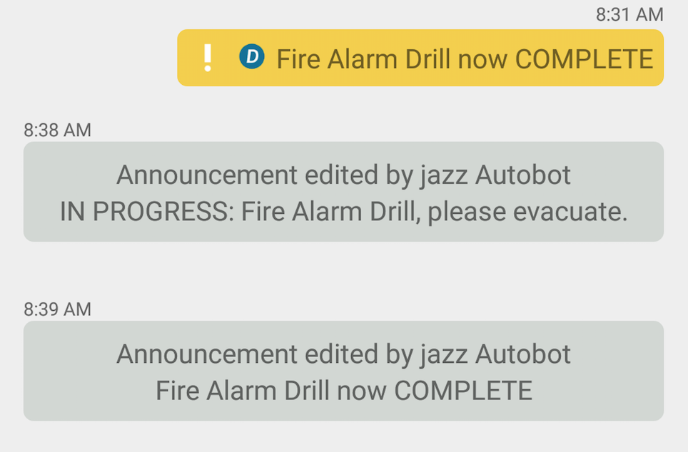

# Announcements for Android

The Announcements app demonstrates how a user can post **announcements** as custom messages in a chat.
We also demonstrate how the [Chat Message References](https://developer.blackberry.com/files/bbm-enterprise/documents/guide/html/references.html)
feature of the BlackBerry Spark Communications Platform can be used to edit an announcement and view the edit history.
This example builds on the [SimpleChat](../SimpleChat/README.md) and utilizes the [Spark Support Library for Android](https://developer.blackberry.com/files/bbm-enterprise/documents/guide/html/examples/android/Support/README.html) library to quickly create a basic chat application.
This example also uses the Android [RecyclerView](https://developer.android.com/guide/topics/ui/layout/recyclerview.html).

### Features

- Post announcements as custom messages in a chat
- View all announcements posted in a chat
- Edit an announcement
- View the edit history of an announcement

<br>

<p align="center">
<a href="screenShots/chatActivity.png"></a>
<a href="screenShots/announcementList.png"></a> 
<a href="screenShots/announcementHistory.png"></a>
</p>


## Getting Started

This example requires the Spark SDK, which you can find along with related resources at the location below.

* Getting started with the [Spark SDK](https://developers.blackberry.com/us/en/products/blackberry-bbm-enterprise-sdk.html)
* [Development Guide](https://developer.blackberry.com/files/bbm-enterprise/documents/guide/html/index.html)
* [API Reference](https://developer.blackberry.com/files/bbm-enterprise/documents/guide/reference/android/index.html)

Visit the [Getting Started with Android](https://developer.blackberry.com/files/bbm-enterprise/documents/guide/html/gettingStarted-android.html) section to see the minimum requirements.
<br>
<p align="center">
    <a href="http://www.youtube.com/watch?feature=player_embedded&v=310UDOFCLWM"
      target="_blank"></a>
</p>
<p align="center">
 <b>Getting started video</b>
</p>

This example can be configured to use Google Sign-In or Azure Active Directory for authenticating your user with the Spark SDK.

* Configure this sample for [Google Sign-In](https://developer.blackberry.com/files/bbm-enterprise/documents/guide/html/googleSignInForAndroidExamples.html)
* Configure this sample for [Azure AD](https://developer.blackberry.com/files/bbm-enterprise/documents/guide/html/azureForAndroidExamples.html)

This application has been built using Gradle 4.2.1 (newer versions have not been validated).

## Walkthrough

- [Starting a chat](#startingAChat)
- [Setup of Chat Activity](#setupChatActivity)
- [Adding a user to a chat](#addAUser)
- [Create an Announcement message](#createAnnouncementMessage)
- [Editing an Announcement message](#editAnnouncementMessage)
- [View all the sent Announcement](#viewSentAnnouncements)
- [View history of the Announcement](#viewAnnouncementHistory)
- [Marking messages as read](#markMessageRead)
- [End Chat](#endChat)


### <a name="startingAChat"></a>Starting a chat

The Spark SDK Support library for Android provides a helper to start a new chat. The same principles apply as in [SimpleChat](../SimpleChat/README.md), a Spark Registration ID is needed to start a chat. Instead of creating an [ProtocolMessageConsumer](https://developer.blackberry.com/files/bbm-enterprise/documents/guide/reference/android/com/bbm/sdk/service/ProtocolMessageConsumer.html) and implementing the code to find and verify a messsage, that code has been rolled into the ChatStartHelper class. In the code below. you just need to send in a list of Spark Registration IDs, subject and a callback.

```java
    ChatStartHelper.startNewChat(new long[]{regId}, subject, new ChatStartHelper.ChatStartedCallback() {
        @Override
        public void onChatStarted(@NonNull String chatId) {
            //Start our chat activity
            Intent intent = new Intent(MainActivity.this, ChatActivity.class);
            intent.putExtra(ChatActivity.INTENT_EXTRA_CHAT_ID, chatId);
            startActivity(intent);
        }

        @Override
        public void onChatStartFailed(ChatStartFailed.Reason reason) {
            Logger.i("Failed to create chat with " + regId);
            Toast.makeText(MainActivity.this, "Failed to create chat for reason " + reason.toString(), Toast.LENGTH_LONG).show();
        }
    });
```


### <a name="setupChatActivity"></a>Setup of Chat Activity

The Support library provided with the Spark SDK for Android also offers some additional helpers to quickly create chat activity, see **chatActivity.java**. It also provides an extensible **ChatMessageRecyclerViewAdapter** to create message bubbles. The **ChatMessageRecyclerViewAdapter** ties a **ChatBubbleColorProvider** and **ChatMessageViewProvider** together to automatically create the chat message bubbles for you. Start by creating a ChatMessageRecyclerViewAdapter and setting it in the [Recycler View](https://developer.android.com/guide/topics/ui/layout/recyclerview.html).

```java
    // Initialize the recycler view
    final RecyclerView recyclerView = findViewById(R.id.messages_list);
    mAdapter = new ChatMessageRecyclerViewAdapter(this,
            recyclerView,
            mChatId,
            new MessageViewProvider(),          // our extend ChatMessageRecyclerViewAdapter
            new MessageColorProvider());        // our extend ChatBubbleColorProvider

    // Set the adapter to auto-scroll on new items
    mAdapter.setAutoScrollOnNewItem(true);

    LinearLayoutManager linearLayoutManager = new LinearLayoutManager(ChatActivity.this);
    linearLayoutManager.setOrientation(LinearLayoutManager.VERTICAL);

    recyclerView.setLayoutManager(linearLayoutManager);
    recyclerView.setAdapter(mAdapter);
```

The MessageViewProvider creates the different view types we want to have in the chat activity. You can define the message types you want to render with a simple integer definition. For example, we define an outgoing, incoming, chat event, and other bubble types (to be added later in this example)

```java
    public final class MessageViewProvider implements ChatMessageViewProvider {

        static final int ITEM_VIEW_TYPE_TEXT_OUTGOING = 0;
        static final int ITEM_VIEW_TYPE_TEXT_INCOMING = 1;
        static final int ITEM_VIEW_TYPE_CHAT_EVENT = 2;
        static final int ITEM_VIEW_TYPE_OTHER = 99;
    ...
```

The values are used to determine what view type will be used for each [ChatMessage](https://developer.blackberry.com/files/bbm-enterprise/documents/guide/reference/android/com/bbm/sdk/bbmds/ChatMessage.html). The view type is decided in the method *getItemTypeForMessage()*.

```java
    @Override
    public int getItemTypeForMessage(ChatMessage item) {

        if (item.exists != Existence.YES) {
            return ITEM_VIEW_TYPE_OTHER;
        }

        // Next look at the item.tag, handle the SDK supported tags and
        // look for the custom Announcement tag.
        switch (item.tag) {
            case ChatMessage.Tag.Join:
            case ChatMessage.Tag.Leave:
            case ChatMessage.Tag.Subject:
                return ITEM_VIEW_TYPE_CHAT_EVENT;
            case ChatMessage.Tag.Text:
                boolean isIncoming = item.hasFlag(ChatMessage.Flags.Incoming);
                return isIncoming ? ITEM_VIEW_TYPE_TEXT_INCOMING : ITEM_VIEW_TYPE_TEXT_OUTGOING;
        }

        return ITEM_VIEW_TYPE_OTHER;
    }
```

Once the view type is determined, the specific view holder can be created. The custom bubble layouts included in this example are:

- EventHolder
- IncomingTextHolder
- OutgoingTextHolder
- UnknownMessage

These holders have their own xml layouts, colors and strings that will be used in the app. When the [RecyclerView](https://developer.android.com/guide/topics/ui/layout/recyclerview.html) is ready to render the view, the appropriate holder will be created based on the view type.

```java
    @Override
    public RecyclerViewHolder<DecoratedMessage> onCreateRecyclerViewHolder(ViewGroup viewGroup, int viewType) {
        switch (viewType) {
            case ITEM_VIEW_TYPE_TEXT_OUTGOING:
                return new OutgoingTextHolder(getLayoutInflater(), viewGroup);
            case ITEM_VIEW_TYPE_TEXT_INCOMING:
                return new IncomingTextHolder(getLayoutInflater(), viewGroup);
            case ITEM_VIEW_TYPE_CHAT_EVENT:
                return new EventHolder(getLayoutInflater(), viewGroup);
            case ITEM_VIEW_TYPE_OTHER:
            default:
                return new UnknownMessage(getLayoutInflater(), viewGroup);
        }
    }
```

Our next piece is the **MessageColorProvider**. This implements the **ChatBubbleColorProvider** which provides the basic chat bubble shape and color to be used for each chat message. The important items for this example are the R.drawable and the first R.color item, these are tied together in the drawable xml. For this example we defined:

```java
    public final class MessageColorProvider implements ChatBubbleColorProvider {

        private final ChatBubbleColors mIncoming;
        private final ChatBubbleColors mOutgoing;

        MessageColorProvider() {
            mIncoming = new ChatBubbleColors(ChatActivity.this,
                    R.drawable.incoming_message_background,
                    R.color.chat_bubble_incoming,
                    R.color.chat_bubble_text_incoming,
                    R.color.chat_bubble_text_incoming,
                    R.color.chat_bubble_highlight_outgoing,
                    R.color.chat_bubble_status_outgoing,
                    R.color.chat_bubble_error_outgoing,
                    R.color.chat_bubble_alert_text_outgoing);

            mOutgoing = new ChatBubbleColors(ChatActivity.this,
                    R.drawable.outgoing_message_background,
                    R.color.chat_bubble_outgoing,
                    R.color.chat_bubble_text_incoming,
                    R.color.chat_bubble_text_incoming,
                    R.color.chat_bubble_highlight_outgoing,
                    R.color.chat_bubble_status_outgoing,
                    R.color.chat_bubble_error_outgoing,
                    R.color.chat_bubble_alert_text_outgoing);
        }
        ...
```


### <a name="addAUser"></a>Adding a user to a chat

The Spark SDK supports chats with up to 250 participants. We created this chat with only one other user, so we need a mechanism to add more users to the existing chat.

Next we need to handle the menu action
```java
    @Override
    public boolean onOptionsItemSelected(MenuItem item) {
        if (item == null) {
            return false;
        }

        switch (item.getItemId()) {

            ...

            case R.id.addUserMenu:
                showAddUserDialog();
                return true;
        }

        return super.onOptionsItemSelected(item);
    }
```

When the user selects "Add User" our method **showAddUserDialog()** is called. The method will show an AlertDialog that will allow a user to enter in a Spark Registration ID. On the positive button action the following is sent to trigger the Spark SDK to add the provided user:

```java
    final Long regId = Long.valueOf(regIdText.getText().toString());

    final ChatInvite.Invitees invite = new ChatInvite.Invitees();
    invite.regId(regId);

    final ChatInvite message = new ChatInvite(mChatId, Collections.singletonList(invite));
    BBMEnterprise.getInstance().getBbmdsProtocol().send(message);
```


### <a name="createAnnouncementMessage"></a>Create an Announcement Message

The first step in creating a custom text message is to define the tag that represents this [ChatMessage](https://developer.blackberry.com/files/bbm-enterprise/documents/guide/reference/android/com/bbm/sdk/bbmds/ChatMessage.html).

```java
    // The custom tag used to identify an announcement message
    public final static String TAG_ANNOUNCEMENTS = "announcement";
```

In **chatActivity.java** we have defined a button dedicated for creating an Announcement message. To send the Announcement message we create a new [ChatMessageSend](https://developer.blackberry.com/files/bbm-enterprise/documents/guide/reference/android/com/bbm/sdk/bbmds/outbound/ChatMessageSend.html) providing the chat identifier and our defined message tag TAG_ANNOUNCEMENTS and the text content of the message.

```java
    final AlertDialog.Builder builder = new AlertDialog.Builder(ChatActivity.this, R.style.AppTheme_dialog)
            .setMessage(R.string.announcement_confirm)
            .setCancelable(false)
            .setPositiveButton(android.R.string.yes, new DialogInterface.OnClickListener() {
                @Override
                public void onClick(DialogInterface dialog, int which) {
    
                    final ChatMessageSend message = new ChatMessageSend(mChatId, TAG_ANNOUNCEMENTS)
                            .content(text);
                    BBMEnterprise.getInstance().getBbmdsProtocol().send(message);
    
                    inputText.setText("");
                }
            })
            .setNegativeButton(android.R.string.no, null);
```

Now that an Announcement has been created, we need to display the message and have it standout from regular chat messages. This involves updating the **MessageViewProvider** to add a new view type and then *getItemTypeForMessage* to return a new holder. To do this, we add in the *ITEM_VIEW_TYPE_ANNOUNCEMENT* type and a new holder *AnnouncementHolder*

```java
    public final class MessageViewProvider implements ChatMessageViewProvider {

        static final int ITEM_VIEW_TYPE_TEXT_OUTGOING = 0;
        static final int ITEM_VIEW_TYPE_TEXT_INCOMING = 1;
        static final int ITEM_VIEW_TYPE_CHAT_EVENT = 2;
        static final int ITEM_VIEW_TYPE_ANNOUNCEMENT = 3;
        static final int ITEM_VIEW_TYPE_OTHER = 99;

        @Override
        public RecyclerViewHolder<DecoratedMessage> onCreateRecyclerViewHolder(ViewGroup viewGroup, int viewType) {
            switch (viewType) {
                ...

                case ITEM_VIEW_TYPE_ANNOUNCEMENT:
                    return new AnnouncementHolder(getLayoutInflater(), viewGroup);
                ...
            }
        }

        @Override
        public int getItemTypeForMessage(ChatMessage item) {

            ...

            // Next look at the item.tag, handle the SDK supported tags and
            // look for the custom Announcement tag.
            switch (item.tag) {

                ...

                case TAG_ANNOUNCEMENTS:
                    return ITEM_VIEW_TYPE_ANNOUNCEMENT;
            }

            return ITEM_VIEW_TYPE_OTHER;
        }
```

We also define a new color in **MessageColorProvider** to be used for our announcement chat bubble.

```java
        MessageColorProvider() {
            mIncoming = new ChatBubbleColors(ChatActivity.this,
                    R.drawable.incoming_message_background,
                    R.color.chat_bubble_incoming,
                    R.color.chat_bubble_text_incoming,
                    R.color.chat_bubble_text_incoming,
                    R.color.chat_bubble_highlight_outgoing,
                    R.color.chat_bubble_status_outgoing,
                    R.color.chat_bubble_error_outgoing,
                    R.color.chat_bubble_alert_text_outgoing);

            mOutgoing = new ChatBubbleColors(ChatActivity.this,
                    R.drawable.outgoing_message_background,
                    R.color.chat_bubble_outgoing,
                    R.color.chat_bubble_text_incoming,
                    R.color.chat_bubble_text_incoming,
                    R.color.chat_bubble_highlight_outgoing,
                    R.color.chat_bubble_status_outgoing,
                    R.color.chat_bubble_error_outgoing,
                    R.color.chat_bubble_alert_text_outgoing);

            mAnnouncement = new ChatBubbleColors(ChatActivity.this,
                    R.drawable.announcement_message_background,
                    R.color.announcement_background,
                    R.color.chat_bubble_text_incoming,
                    R.color.chat_bubble_text_incoming,
                    R.color.chat_bubble_highlight_outgoing,
                    R.color.chat_bubble_status_outgoing,
                    R.color.chat_bubble_error_outgoing,
                    R.color.chat_bubble_alert_text_outgoing);
        }
```

Finally we define our announcement bubble, **AnnouncementHolder.java** as

```java
public final class AnnouncementHolder extends BaseBubbleHolder implements RecyclerViewHolder<DecoratedMessage> {

    private TextView mMessageBody;
    private View mContextView;

    public AnnouncementHolder(LayoutInflater layoutInflater, ViewGroup parent) {
        super(layoutInflater, parent, com.bbm.sdk.support.R.layout.chat_bubble_base_outgoing_holder);
    }

    @Override
    public View createView(LayoutInflater inflater, ViewGroup parent) {
        mContextView = super.setContentSpecificView(inflater, R.layout.chat_bubble_announcement);
        mMessageBody = mContextView.findViewById(R.id.message_body);
        return super.getRootView();
    }

    @Override
    public void updateView(DecoratedMessage decoratedMessage, int position) {
        super.updateGeneric(decoratedMessage);

        ChatMessage message = decoratedMessage.getChatMessage();
        if (message != null) {
            mMessageBody.setText(Helper.getMessageContent(message));
        }
    }

    @Override
    public void onRecycled() {
        mMessageBody.setText(null);
        mContextView = null;
    }
}
```

After this is done, all announcement chat bubbles will have their own look compared to other regular text chat messages.
<br>
<p align="center">
<a href="screenShots/announcementBubble.png"></a>
</p>

Of note here, the **AnnouncementHolder** is setup to show the most recent edited announcement, this is achieved by using the **Helper.getMessageContent()** this is be covered in more detail [Editing an Announcement message](#editAnnouncementMessage)

### <a name="editAnnouncementMessage"></a>Editing an Announcement message

Now, lets add the ability to edit the announcement. To do so, add in the support to long-click the announcement chat bubble to bring up a popup-menu in our chat activity. We first need to update our **AnnouncementHolder** to implement the Spark SDK Support library ContextMenuAwareHolder interface and the required method. The result is a **RecyclerContextMenuInfoWrapperView** is created internally in the Spark SDK Support library which will be used to link the **AnnouncementHolder** to Androids menu framework.

```java
    public final class AnnouncementHolder extends BaseBubbleHolder implements RecyclerViewHolder<DecoratedMessage>, ContextMenuAwareHolder {

        ...

        @Override
        public List<View> getContextMenuAwareView() {
            return Collections.singletonList(mContextView);
        }
    }
```

Next update the chat activity to implement the Android [Activity](https://developer.android.com/reference/android/app/Activity.html) method *onCreateContextMenu*. The chat activity will need to keep track of which user selected announcement message has been long-pressed in mAnnouncementMessageToEdit. To determine that the code must verify the provided menuInfo is an instance of our **RecyclerContextMenuInfoWrapperView** inner class of **RecyclerContextMenuInfo**. The inner class contains useful information to find a chat message from the ChatMessageRecyclerViewAdapter. From there we simply look for our announcement message tag to set the the mAnnouncementMessageToEdit.

```java
    @Override
    public void onCreateContextMenu(ContextMenu menu, View v, ContextMenu.ContextMenuInfo menuInfo) {
        super.onCreateContextMenu(menu, v, menuInfo);

        if (menuInfo instanceof RecyclerContextMenuInfoWrapperView.RecyclerContextMenuInfo) {
            RecyclerContextMenuInfoWrapperView.RecyclerContextMenuInfo info =
                    (RecyclerContextMenuInfoWrapperView.RecyclerContextMenuInfo) menuInfo;

            int position = info.position;

            DecoratedMessage decoratedMessage = mAdapter.getItem(position);
            ChatMessage chatMessage = decoratedMessage.getChatMessage();
            if (chatMessage.tag.equals(TAG_ANNOUNCEMENTS)) {
                menu.add(Menu.NONE, MENU_ANNOUNCEMENT_ID, Menu.NONE, R.string.edit_announcement);
                mAnnouncementMessageToEdit = decoratedMessage;
            } else {
                mAnnouncementMessageToEdit = null;
            }
        }
    }

    (where R.string.edit_announcement displays "Edit Announcement")
```

When a user does click on the popup menu item,  *mAnnouncementMessageToEdit* will have the selected chat message when *onContextItemSelected* is invoked.

```java
    @Override
    public boolean onContextItemSelected(MenuItem item) {
        if (item.getItemId() == MENU_ANNOUNCEMENT_ID && mAnnouncementMessageToEdit != null) {
            Helper.showEditAnnouncementDialog(ChatActivity.this, mAnnouncementMessageToEdit.getChatMessage());
            return true;
        }

        return super.onContextItemSelected(item);
    }
```

At this point the **Helper.showEditAnnouncementDialog** will show a dialog that allows a user to edit the announcement message. [ChatMessageSend](https://developer.blackberry.com/files/bbm-enterprise/documents/guide/reference/android/com/bbm/sdk/bbmds/outbound/ChatMessageSend.html) is used to first construct a the message, setting the chat ID and [ChatMessageSend.Tag](https://developer.blackberry.com/files/bbm-enterprise/documents/guide/reference/android/com/bbm/sdk/bbmds/outbound/ChatMessageSend.Tag.html) value of *Text*. If we send the message, it would be considered a regular text message, we need to link this new message as an edit to the announcement. 

To do so, we need to use the [ChatMessageSend.Ref](https://developer.blackberry.com/files/bbm-enterprise/documents/guide/reference/android/com/bbm/sdk/bbmds/outbound/ChatMessageSend.Ref.html) to set the original announcement chat message identifier and the type of reference using [ChatMessageSend.Ref.Tag](https://developer.blackberry.com/files/bbm-enterprise/documents/guide/reference/android/com/bbm/sdk/bbmds/outbound/ChatMessageSend.Ref.Tag.html). It is important to note a single message can only have one reference for each [ChatMessageSend.Ref.Tag](https://developer.blackberry.com/files/bbm-enterprise/documents/guide/reference/android/com/bbm/sdk/bbmds/outbound/ChatMessageSend.Ref.Tag.html), this is done to allow multiple different kinds of references between messages. For example, a message could both 'Quote' one message and 'Edit' another. Once the [ChatMessageSend.Ref](https://developer.blackberry.com/files/bbm-enterprise/documents/guide/reference/android/com/bbm/sdk/bbmds/outbound/ChatMessageSend.Ref.html) is set we can send the message as normally.

```java
    ...

    // 1. Create the new message to be sent
    final ChatMessageSend editedMessage = new ChatMessageSend(announcementMessage.chatId, ChatMessageSend.Tag.Text)
        .content(editText.getText().toString().trim());

    // 2. Set the reference of the editedMessage to the announcement message identifier and set the reference tag to "edit"
    editedMessage.ref(Collections.singletonList(new ChatMessageSend.Ref(announcementMessage.messageId, ChatMessageSend.Ref.Tag.Edit)));

    // 3. Send the message
    BBMEnterprise.getInstance().getBbmdsProtocol().send(editedMessage);
```

Backing up for a moment, when a user decides to edit the announcement we want to display the most recent announcement edit. To find the most recent message we need to traverse the [ChatMessage.RefBy](https://developer.blackberry.com/files/bbm-enterprise/documents/guide/reference/android/com/bbm/sdk/bbmds/ChatMessage.RefBy.html) array looking for a [ChatMessage.RefBy.Tag](https://developer.blackberry.com/files/bbm-enterprise/documents/guide/reference/android/com/bbm/sdk/bbmds/ChatMessage.RefBy.Tag.html) of type *Edit*.  The [ChatMessage.RefBy](https://developer.blackberry.com/files/bbm-enterprise/documents/guide/reference/android/com/bbm/sdk/bbmds/ChatMessage.RefBy.html) will also contain the message identifier to the newest message. With that data we can lookup the referenced chat message and obtain the message content to display. This is all wrapped up in the **Helper.getMessageContent()** method.


```java
    public static String getMessageContent(ChatMessage message) {

        for (ChatMessage.RefBy ref : message.refBy) {
            if (ref.tag == ChatMessage.RefBy.Tag.Edit && ref.newestRef != 0) {
                //We only care about the most recent edit reference to this message
                ChatMessage.ChatMessageKey key = new ChatMessage.ChatMessageKey(message.chatId, ref.newestRef);

                ChatMessage refedByMessage = BBMEnterprise.getInstance().getBbmdsProtocol().getChatMessage(key).get();
                if (refedByMessage.exists == Existence.YES) {
                    return refedByMessage.content;
                }
            }
        }
        return message.content;
    }
```

Putting it together, when we need to show the most recent announcement edit, simply call the **Helper.getMessageContent()**

```java
    // Get the announcement message, we want to update the latest edit, so need to find the
    // appropriate message
    editText.setText(getMessageContent(announcementMessage));
```

At this point we also want to visually show an edited announcement message differently from a regular chat message and announcement message. Similar to [Create an Announcement message](#createAnnouncementMessage) we can add a new view type and supporting holders. This will show up as below:

<br>
<p align="center">
<a href="screenShots/announcementEdit.png"></a>
</p>

### <a name="viewSentAnnouncements"></a>View all the sent Announcement

This example has an activity to view all the announcements in a chat, **ViewAnnouncementsActivity.java**. The **ViewAnnouncementsActivity** uses the Android [RecyclerView](https://developer.android.com/guide/topics/ui/layout/recyclerview.html) and the Spark SDK Support library **MonitoredRecyclerAdapter** to create a data adapter. We can then use [ChatMessageCriteria](https://developer.blackberry.com/files/bbm-enterprise/documents/guide/reference/android/com/bbm/sdk/bbmds/ChatMessageCriteria.html) to request a filter list of items from the Spark SDK. To do so simply provide the chat identifier and the custom announcement tag **TAG_ANNOUNCEMENTS**

```java
    AnnouncementsDataAdapter(@NonNull final Context context, @NonNull final RecyclerView recyclerView) {
        super(context, recyclerView);

        // Create a lookup criteria. We need to supply the ChatId and our custom Announcement Tag
        final ChatMessageCriteria criteria = new ChatMessageCriteria()
                .chatId(mChatId)
                .tag(ChatActivity.TAG_ANNOUNCEMENTS);

        // Query BBM Enterprise SDK for the data.
        mList = BBMEnterprise.getInstance().getBbmdsProtocol().getChatMessageList(criteria);
    }
```

### <a name="viewAnnouncementHistory"></a>View history of the Announcement

<p align="center">
<a href="screenShots/announcementHistory.png"></a>
</p>

In addition to viewing a list of announcements in a chat we can also see all the edits to single announcement. The activity **ViewAnnouncementHistory** is similar to the [View all the sent Announcement](#viewSentAnnouncements), but the usage of the [ChatMessageCriteria](https://developer.blackberry.com/files/bbm-enterprise/documents/guide/reference/android/com/bbm/sdk/bbmds/ChatMessageCriteria.html) differs.

Since we want to show all the edits to a single announcement we must create a [ChatMessage.Ref](https://developer.blackberry.com/files/bbm-enterprise/documents/guide/reference/android/com/bbm/sdk/bbmds/ChatMessage.Ref.html) that uses the announcement message identifier as the reference to filter by. In addition we need to set the [ChatMessage.Ref.Tag](https://developer.blackberry.com/files/bbm-enterprise/documents/guide/reference/android/com/bbm/sdk/bbmds/ChatMessage.Ref.Tag.html) to *Edit*. Once created the [ChatMessage.Ref](https://developer.blackberry.com/files/bbm-enterprise/documents/guide/reference/android/com/bbm/sdk/bbmds/ChatMessage.Ref.html) is used in the [ChatMessageCriteria](https://developer.blackberry.com/files/bbm-enterprise/documents/guide/reference/android/com/bbm/sdk/bbmds/ChatMessageCriteria.html) along with the chat identifier. This however returns a list of edited announcements, which will not include the original announcement item, to add that into the list, we request that chat message separately as the chat and message identifier are known.

```java
    // Get the root message for the history. It is not included in the edit lookup.
    mRootMessage = BBMEnterprise.getInstance().getBbmdsProtocol().getChatMessage(
            new ChatMessage.ChatMessageKey(mChatId, mMessageId));

    // First create a reference query object. In this case we want all history of
    // the given mMessageId that is of type ChatMessage.Ref.Tag.Edit
    ChatMessage.Ref ref = new ChatMessage.Ref();
    ref.messageId = mMessageId;
    ref.tag = ChatMessage.Ref.Tag.Edit;

    // Next create the lookup criteria object, pass in the ChatId associated with the
    // messageId, our custom Announcement Tag and the ChatMessage.Ref created above.
    final ChatMessageCriteria criteria = new ChatMessageCriteria()
            .chatId(mChatId)
            .ref(ref);

    // Now query the BBM Enterprise SDK for data.
    mList = BBMEnterprise.getInstance().getBbmdsProtocol().getChatMessageList(criteria);
```

## License

These samples are released as Open Source and licensed under the [Apache 2.0 License](http://www.apache.org/licenses/LICENSE-2.0.html).

The Android robot is reproduced or modified from work created and shared by Google and used according to terms described in the [Creative Commons 3.0 Attribution License](https://creativecommons.org/licenses/by/3.0/).

This page includes icons from: https://material.io/icons/ used under the [Apache 2.0 License](http://www.apache.org/licenses/LICENSE-2.0.html).

## Reporting Issues and Feature Requests

If you find an issue in one of the Samples or have a Feature Request, simply file an [issue](https://github.com/blackberry/bbme-sdk-android-samples/issues).

