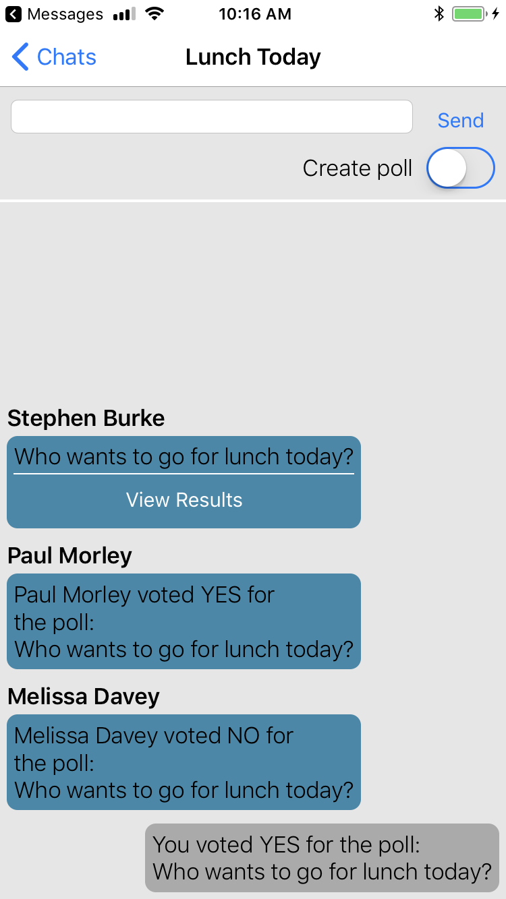
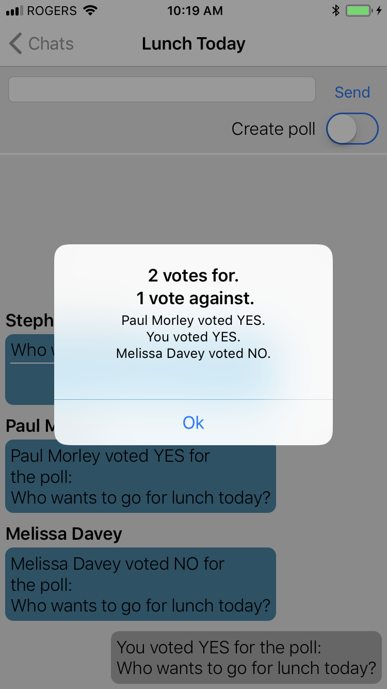
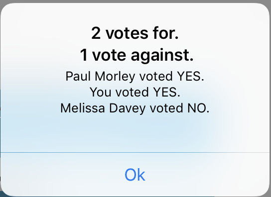

# Chat Poll for iOS

The Chat Poll sample application demonstrates how a user can post polls within a chat as custom messages. 
The app also demonstrates how the 
[Chat Message References](https://developer.blackberry.com/files/bbm-enterprise/documents/guide/reference/ios/interface_b_b_m_chat_message.html)
feature of the SDK can be used to cast and tally votes for a particular poll.
We demonstrate how a user can post **polls** within a chat as custom messages. 
We also demonstrate how the [Chat Message References](https://developer.blackberry.com/files/bbm-enterprise/documents/guide/reference/ios/interface_b_b_m_chat_message.html) feature of the SDK can be used to cast and tally votes for a particular poll. 


### Features

This app can be used with the other sample apps but will only send and render messages with
the "Text" tag and other tags related to polls: "Poll", "PollVoteUp" and "PollVoteDown".  It will allow you to do the following:

* Create a poll as custom messages in a chat
* Vote on a poll created by other users
* View a poll's results

<p align="center">
<a href="screenShots/ChatPoll_1.png"></a>
<a href="screenShots/ChatPoll_2.png"></a>
<a href="screenShots/ChatPoll_3.png"></a>
</p>

## Getting Started

This sample requires the Spark SDK, which you can find along with related resources at the location below.

* Getting started with the [Spark SDK](https://developers.blackberry.com/us/en/products/blackberry-bbm-enterprise-sdk.html)
* [Development Guide](https://developer.blackberry.com/files/bbm-enterprise/documents/guide/html/index.html)
* [API Reference](https://developer.blackberry.com/files/bbm-enterprise/documents/guide/reference/ios/index.html)

<p align="center">
    <a href="http://www.youtube.com/watch?feature=player_embedded&v=H1yiHSGsAIg"
      target="_blank"></a>
</p>
<p align="center">
 <b>Getting started video</b>
</p>


### Configuration

* [Sample application configuration using Google Sign-In and Firebase](https://developer.blackberry.com/files/bbm-enterprise/documents/guide/html/googleSignInForiOSExamples.html)

## Walkthrough
- [Chat Poll App](#chatPollApp)
- [Chat View Controller](#chatViewController)

### <a name="chatPollApp"></a>ChatPollApp

The *ChatPollApp* class is the primary entry point for the application and owns an instance of a *BBMAuthController*.  These classes provide authentication via GoogleSignIn and key management via Firebase.

For *BBMAuthController*, you can substitute an implementation of *id&lt;BBMTokenManager&gt;* that interacts with your oAuth provider of choice.  Configuration is handled via the ConfigSettings.plist file:
```swift
    private let _authController : BBMAuthController! = {
        let controller = BBMAuthController.fromConfigFile()
        return controller
    }()
```

Sample Token Managers are provided for both Azure AD and Google SignIn.  To use Google SignIn with the BlackBerry Key Management Service (for example), the ConfigSettings.plist should be configured as follows:
```xml
<?xml version="1.0" encoding="UTF-8"?>
<!DOCTYPE plist PUBLIC "-//Apple//DTD PLIST 1.0//EN" "http://www.apple.com/DTDs/PropertyList-1.0.dtd">
<plist version="1.0">
<dict>
    <key>authProvider</key>
    <string>googleSignIn</string>
    <key>useBlackBerryKMS</key>
    <true/>

    <!-- This key must match the authProvider value above -->
    <key>googleSignIn</key>
    <dict>
        <key>domain</key>
        <string>blackberry_service_domain (ie :abde-ed6d-11e6-a754-f8cab45257283)</string>
        <key>clientId</key>
        <string>google_client_id (ie: 485684fd-643d-4612-83c6-71a075f4357f)</string>
        <key>environment</key>
        <string>sandbox</string>
    </dict>
</dict>
</plist>
```

### <a name="chatViewController"></a>ChatViewController

*ChatViewController* will render a list of the messages in a specific chat.  An ObservableMonitor is used to monitor the message count and last message identifier on the chat and request messages and update the tableView when either change. Only messages with a tag known by the app will be displayed, the rest will be ignored.

*ChatViewController* will monitor the chat state and load new messages and update the tableView via:
```swift
//This monitor will lazy-load all of the messages in a given chat and add them to an array
//that we can use to drive our tableView.  chat.lastMessage and chat.numMessages are both
//observable properties so this block will run whenever these change - which will happen whenever
//a message is added or removed.
chatMonitor = ObservableMonitor.init(activatedWithName: "messageMonitor") {
            [weak self]() -> Void in
            guard let weakSelf = self else {
                return;
            }
            var messageIsPending : Bool = false
            let lastMsg : UInt64 = weakSelf.chat!.lastMessage
            let firstMsg : UInt64 = weakSelf.chat!.numMessages > 0 ? lastMsg - weakSelf.chat!.numMessages + 1 : 0

            var messages = Array<BBMChatMessage>()

            let msgMap : BBMLiveMap = BBMEnterpriseService.shared().model().chatMessage

            for msgId in firstMsg...lastMsg {
                let key : BBMChatMessageKey = BBMChatMessageKey.init(chatId: weakSelf.chat!.chatId, messageId: msgId)
                let chatMessage : BBMChatMessage = msgMap[key] as! BBMChatMessage
                //Only display messages with known tags
                guard chatMessage.tag != nil && weakSelf.isKnownTag(tag : chatMessage.tag) else {
                    continue
                }
                messageIsPending = messageIsPending || chatMessage.bbmState == kBBMStatePending
                messages.insert(chatMessage, at: 0)
            }
            if(messageIsPending == false) {
                self?.messages = messages
                self?.tableView.reloadData()
            }
        }
```

When sending a message the tag "Text" is used for text messages and "Poll" is used to create a poll. We render the "Poll" message differently, allowing the participants in a chat to vote "YES" or "NO" on it.

<p align="center">
<a href="screenShots/ChatPoll_4.png"></a>
</p>

```swift
let tag : String = self.pollSwitch.isOn ? "Poll" : "Text"
let chatMessageSend : BBMChatMessageSendMessage = BBMChatMessageSendMessage(chatId: self.chat.chatId, tag:tag)
chatMessageSend.content = self.messageField.text
BBMEnterpriseService.shared().sendMessage(toService: chatMessageSend)
```

When a user votes, a message with the tag "PollVoteUp" or "PollVoteDown" is sent. We use [Chat Message References](https://developer.blackberry.com/files/bbm-enterprise/documents/guide/reference/ios/interface_b_b_m_chat_message.html) to associate the vote with the "Poll" message. We pass the "Poll" message's id as a reference in BBMChatMessageSendMessage_Ref and use the "PollVoteUp" or "PollVoteDown" tags to help us tally the votes later on.

To avoid more than one vote per user, we record locally that the user has cast a vote in the localData field of the chat.
```swift
func sendVote(vote : Bool) {
    let tag : String = vote ? "PollVoteUp" : "PollVoteDown"
    let chatMessageSend : BBMChatMessageSendMessage = BBMChatMessageSendMessage(chatId: self.message.chatId, tag: tag)

    let ref : BBMChatMessageSendMessage_Ref = BBMChatMessageSendMessage_Ref.init(messageId: self.message.messageId, tag: tag)
    chatMessageSend.ref = [ref]
    BBMEnterpriseService.shared().sendMessage(toService: chatMessageSend)

    //Record vote locally in locaData to avoid a second vote
    let localData : NSMutableDictionary
    if(self.message.localData == nil) {
        localData = NSMutableDictionary()
    }
    else {
        localData = self.message.localData as! NSMutableDictionary
    }
    localData["pollVote"] = vote

    let messageId : String = String(self.message.messageId)
    let elements : [String : Any] = ["messageId":messageId,"chatId":self.message.chatId , "localData": localData]
    let requestListChange : BBMRequestListChangeMessage = BBMRequestListChangeMessage.init(elements: [elements], type: "chatMessage")
    BBMEnterpriseService.shared().sendMessage(toService: requestListChange)
}
```

To view the results of the poll, the original poll message is needed.
```swift
//If the tag is "PollVoteUp" or "PollVoteDown" we need to get the referenced message
//which is the poll.
var messageId = message.messageId
if(message.tag == "PollVoteUp" || message.tag == "PollVoteDown") {
    //Get messageId for poll, which is the referenced message
    let reference : BBMChatMessage_Ref = message.ref.first as! BBMChatMessage_Ref
     messageId = reference.messageId
}
```

After the messageId of the poll message is obtained, a BBMChatMessageCriteria request is sent to get the list of messages with the tag "PollVoteUp" that reference the poll. The result is a list of BBMChatMessage objects.
```swift
//Get list for upvotes by matching a criteria
let forChatMessageCriteria : BBMChatMessageCriteria = BBMChatMessageCriteria()
forChatMessageCriteria.chatId = message.chatId
let forRef : BBMChatMessageCriteria_Ref = BBMChatMessageCriteria_Ref()
forRef.tag = "PollVoteUp"
forRef.messageId = messageId
forChatMessageCriteria.ref = forRef
let forRefs : BBMLiveList = BBMEnterpriseService.shared().model().chatMessage(with: forChatMessageCriteria)
```

Now the same is done but using the tag "PollVoteDown" and the same messasgeId. This will return a list of messages with the tag "PollVoteDown" that reference the poll.
```swift
//Get list of downvotes by matching a criteria
let againstChatMessageCriteria : BBMChatMessageCriteria = BBMChatMessageCriteria()
againstChatMessageCriteria.chatId = message.chatId
let againstRef : BBMChatMessageCriteria_Ref = BBMChatMessageCriteria_Ref()
againstRef.tag = "PollVoteDown"
againstRef.messageId = messageId
againstChatMessageCriteria.ref = againstRef
let againstRefs : BBMLiveList = BBMEnterpriseService.shared().model().chatMessage(with: againstChatMessageCriteria)
```

After we get both lists, we use a monitor to make sure both lists are kept up to date, we then tally the votes and show the results.
<p align="center">
<a href="screenShots/ChatPoll_5.png"></a>
</p>

```swift
pollResultsMonitor = ObservableMonitor.init(activatedWithName: "voteMonitor", selfTerminatingBlock: {
    [weak self]() -> Bool in
        guard let weakSelf = self else {
            return true;
        }
        if(forRefs.bbmState == kBBMStatePending || againstRefs.bbmState == kBBMStatePending) {
            return false
        }

        for ref in forRefs.array as! Array<BBMChatMessage> {
            //Access the chat message and extract any useful data
        }

        for ref in againstRefs.array as! Array<BBMChatMessage> {
            //Access the chat message and extract any useful data
        }
        //Present data extracted from messages
        return true
})
```

## License

These samples are released as Open Source and licensed under the
[Apache 2.0 License](http://www.apache.org/licenses/LICENSE-2.0.html).

These samples were created using SDKs from Apple Inc. and may contain code
licensed for use only with Apple products. Please review your Apple SDK
Agreement for additional details.

This page includes icons from: https://material.io/icons/ used under the [Apache 2.0 License](http://www.apache.org/licenses/LICENSE-2.0.html).

## Reporting Issues and Feature Requests

If you find a issue in one of the Samples or have a Feature Request, simply file an [issue](https://github.com/blackberry/bbme-sdk-ios-samples/issues).

