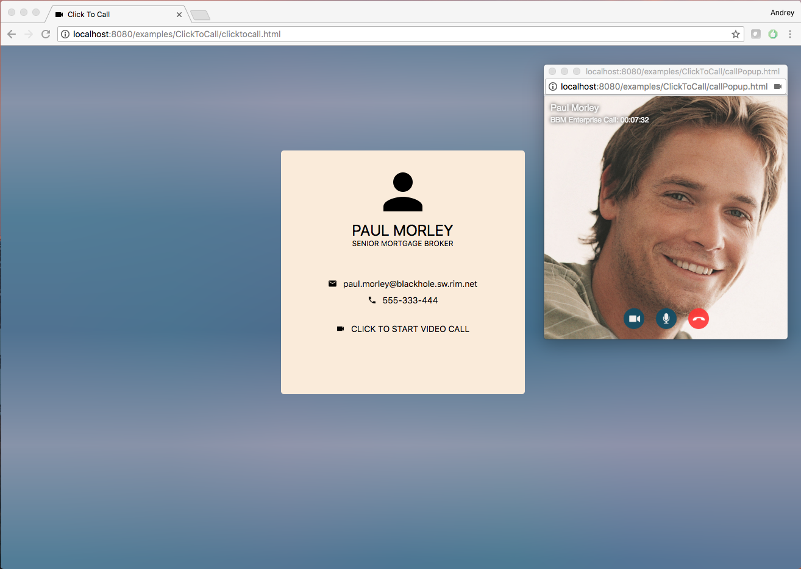

# Click To Call Sample for JavaScript

The Click to Call sample app demonstrates how to integrate a video call
experience into your website with the Spark Communications SDK. This app allows
a user to click a button on a webpage to start a secure video call with a
predefined user or agent. The bbmCall widget handles the rendering of the
incoming and outgoing video streams.

### Features

This app demonstrates how easy it is to integrate the bbmCall widget into your
webpage. It initializes the SDK, and starts a video call with a predefined user.

<br>

<p align="center">
<a href="screenShots/ClickToCall.png"></a>
</p>

## Getting Started

This sample requires the Spark Communications SDK for JavaScript, which you can find along with related resources at the location below.
    
* Getting started with the [Spark Communications SDK](https://developers.blackberry.com/us/en/products/blackberry-spark-communications-platform.html)
* [Development Guide](https://developer.blackberry.com/files/bbm-enterprise/documents/guide/html/index.html)
* [API Reference](https://developer.blackberry.com/files/bbm-enterprise/documents/guide/reference/javascript/index.html)

<p align="center">
    <a href="https://www.youtube.com/watch?v=LAbxok2EQtI"
      target="_blank"></a>
</p>
<p align="center">
 <b>Getting started video</b>
</p>

### Prerequisites

Run "yarn install" in the ClickToCall application directory to install the required packages.

Visit the [Getting Started with Web](https://developer.blackberry.com/files/bbm-enterprise/documents/guide/html/gettingStarted-web.html) section to see the minimum requirements.

To use the ClickToCall example, you must set up the following elements in js/config.js:

- Oauth2 configuration (AUTH_CONFIGURATION)
- A hard coded contact registration ID with whom anyone who views the page will talk (CONTACT_REG_ID)
- Your sandbox domain (ID_PROVIDER_DOMAIN)
- Firebase configuration (FIREBASE_CONFIG)
- User passcode (USER_SECRET)

## Walkthrough

Follow this guide for a walkthrough of how to integrate a video call into your webpage.

- [Import the bbmCall UI widget into your web application](#importCall)
- [Initialize the SDK](#init)
- [Perform setup](#setup)
- [Start a video call with a predefined user](#startCall)

### <a name="importCall"></a>Import the bbmCall UI widget into your web application

Your web application needs to import the bbmCall widget in order to bring a video call experience into your webpages.

```html
  <link rel="import" href="node_modules/bbmCall/bbmCall.html">
```

### <a name="init"></a>Initialize the SDK

```javascript
  // Instantiate BBMEnterprise.
  bbmeSdk = new BBMEnterprise({
    domain: ID_PROVIDER_DOMAIN,
    environment: ID_PROVIDER_ENVIRONMENT,
    userId: authUserInfo.userId,
    getToken: authManager.getBbmSdkToken,
    description: navigator.userAgent,
    messageStorageFactory: BBMEnterprise.StorageFactory.SpliceWatcher,
    kmsArgonWasmUrl: KMS_ARGON_WASM_URL
  });
```

For more information about setting up the SDK, visit the [Getting Started with Web](https://developer.blackberry.com/files/bbm-enterprise/documents/guide/html/gettingStarted-web.html) section of the guide.

### <a name="setup"></a>Perform setup
```javascript
  // Handle changes of BBM Enterprise setup state.
  bbmeSdk.on('setupState', state => {
    console.log(`ClickToCall: BBMEnterprise setup state: ${state.value}`);
    switch (state.value) {
      case BBMEnterprise.SetupState.Success: {
        // Setup was successful. Create user manager and initiate call.
        const userRegId = bbmeSdk.getRegistrationInfo().regId;
        createUserManager(userRegId, authManager, bbmeSdk.getIdentitiesFromAppUserId, bbmeSdk.getIdentitiesFromAppUserIds)
        .then(userManager => {
            contactsManager = userManager;
            contactsManager.initialize()
            .then(() => {
              // User manage was created and initialized. Make a call to CONTACT_REG_ID.
              makeCall(CONTACT_REG_ID, true);
            });
          });
      }
      break;
      case BBMEnterprise.SetupState.SyncRequired: {
        if (isSyncStarted) {
          alert('Failed to get user keys using provided USER_SECRET.');
          window.close();
          return;
        }
        const isNew = bbmeSdk.syncPasscodeState === BBMEnterprise.SyncPasscodeState.New;
        const syncAction = isNew ? BBMEnterprise.SyncStartAction.New : BBMEnterprise.SyncStartAction.Existing;
        bbmeSdk.syncStart(USER_SECRET, syncAction);
      }
      break;
      case BBMEnterprise.SetupState.SyncStarted:
        isSyncStarted = true;
      break;
    }
  });
  
  // Handle setup error.
  bbmeSdk.on('setupError', error => {
    // Notify user about the setup error.
    alert(`BBM Enterprise registration failed: ${error.value}`);
  });

  // Start BBM Enterprise setup.
  bbmeSdk.setupStart();
```

### <a name="startCall"></a>Start a video call with a predefined user
To start a video call with a predefined user and show the bbmCall widget, you must invoke the public method makeCall() of the bbmCall widget and pass in the user's registration ID. After the call is finished, the bbmCall widget will fire the 'CallEnded' event.

```javascript
  // Create bbm-call widget.
  const bbmCallWidget = document.createElement('bbm-call');
  // Initiate video call.
  bbmCallWidget.makeCall(regId, isVideo);
  // Handle 'CallEnded' event.
  bbmCallWidget.addEventListener('CallEnded', () => {
    document.body.removeChild(bbmCallWidget);
    bbmCallWidget = null;
    window.close();
  });
```

## License

These samples are released as Open Source and licensed under the [Apache 2.0 License](http://www.apache.org/licenses/LICENSE-2.0.html).

This page includes icons from: https://material.io/icons/ used under the [Apache 2.0 License](http://www.apache.org/licenses/LICENSE-2.0.html).

## Reporting Issues and Feature Requests

If you find a issue in one of the Samples or have a Feature Request, simply file an [issue](https://github.com/blackberry/bbme-sdk-javascript-samples/issues).
