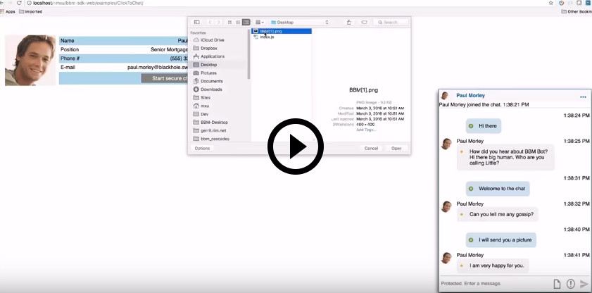
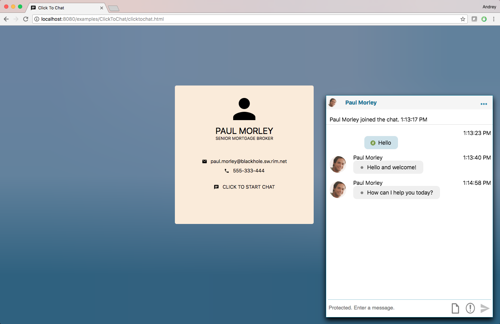

# Click To Chat for JavaScript

The Click to Chat example application demonstrates how to integrate a chat
experience into your website with BlackBerry Spark Communications Services.
This example allows a user to click a button on a webpage to start a
secure chat with a predefined user or agent. The `bbmChat` component handles
the rendering of messages within the chat, and allows the user to send text,
picture, and file messages.

This example builds on the [Quick Start](../QuickStart/README.md) example that
demonstrates setting up the SDK in a domain with user authentication disabled
and the BlackBerry Key Management Service enabled.

<p align="center">
<br>
    <a href="https://youtu.be/C0-5hT2nSSM"
      target="_blank"></a>
</p>
<p align="center">
 <b>Demo video: Integrate a secure chat component into your web page</b>
</p>

### Features

This example demonstrates how easy it is to integrate the `bbmChat`
component into your webpage. It initializes the SDK and starts a chat with a
predefined user. The app then launches the `bbmChat` component which allows
the user to:
* View all sent and received messages in a chat
* Send a text message, picture, or file attachment
* Send high priority messages
* Mark incoming messages as Read
* Show typing notifications
* Retract messages
* Delete messages
* Show delivered and read message status
* Show the chat participant
* End and leave the chat

<br/>
<p align="center">
  <a href="screenShots/ClickToChat.png"></a>
</p>

## Getting Started

This example requires the Spark Communications SDK, which you can find along
with related resources at the locations below.

* Instructions to
[Download and Configure](https://developer.blackberry.com/files/bbm-enterprise/documents/guide/html/gettingStarted.html)
the SDK.
* [Getting Started with Web](https://developer.blackberry.com/files/bbm-enterprise/documents/guide/html/gettingStarted-web.html)
instructions in the Developer Guide.
* [API Reference](https://developer.blackberry.com/files/bbm-enterprise/documents/guide/reference/javascript/index.html)
This sample requires the Spark Communications SDK for JavaScript, which you can find along with related resources at the location below.

<p align="center">
    <a href="https://youtu.be/CSXZT2perqE"
      target="_blank"></a>
</p>
<p align="center">
 <b>Getting started video</b>
</p>

By default, this example application is configured to work in a domain with
user authentication disabled and the BlackBerry Key Management Service
enabled.  See the [Download & Configure](https://developer.blackberry.com/files/bbm-enterprise/documents/guide/html/gettingStarted.html)
section of the Developer Guide to get started configuring a
[domain](https://developer.blackberry.com/files/bbm-enterprise/documents/guide/html/faq.html#domain)
in the [sandbox](https://developer.blackberry.com/files/bbm-enterprise/documents/guide/html/faq.html#sandbox).

When you have a domain in the sandbox, edit Click to Chat's `config_mock.js`
file to configure the example with your domain ID, your agent's user ID, and a
key passcode.

Set the `DOMAIN_ID` parameter to your sandbox domain ID.

```javascript
const DOMAIN_ID = 'your_domain_id';
```

Set the `AGENT_USER_ID` parameter to the user ID of the agent that will be
handling the chat.  This example cannot interact with chats it did not
initiate, but the [Rich Chat example
application](https://developer.blackberry.com/files/bbm-enterprise/documents/guide/html/examples/javascript/RichChat/README.html)
can.  You can configure the Rich Chat example application to use your domain.
The user ID of the user logged into the Rich Chat application may be used as
the `AGENT_USER_ID` for this example as long as the Rich Chat user remains
logged in.

```javascript
const AGENT_USER_ID = 'agent_user_id';
```

Set the `KEY_PASSCODE` parameter to the string used to protect the logged in
user's keys stored in the [BlackBerry Key Management Service](https://developer.blackberry.com/files/bbm-enterprise/documents/guide/html/security.html).
Real applications should not use the same passcode for all users.   However,
it allows this example application to be smaller and focus on demonstrating
its call functionality instead of passcode management.
```javascript
const KEY_PASSCODE = 'passcode';
```

Run `yarn install` in the Click to Chat application directory to install the
required packages.

When you run the Click to Chat application, it will prompt you for a user ID.
Because you've configured your domain to have user authentication disabled, you
can enter any string you like for the user ID and an SDK identity will be
created for it.  Other applications that you run in the same domain will be
able to find this identity by this user ID.

## Walkthrough

Before a chat with a configured user can be initiated, the user must be
[authenticated](https://developer.blackberry.com/files/bbm-enterprise/documents/guide/html/gettingStarted-web.html#authentication)
and the [SDK
started](https://developer.blackberry.com/files/bbm-enterprise/documents/guide/html/gettingStarted-web.html#start-sdk).

Follow this guide for a walkthrough of how to integrate a rich chat experience
into your webpage.

- [Import the bbmChat component into your web application](#importChat)
- [Create the user manager](#createUserManager)
- [Configure the bbmChat component](#configureComponent)
- [Lookup the identity of the configured user](#identityLookup)
- [Start a chat with the configured user](#startChat)

### <a name="importChat"></a>Import the bbmChat component into your web application

The `bbmChat` component will manage all aspects of chat interaction for your
application, except chat creation.

```html
  <link rel="import" href="node_modules/bbmChat/bbmChat.html">
```

### <a name="createUserManager"></a>Create the user manager

The `bbmChat` component requires a user manager to supply information
about the user for display purposes.  The `createUserManager` function is
defined in `config_mock.js` to create a `MockUserManager` instance from
the support library.

```javascript
  // Create and initialize the user manager.
  const contactsManager = await createUserManager(
    sdk.getRegistrationInfo().regId,
    authManager,
    (...args) => sdk.getIdentitiesFromAppUserIds(...args)
  );
  await contactsManager.initialize();
```

### <a name="configureComponent"></a>Configure the bbmChat component

The `bbmChat` component must be associated with the SDK and user manager so
that it can manage the chat your application will create.

```javascript
  // Setup the bbmChat component to use the SDK and contact manager that
  // we've created for it to use.  We also disable the media
  // capabilities of the component.
  const bbmChat = Polymer.dom(document.body).querySelector('#bbm-chat');
  bbmChat.setBbmSdk(sdk);
  bbmChat.setContactManager(userManager);
  bbmChat.getChatHeader().set('isMediaEnabled', false);
```

### <a name="identityLookup"></a>Lookup the identity of the configured user

The SDK can only start a chat with an identity if they have a `regId`.  You
can use
[`BBMEnterprise.getIdentitiesFromAppUserId()`](https://developer.blackberry.com/files/bbm-enterprise/documents/guide/reference/javascript/BBMEnterprise.html#getIdentitiesFromAppUserId)
to lookup the identity details for the configured user.

```javascript
  const identity = await sdk.getIdentitiesFromAppUserId(AGENT_USER_ID);
```

### <a name="startChat"></a>Start a chat with the configured user
To start a chat, you must call
[`BBMEnterprise.Messenger.chatStart()`](https://developer.blackberry.com/files/bbm-enterprise/documents/guide/reference/javascript/BBMEnterprise.Messenger.html#chatStart).
When the chat with the configured user identity has been started, control over
the chat interaction can be handed over to the `bbmChat` component.  Listening
for the `chatDefunct` event will allow you to handle any necessary cleanup
when the chat is no longer active.

```javascript
  // Before we can start a chat, we must wait for all of the chat
  // creation dependencies to have completed.  This includes the SDK
  // setup and the identity lookup for the user that we will be starting
  // a chat with.
  const { sdk, identity } = await bbmChatIsReady.promise;

  // Begin a 1:1 chat with the configured user.
  const newChat = await sdk.messenger.chatStart({
    // This is a one-to-one chat with the configured user.
    isOneToOne: true,
    invitees: identity.regId
  });

  // Let the bbmChat component handle the chat interactions.
  const bbmChat = Polymer.dom(document.body).querySelector('#bbm-chat');
  bbmChat.setChatId(newChat.chat.chatId);

  // Show the chat window.
  document.querySelector('#chat-pane').style.display = 'block';

  // Listen for the chatDefunct event which indicates that the chat is
  // no longer active.  We use this event hide the bbmChat component
  // and indicate that the user is no longer chatting.
  bbmChat.addEventListener('chatDefunct', () => {
    document.querySelector('#chat-pane').style.display = 'none';
    isChatting = false;
  });
```

## License

These examples are released as Open Source and licensed under the [Apache 2.0 License](http://www.apache.org/licenses/LICENSE-2.0.html).

This page includes icons from: https://material.io/icons/ used under the [Apache 2.0 License](http://www.apache.org/licenses/LICENSE-2.0.html).

## Reporting Issues and Feature Requests

If you find a issue in one of the Samples or have a Feature Request, simply file an [issue](https://github.com/blackberry/bbme-sdk-javascript-samples/issues).
