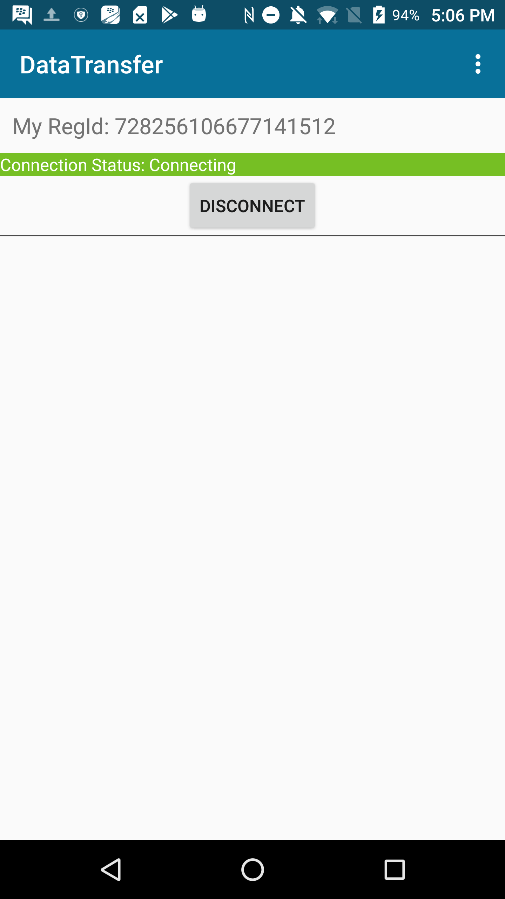

# Data Transfer for Android

The Data Transfer application demonstrates how to use the peer-to-peer data connection feature of BlackBerry Spark Communications Services. The data connection API allows arbitrary data to be sent securely through a familiar stream interface. This example builds on the [Quick Start](../QuickStart/README.md) example that demonstrates how you can authenticate with the Spark SDK using the [Identity Provider](https://developer.blackberry.com/files/bbm-enterprise/documents/guide/html/identityManagement.html) of your application.

### Features

The sample application allows the user to do the following:

- Start a data connection
- Send and receive files over the connection

<br>

<p align="center">
<a href="screenShots/connecting.png"></a>
<a href="screenShots/incoming_connection.png"></a>
<a href="screenShots/transferring.png"></a>
</p>

## Getting Started

This example requires the Spark SDK, which you can find along with related resources at the location below.

* Getting started with the [Spark SDK](https://developers.blackberry.com/us/en/products/blackberry-bbm-enterprise-sdk.html)
* [Development Guide](https://developer.blackberry.com/files/bbm-enterprise/documents/guide/html/index.html)
* [API Reference](https://developer.blackberry.com/files/bbm-enterprise/documents/guide/reference/android/index.html)

Visit the [Getting Started with Android](https://developer.blackberry.com/files/bbm-enterprise/documents/guide/html/gettingStarted-android.html) section to see the minimum requirements.

<p align="center">
    <a href="http://www.youtube.com/watch?feature=player_embedded&v=310UDOFCLWM"
      target="_blank"></a>
</p>
<p align="center">
 <b>Getting started video</b>
</p>

This sample application is pre-configured to use simple unvalidated user authentication and the BlackBerry Key Management Service. This allows you to get up and running quickly with minimal setup.

[Create a Spark application](https://account.good.com/#/a/organization//applications/add) and configure a sandbox domain, with settings to use no identity provider and using the BlackBerry Key Management Service.   

Once your sandbox domain is configured, edit the app.properties file with your Spark domain and your Android signing keystore parameters. Signing-in will require you to enter a unique user identifier (such as a name or email) and a password for the BlackBerry Key Management Service.

This application has been built using Gradle 4.2.1 (newer versions have not been validated).


## Walkthrough

Follow this guide for a walkthrough explaining how the Spark SDK is used to share data over a secure peer-to-peer data connection.

- [Creating a connection](#create)
- [Receive a connection](#receive)
- [Data channels](#channels)
- [Send and receive data](#sendAndReceive)


### <a name="create"></a> Creating a connection

We can start a new data connection using [startDataConnection](https://developer.blackberry.com/files/bbm-enterprise/documents/guide/reference/android/com/bbm/sdk/media/BBMEMediaManager.html#startDataConnection-long-java.lang.String-com.bbm.sdk.media.BBMEDataConnectionCreatedObserver-). When starting a data connection we can include a metadata string which is passed to the participant. The meta data can be used to describe the intent or content of the connection.

```java
/**
 * Starts a data connection with the provided regid.
 */
public void startDataConnection(final long regId, final String metaData) {
    //Ask the media service to start a connection with the specified regId and include an observer to be notified of the result
    BBMEnterprise.getInstance().getMediaManager().startDataConnection(regId, metaData, new BBMEDataConnectionCreatedObserver() {
        @Override
        public void onConnectionCreationSuccess(int connectionId) {
            mDataConnectionId = connectionId;
            mConnectionMonitor.activate();
        }

        @Override
        public void onConnectionCreationFailure(@NonNull BBMEMediaManager.Error error) {
            //The connection wasn't created. Display an error
            Toast.makeText(MainActivity.this, getString(R.string.error_creating_connection, error.name()), Toast.LENGTH_LONG).show();
        }
    });
}
```
*MainActivity.java*

#### Observing the connection

The [state](https://developer.blackberry.com/files/bbm-enterprise/documents/guide/reference/android/com/bbm/sdk/media/BBMEDataConnection.ConnectionState.html) of the data connection can be observed by [getting](https://developer.blackberry.com/files/bbm-enterprise/documents/guide/reference/android/com/bbm/sdk/media/BBMEMediaManager.html#getDataConnection-int-) the data connection from the [media manager](https://developer.blackberry.com/files/bbm-enterprise/documents/guide/reference/android/com/bbm/sdk/media/BBMEMediaManager.html). When the state is connected we show the send file button. When the state is disconnected we hide the button. We can also check the [failure reason](https://developer.blackberry.com/files/bbm-enterprise/documents/guide/reference/android/com/bbm/sdk/media/BBMEDataConnection.FailReason.html) when the connection is disconnected.

```java
//Monitor to observe the data connection
ObservableMonitor mConnectionMonitor = new ObservableMonitor() {
    @Override
    protected void run() {
        BBMEDataConnection connection = BBMEnterprise.getInstance().getMediaManager().getDataConnection(mDataConnectionId).get();
        switch (connection.getState()) {
            case CONNECTED:
                mConnectionStatusTextView.setText(getString(R.string.connection_status, "Connected"));
                //Show the send button when connected
                sendFileFab.setVisibility(View.VISIBLE);
                break;
            case CONNECTING:
                mConnectionStatusTextView.setText(getString(R.string.connection_status, "Connecting"));
                //Clear the list when we are starting a new connection
                mTransfers.clear();
                mDataChannelsAdapter.notifyDataSetChanged();
                break;
            case OFFERING:
                mConnectionStatusTextView.setText(getString(R.string.connection_status, "Offering"));
                break;
            case DISCONNECTED:
                mConnectionStatusTextView.setText(getString(R.string.connection_status, "Disconnected"));
                mConnectionStatusTextView.setBackgroundColor(getResources().getColor(R.color.disconnected_color));
                mStartStopConnectionButton.setText(R.string.create_connection);
                //Hide the send button when disconnected
                sendFileFab.setVisibility(View.GONE);
                connection.setDataChannelCreatedObserver(null);
                //Display a connection error if one exists
                if (connection.getFailureReason() != BBMEDataConnection.FailReason.NO_FAILURE) {
                    mConnectionErrorTextView.setVisibility(View.VISIBLE);
                    mConnectionErrorTextView.setText(getString(R.string.connection_error, connection.getFailureReason().toString()));
                }
                break;
        }

        if (connection.getState() != BBMEDataConnection.ConnectionState.DISCONNECTED) {
            mConnectionErrorTextView.setVisibility(View.GONE);
            mConnectionStatusTextView.setBackgroundColor(getResources().getColor(R.color.connected_color));
            mStartStopConnectionButton.setText(R.string.disconnect);
            connection.setDataChannelCreatedObserver(MainActivity.this);
        }
    }
};
```
*MainActivity.java*

### <a name="receive"></a> Receive a connection

To monitor for incoming data connections, we register a [BBMEIncomingDataConnectionObserver](https://developer.blackberry.com/files/bbm-enterprise/documents/guide/reference/android/com/bbm/sdk/media/BBMEIncomingDataConnectionObserver.html).

```java
//Add incoming connection observer
mConnectionObserver = new IncomingConnectionObserver(DataTransferApplication.this);
BBMEnterprise.getInstance().getMediaManager().addIncomingDataConnectionObserver(mConnectionObserver);
```
*DataTransferApplication.java*

The observer is triggered every time a new connection request arrives. After accepting the connection we launch a simple activity to prompt the user to accept or decline the connection.

```java
/**
 * The IncomingConnectionObserver will be notified when a new call has arrived.
 */
public class IncomingConnectionObserver implements BBMEIncomingDataConnectionObserver {

    private Context mContext;
    public static final String INCOMING_CONNECTION_ID = "INCOMING_CONNECTION_ID";

    public IncomingConnectionObserver(Context context) {
        mContext = context;
    }

    @Override
    public void onIncomingDataConnection(final int connectionId) {
        //Accept the data connection
        BBMEnterprise.getInstance().getMediaManager().acceptDataConnection(connectionId);

        //Launch the incoming data connection activity
        Intent incomingCallIntent = new Intent(mContext, IncomingDataConnectionActivity.class);
        incomingCallIntent.putExtra(IncomingConnectionObserver.INCOMING_CONNECTION_ID, connectionId);
        incomingCallIntent.setFlags(Intent.FLAG_ACTIVITY_NEW_TASK);
        mContext.startActivity(incomingCallIntent);
    }
}
```
*IncomingConnectionObserver.java*

To complete the connection, we must call [openDataConnection](https://developer.blackberry.com/files/bbm-enterprise/documents/guide/reference/android/com/bbm/sdk/media/BBMEMediaManager.html#openDataConnection-int-). The connection should transition to [connected](https://developer.blackberry.com/files/bbm-enterprise/documents/guide/reference/android/com/bbm/sdk/media/BBMEDataConnection.ConnectionState.html#CONNECTED) and we can being writing data into the connection.

```java
//Open the data connection, this will transition the connection to "connected"
BBMEnterprise.getInstance().getMediaManager().openDataConnection(mDataConnectionId);
```
*IncomingDataConnectionActivity.java*

### <a name="channels"></a> Data channels

Sending and receiving data in a connection is done through a [DataChannel](https://developer.blackberry.com/files/bbm-enterprise/documents/guide/reference/android/com/bbm/sdk/media/BBMEDataChannel.html). A data channel is a stream with a specified name and [type](https://developer.blackberry.com/files/bbm-enterprise/documents/guide/reference/android/com/bbm/sdk/media/BBMEDataConnection.ChannelType.html). The type and name define the expected data for the receiver. [File](https://developer.blackberry.com/files/bbm-enterprise/documents/guide/reference/android/com/bbm/sdk/media/BBMEDataConnection.ChannelType.html#FILE) and [Data](https://developer.blackberry.com/files/bbm-enterprise/documents/guide/reference/android/com/bbm/sdk/media/BBMEDataConnection.ChannelType.html#DATA) types have a defined expected size. The [Stream](https://developer.blackberry.com/files/bbm-enterprise/documents/guide/reference/android/com/bbm/sdk/media/BBMEDataConnection.ChannelType.html#STREAM) type should be used when the size of the transfer is undefined.

Each time the user selects a file to send, we'll create a new data channel using the [createDataChannel](https://developer.blackberry.com/files/bbm-enterprise/documents/guide/reference/android/com/bbm/sdk/media/BBMEDataConnection.html#createDataChannel-java.lang.String-java.lang.String-long-com.bbm.sdk.media.BBMEDataConnection.ChannelType-) method. We add a transfer item to the adapter to display the status of the file transfer to the user.

```java
//Create a new data channel of type "File" specifying the name and size. The channel id we are providing is a random string.
final BBMEDataChannelSender sender = connection.createDataChannel(
        UUID.randomUUID().toString(),
        fileName,
        fileSize,
        BBMEDataConnection.ChannelType.FILE
);

//Add the channel to the list and notify the adapter
final DataChannelsAdapter.TransferItem transferItem = new DataChannelsAdapter.TransferItem(fileUri, sender);
mTransfers.add(transferItem);
mDataChannelsAdapter.notifyDataSetChanged();
```
*MainActivity.java*

#### Observe a new incoming channel

To be notified when a new channel has been created in a connection use the [BBMEDataChannelCreatedObserver](https://developer.blackberry.com/files/bbm-enterprise/documents/guide/reference/android/com/bbm/sdk/media/BBMEDataChannelCreatedObserver.html). When a new channel arrives a [BBMEDataChannelReceiver](https://developer.blackberry.com/files/bbm-enterprise/documents/guide/reference/android/com/bbm/sdk/media/BBMEDataChannelReceiver.html) is provided.

```java
connection.setDataChannelCreatedObserver(MainActivity.this);
```
```java
@Override
public void onDataChannelCreated(String s, BBMEDataChannelReceiver receiver) {

    //Add a new "transfer item" to the data channels adapter
    DataChannelsAdapter.TransferItem transferItem = new DataChannelsAdapter.TransferItem(null, receiver);
    mTransfers.add(transferItem);
    mDataChannelsAdapter.notifyDataSetChanged();
    writeFile(receiver, transferItem);
}
```

### <a name="sendAndReceive"></a> Send and receive data

Data can be sent into the channel through an [OutputStream](https://developer.android.com/reference/java/io/OutputStream.html) in the [BBMEDataChannelSender](https://developer.blackberry.com/files/bbm-enterprise/documents/guide/reference/android/com/bbm/sdk/media/BBMEDataChannelSender.html). In our example we copy a file into the channel output stream. Reading and writing from a data channel stream will block when required to send and receive from the underlying connection. Accessing data in the stream should always be performed on a background thread to avoid blocking the main activity.

```java
//Start a background task to write the file to the data channel
AsyncTask.execute(new Runnable() {
    @Override
    public void run() {
        OutputStream dataChannelOutputStream = sender.getOutputStream();
        InputStream fileInputStream = null;
        try {
            fileInputStream = getContentResolver().openInputStream(fileUri);
            //Copy the data from the file to the data channel output stream
            IOUtils.copy(fileInputStream, dataChannelOutputStream);
        } catch (IOException e) {
            //If an error occurred then mark the transfer as failed and display an error to the user
            Logger.e(e);
            mMainHandler.post(new Runnable() {
                @Override
                public void run() {
                    transferItem.mError = true;
                    mDataChannelsAdapter.notifyDataSetChanged();
                    Toast.makeText(MainActivity.this, "IOException occurred while sending " + fileName, Toast.LENGTH_LONG).show();
                }
            });
        } finally {
            IOUtils.safeClose(fileInputStream);
            IOUtils.safeClose(dataChannelOutputStream);
        }
    }
});
```

#### Reading data from a channel

Data is read from a [BBMEDataChannelReceiver](https://developer.blackberry.com/files/bbm-enterprise/documents/guide/reference/android/com/bbm/sdk/media/BBMEDataChannelReceiver.html) through an [InputStream](https://developer.android.com/reference/java/io/InputStream.html). All incoming channels are written into the /data_transfer_example directory.

```java
private void writeFile(final BBMEDataChannelReceiver receiver, final DataChannelsAdapter.TransferItem transferItem) {
    //Create an asynctask to copy the data from the channel into a file
    AsyncTask.execute(new Runnable() {
        @Override
        public void run() {
            //Create a folder to write the incoming data to
            String outputDirectoryPath = Environment.getExternalStorageDirectory() + "/data_transfer_example";
            File outputDir = new File(outputDirectoryPath);
            if (!outputDir.exists()) {
                outputDir.mkdirs();
            }

            //Create a file using the "name" provided in the data channel
            final File outputFile = new File(outputDirectoryPath + "/" + receiver.getName());
            OutputStream fileOutputStream = null;

            //Get the input stream from the data channel
            InputStream dataChannelInputStream = receiver.getInputStream();

            try {
                fileOutputStream = new FileOutputStream(outputFile);
                //Read data from the input stream and copy it to the file
                IOUtils.copy(dataChannelInputStream, fileOutputStream);
            } catch (IOException e) {
                //If an error occurred then mark the transfer as failed and display an error to the user
                Logger.e(e);
                mMainHandler.post(new Runnable() {
                    @Override
                    public void run() {
                        transferItem.mError = true;
                        mDataChannelsAdapter.notifyDataSetChanged();
                        Toast.makeText(MainActivity.this, "IOException when writing received file " + receiver.getName(), Toast.LENGTH_LONG).show();
                    }
                });
            } finally {
                IOUtils.safeClose(dataChannelInputStream);
                IOUtils.safeClose(fileOutputStream);
            }

            if (!transferItem.mError) {
                //Set the file uri in the transfer item
                transferItem.mFileUri = FileProvider.getUriForFile(
                        MainActivity.this,
                        getApplicationContext().getPackageName() + ".fileprovider",
                        outputFile
                );
            }
        }
    });
}
```

#### Observing a channel

To display a progress bar, we ask the [DataChannel](https://developer.blackberry.com/files/bbm-enterprise/documents/guide/reference/android/com/bbm/sdk/media/BBMEDataChannel.html) for the [progress](https://developer.blackberry.com/files/bbm-enterprise/documents/guide/reference/android/com/bbm/sdk/media/BBMEDataChannel.html#getProgress--). The progress value is a provided as an observable value integer between 0 and 100. The progress is only available for channel types where the expected size is known. We also display the number of bytes transferred using [getBytesTransferred()](https://developer.blackberry.com/files/bbm-enterprise/documents/guide/reference/android/com/bbm/sdk/media/BBMEDataChannel.html#getBytesTransferred--). If the bytes transferred or progress values change the [ObservableMonitor](https://developer.blackberry.com/files/bbm-enterprise/documents/guide/reference/android/com/bbm/sdk/reactive/ObservableMonitor.html) is triggered and the UI is updated.

```java
public ObservableMonitor mProgressObserver = new ObservableMonitor() {
    @Override
    protected void run() {
        mProgressBarView.setProgress(mItem.mDataChannel.getProgress().get());
        long bytesTransferred = mItem.mDataChannel.getBytesTransferred().get() / 1024;
        long expectedSize = mItem.mDataChannel.getExpectedSize() / 1024;
        mSizeView.setText(mSizeView.getContext().getString(R.string.transfer_size, bytesTransferred, expectedSize));
    }
};
```
*DataChannelsAdapter.java*

## License

These samples are released as Open Source and licensed under the [Apache 2.0 License](http://www.apache.org/licenses/LICENSE-2.0.html).  

The Android robot is reproduced or modified from work created and shared by Google and used according to terms described in the [Creative Commons 3.0 Attribution License](https://creativecommons.org/licenses/by/3.0/).

This page includes icons from: https://material.io/icons/ used under the [Apache 2.0 License](http://www.apache.org/licenses/LICENSE-2.0.html).

## Reporting Issues and Feature Requests

If you find an issue in one of the Samples or have a Feature Request, simply file an [issue](https://github.com/blackberry/bbme-sdk-android-samples/issues).

