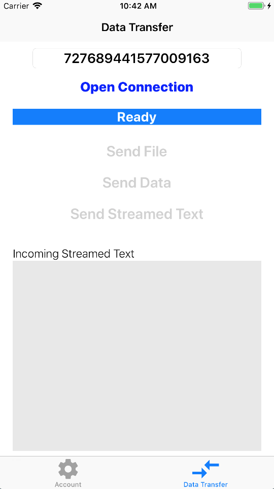

# Data Transfer for iOS

The Data Transfer sample application 
demonstrates how to use the peer-to-peer data connection capability of
Spark. This example builds on the [Quick Start Swift](../QuickStartSwift/README.md) example that
demonstrates how you can authenticate with Spark using the [Identity Provider](https://developer.blackberry.com/files/bbm-enterprise/documents/guide/html/identityManagement.html) 
of your application.

### Features

The DataTransfer sample allows the user to do the following:

* Start a data connection by typing in a regId
* Accept/Decline incoming data connection requests
* Send and view files, data and a data stream

This sample can interact with the
[Rich Chat](https://developer.blackberry.com/files/bbm-enterprise/documents/guide/html/examples/ios/RichChat/README.html) 
and [Quick Start Swift](../QuickStartSwift/README.md) samples so it may utilize the same configuration.

<br>


<p align="center">
<a href="screenShots/DT_OpenConnection.pn"></a>
<a href="(screenShots/DT_Transfer.png"></a>
</p>

## Getting Started

This sample requires the Spark SDK, which you can find along with related resources at the location below.

* Getting started with the [Spark SDK](https://developers.blackberry.com/us/en/products/blackberry-bbm-enterprise-sdk.html)
* [Development Guide](https://developer.blackberry.com/files/bbm-enterprise/documents/guide/html/index.html)
* [API Reference](https://developer.blackberry.com/files/bbm-enterprise/documents/guide/reference/ios/index.html)

<p align="center">
    <a href="http://www.youtube.com/watch?feature=player_embedded&v=H1yiHSGsAIg"
      target="_blank"></a>
</p>
<p align="center">
 <b>Getting started video</b>
</p>


### Configuration

* [Sample application configuration using Google Sign-In and Firebase](https://developer.blackberry.com/files/bbm-enterprise/documents/guide/html/googleSignInForiOSExamples.html)

## Walk-through
- [DataTransfers & Push](#dataTransferPush)
- [Support Library](#supportLib)
- [Configuring BBMEMediaManager](#configBBMEMediaManager)
- [Listening for Data Connections](#listenDataConnections)
- [Starting a Data Connection](#startingDataConnection)
- [Sending Data](#sendingData)
- [Streams](#streams)
- [Data and Files](#dataFiles)
- [Receiving Data](#receivingData)

### <a name="dataTransferPush"></a>DataTransfers & Push

If you enable the media layer (voice, video or data)  in your app, push should be implemented via PushKit.  When a PushKit message is received, it should be sent to [BBMEntperiseService](https://developer.blackberry.com/files/bbm-enterprise/documents/guide/reference/ios/interface_b_b_m_enterprise_service.html) via BBMEnteprirseService.shared().pushRecieved(pushJSON).  If the push includes call data, this will then invoke the incomingDataConnectionOffered(_ connection:) callback on any delegates registered with [BBMEMediaManager](https://developer.blackberry.com/files/bbm-enterprise/documents/guide/reference/ios/interface_b_b_m_e_media_manager.html).

For PushKit integration to work, you must enable the "Voice over IP" background mode under your projects capabilities.

**Note:** Legacy APNS is not suitable for Voice and Video and media
integration as the incoming push will not always wake the application.  
See the
[Rich Chat](https://developer.blackberry.com/files/bbm-enterprise/documents/guide/html/examples/ios/RichChat/README.html) 
sample for how to integrate PushKit with your application.

### <a name="supportLib"></a>Support Library

Common code for authenticating users, synchronizing keys and performing common tasks can be found in /examples/Support/Source.  Much of the heavy lifting can be found in these classes and they should be referenced before implementing a custom key management or authentication scheme.

*BBMAuthController* and *BBMKeyManager* can be instantiated with classes/instances that allow you to substitute your own user authentication or key management scheme while handling all of the SDK related functionality.

*BBMAccess* provides wrappers around common outgoing messages and the SDK data model.

### <a name="configBBMEMediaManager"></a>Configuring BBMEMediaManager

The *DataTransferApp* class is the primary entry point for the application and owns an instance of a *BBMAuthController* and a *BBMKeyManager*.  These classes provide authentication via GoogleSignIn and key management via Firebase.  *DataTransferApp* uses ObservableMonitors to monitor the credential and service state on the *BBMAuthController* instance and syncronizes keys and/or configures services when the appropriate conditions are met.

Unlike voice and video, there is not explicit setup required for data calls.  Incoming data calls are silent by default and must be handled explicitly by your application.

### <a name="listenDataConnections"></a>Listening For Data Connections

*DataConnectionListener* registers with the shared [BBMEMediaManager](https://developer.blackberry.com/files/bbm-enterprise/documents/guide/reference/ios/interface_b_b_m_e_media_manager.html) singleton as a [BBMMediaDelegate](https://developer.blackberry.com/files/bbm-enterprise/documents/guide/reference/ios/protocol_b_b_m_e_media_delegate_01-p.html), listens for incoming and outgoing data transfer requests and presents the appropriate user interface(s).

To notify the user that a data connection has been requested we listen for the [BBMMediaDelegate](https://developer.blackberry.com/files/bbm-enterprise/documents/guide/reference/ios/protocol_b_b_m_e_media_delegate_01-p.html) incomingDataConnectionOffered(_ connection: BBMDataConnection!) callback.

```swift
func incomingDataConnectionOffered(_ connection: BBMDataConnection!) {
    //This user interface in this sample supports only a single concurrent data connection
    //but the API is capable of several concurrent connections with different users
    if  activeDataConnection != nil {
        NSLog("This app supports only a single ongoing data connection")
        BBMEnterpriseService.shared().mediaManager().end(connection)
        return
    }
    self.activeDataConnection = connection;
    self.mediaManager.dataConnectionSetupComplete(connection)
}
```

Once we have indicated that the call setup is complete, we listen for the [BBMMediaDelegate](https://developer.blackberry.com/files/bbm-enterprise/documents/guide/reference/ios/protocol_b_b_m_e_media_delegate_01-p.html) incomingDataConnectionAvailable(_ connection:) callback. In this example, we present an alert view to the user, allowing them to accept or decline the connection.  This may also be done automatically.
```swift
func incomingDataConnectionAvailable(_ connection: BBMDataConnection!) {
    self.notifyOfIncomingDataConnection(regId: connection.peerRegId)
}
```

To start the connection we must call accept(_ connection:) on the media manager.
```swift
BBMEnterpriseService.shared().mediaManager().accept(connection)
```

To end the connection, call end(_ connection:) on the media manager```
```swift
BBMEnterpriseService.shared().mediaManager().end(connection)
```

### <a name="startingDataConnection"></a>Starting A Data Connection

The *DataViewController* is used to initiate a data connection between two users.  Users are addressed using their respective registration IDs.  To start a connection:

Note that  Data Connections require that the keys first be synchronized between the users.   This can be done using the readUserKey(_ regId:) method on the the key manager.  Likewise, the keys must be synchronized on the incoming side as noted above.

When opening a connection, you may also provide up to 4Kb of metadata.  This data can be any arbitrary string.  

```swift
func openDataConnection(_ regId: NSNumber, metaData: String!) {
    self.mediaManager.startDataConnection(regId, metaData: metaData) {
        connection, error in
        if(error != kMediaErrorNoError) {
            self.statusField.text = "Connection Error"
            self.statusField.backgroundColor = UIColor.red
            self.openConnectionButton.isEnabled = true
            return
        }
    }
}
```

We place the call inside of an [ObservableMonitor](https://developer.blackberry.com/files/bbm-enterprise/documents/guide/reference/ios/interface_observable_monitor.html) which waits for the chat keys to exchange (which is done via the keyMonitor in *SoftPhoneApp*).  Keys must be exchanged before a call can be placed or the call will fail with *kMediaFailureKeyError*.

### <a name="sendingData"></a>Sending Data

Once a connection is established the delegate will get the dataConnectionAccepted(_ connection:) callback.  At this point you may use the supplied connection object to send/receive data.

You may send data as either a stream, file or data object.   Streams are long-lasting channels to which you can send blocks of data.

#### <a name="streams"></a>Streams

To send data to a stream you must first create a dataChannel using createDataChannel(_ description:).  You may then send an Data object using that channelId.

```swift
let streamId = connection?.createDataChannel("HelloWorld Stream")

let data = "Hello World\n".data(using: .utf8)
_ = self.connection?.send(data, toChannel: self.streamId!) {
    _, done, error in  //Progress has no meaning for streams
    //Handle errors
    if(done) {
        //The data has been queued for sending
    }
}
```

When you have no more data to stream, call closeDataChannel(channelId).  This will cancel any pending send operations so ensure you have received callbacks for all calls to send() before this is invoked.

#### <a name="dataFiles"></a>Data and Files

You may also send longer data blocks or files in a single call.  Data is sent and received in-memory and is suitable for smaller transfers.  Files are read from and written to disk and are suitable for larger transfers.  Note that you are responsible for ensure there is adequate space on the receiving side before attempting a large file transfer.

To send a data block:
```swift
_ = self.connection?.send(data as Data, description: "TestData.txt") {
    progress, done, error in
    //Handle errors
    if(done) {
        //The transfer is complete
    }
}
```

To send a file:
```swift
//The api will use the file name from the provided path.
_ = self.connection?.sendFile(filePath){
    progress, done, error in
    //Handle errors
    if(done) {
        //The transfer is complete
    }
}
```

You must ensure that the file remains a the specified path for the duration of the transfer.

### <a name="receivingData"></a>Receiving Data

To receive data, you must specify the callbacks on the connection.  If data is sent before the callbacks are specified, it will be ignored.  These should be set as early as possible.

For incoming data blobs and streams, use the dataAvailableCallback.   This callback will be invoked any time data is received as a raw data block, or as new data in a stream.  The callback should check the type.

```swift
connection.dataAvailableCallback = {
    channelData, error in

    //Handle Errors

    //For data blobs and strings
    if(channelData.type == kDataChannelData || channelData.type == kDataChannelString){
        if(channelData.transferComplete) {
            let data = channelData.data;
            //Do something with data
        }else{
            //Render progress
        }
    }

    if(channelData.type == kDataChannelStream) {
        //Progress has no meaning here.  Streams have no fixed size
        let data = channelData.data;
        //Do something with data
    }
}
```

Incoming files are handled similarly, however, the channelData will contain a URL to a temporary file rather than a Data or NSData object.  Files will be saved in the cache directory and should be moved to permanent storage.

```swift
connection.fileAvailableCallback = {
    channelData, error in

    //Handle Errors (the url will be nil if an error is encountered)

    if(channelData?.transferComplete)! {
        let path = data.filePath
        saveFile(path)
    }
}
```

## License

These samples are released as Open Source and licensed under the
[Apache 2.0 License](http://www.apache.org/licenses/LICENSE-2.0.html).

These samples were created using SDKs from Apple Inc. and may contain code
licensed for use only with Apple products. Please review your Apple SDK
Agreement for additional details.

This page includes icons from: https://material.io/icons/ used under the [Apache 2.0 License](http://www.apache.org/licenses/LICENSE-2.0.html).

## Reporting Issues and Feature Requests

If you find a issue in one of the Samples or have a Feature Request, simply file an [issue](https://github.com/blackberry/bbme-sdk-ios-samples/issues).

