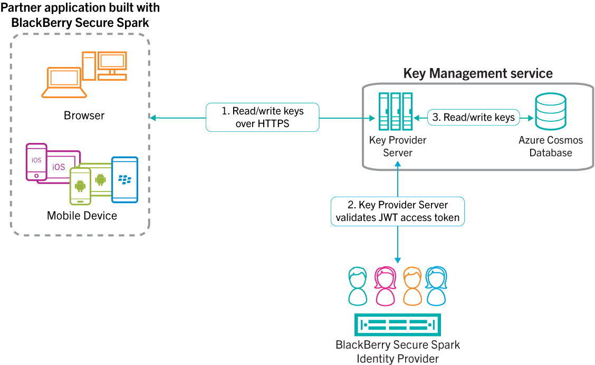

# KeyProviderServer Sample for JavaScript

The **KeyProviderServer** demonstrates how your app can enforce access control to a cloud storage solution. It provides a RESTful interface that your client app can use to export and import security keys. The **KeyProviderServer** demonstrates the following functions:

1. Provides database access to only authenticated users by validating the JWT access token that's passed by the client app.

2. Allows **only** the user to read or write their private key data.

3. Allows **only** the user to write their public key data.

4. Allows all authenticated users to read public key data.

You can use this server with popular cloud storage solutions like [Azure Cosmos DB](https://docs.microsoft.com/en-us/azure/cosmos-db/introduction). To learn more about setting up Azure Cosmos DB for Cloud Key Storage, follow the steps provided [here](https://developer.blackberry.com/files/bbm-enterprise/documents/guide/html/azureCloudKeyStorage.html).


## Getting Started

These samples require the Spark Communications SDK for JavaScript which you can find along with related resources at the location below.
    
* Getting stated with the [Spark Communications SDK](https://developers.blackberry.com/us/en/products/blackberry-spark-communications-platform.html)
* [Development Guide](https://developer.blackberry.com/files/bbm-enterprise/documents/guide/html/index.html)
* [API Reference](https://developer.blackberry.com/files/bbm-enterprise/documents/guide/reference/javascript/index.html)

<p align="center">
    <a href="https://www.youtube.com/watch?v=LAbxok2EQtI"
      target="_blank"></a>
</p>
<p align="center">
 <b>Getting started video</b>
</p>

# KeyProviderServer

The cryptographic keys used by Spark Communications Services to protect your communications are stored and distributed in [cloud storage system](https://developer.blackberry.com/files/bbm-enterprise/documents/guide/html/cloudKeyStorage.html) that you choose. Some cloud storage solutions like [Firebase](https://developer.blackberry.com/files/bbm-enterprise/documents/guide/html/firebaseCloudKeyStorage.html) satisfy all the [requirements](https://developer.blackberry.com/files/bbm-enterprise/documents/guide/html/cloudKeyStorage.html) to securely store and distribute keys to authenticated users. However, you may choose a different cloud storage solution that would require you to enforce access control on your application server.

<p align="center">
<a href="screenShots/keyProviderService-azure.png"></a>
</p>


### Configuration Settings for the KeyProviderServer

Modify the config.js file in the **KeyProviderServer** example as follows:


* Set the applicationIds value to the GUID assigned to the application that will be using the KeyProviderServer.  This may be set to an array of application ID GUIDs if you have multiple applications that will access the same KeyProviderServer instance.
```JavaScript
   applicationIds: 'YOUR APPLICATION ID',
```

* Set the tenantIds value to the GUID identifying the tenant whose users will be accessing the applications previously identified.  This may be set to the GUID for a single-tenant environment or to an array of GUIDs for a multi-tenant environment.
```JavaScript
  tenantIds: 'YOUR TENANT ID',
```

* Set the 'collectionName' to be the table name in your [instance of Azure Cosmos DB](https://developer.blackberry.com/files/bbm-enterprise/documents/guide/html/azureCloudKeyStorage.html).
```JavaScript
   collectionName: 'YOUR TABLE NAME',
```

* Set 'connectionString' value to be the connectionString of your [instance of Azure Cosmos DB](https://developer.blackberry.com/files/bbm-enterprise/documents/guide/html/azureCloudKeyStorage.html).
```JavaScript
   connectionString: 'YOUR CONNECTION STRING',
```

* Set your application's URI to be the value of 'accessControlAllowOrigin'.
```JavaScript
   accessControlAllowOrigin: 'https://myApplication.com',
```

Alternatively, you can set it to wildcard. Refer to [CORS on ExpressJS](https://enable-cors.org/server_expressjs.html) for details.

* Set the full path to your private key and public certificate.
```JavaScript
   keyPath: `${__dirname}/privateKey.pem`,
   certPath: `${__dirname}/publicCert.pem`,
```

* Set the key passphrase from your private key.
```JavaScript
  keyPassphrase: 'myPassphrase',
```

* Optionally, configure server ports or turn off SSL

By default, the **KeyProviderServer** is configured to run in HTTPS (SSL).
```JavaScript
  useSsl: true,
```

The default server port in this configuration is 3000.
```JavaScript
  serverPort: 3000,
```

* Optionally, provide a regular expression to validate the userID.

By default, KerProviderServer is configured to to work with Azure AD user IDs. This is enforced by the regular expression under the 'userIdRegex':
```JavaScript
  userIdRegex: /^[0-9a-fA-F]{8}-[0-9a-fA-F]{4}-[0-9a-fA-F]{4}-[0-9a-fA-F]{4}-[0-9a-fA-F]{12}$/
```
## Running the KeyProviderServer

Execute below commands in **KeyProviderServer** directory:

* Setup NPM packages.
```shell
yarn install
```

* Start server.
```shell
node app.js
```

## License

These samples are released as Open Source and licensed under the [Apache 2.0 License](http://www.apache.org/licenses/LICENSE-2.0.html).

## Reporting Issues and Feature Requests

If you find a issue in one of the Samples or have a Feature Request, simply file an [issue](https://github.com/blackberry/bbme-sdk-javascript-samples/issues).
