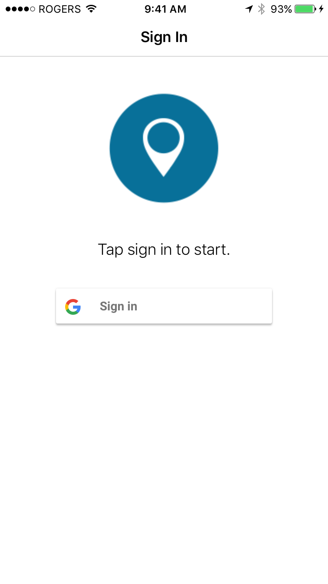
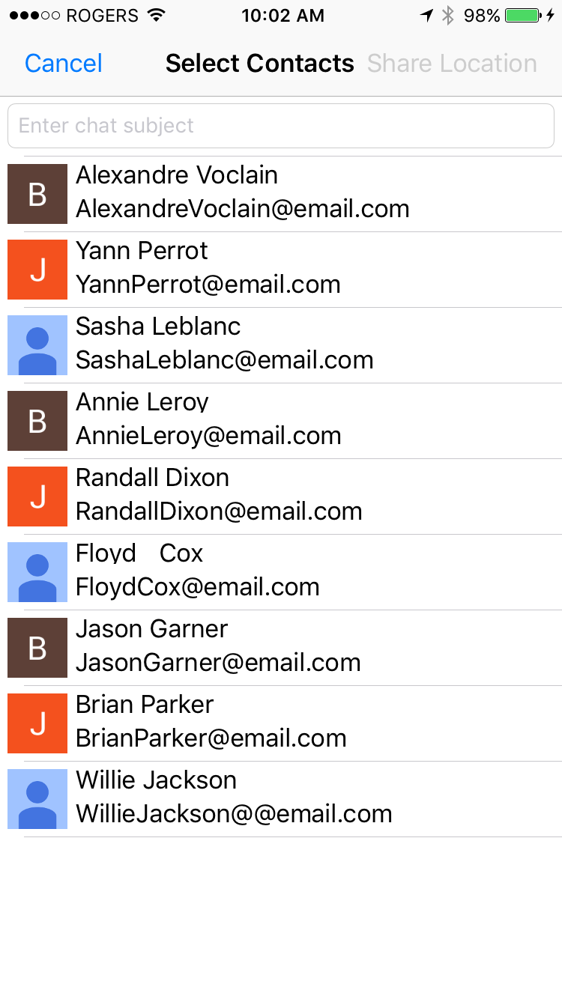
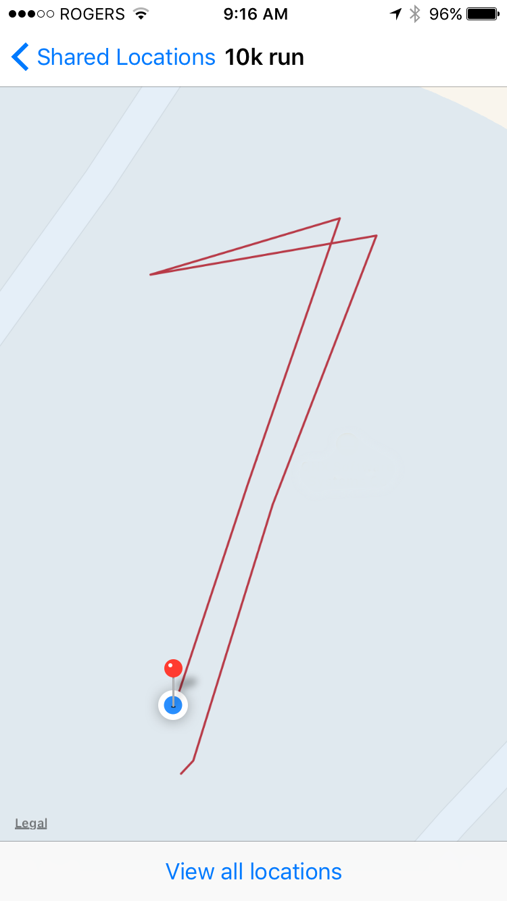
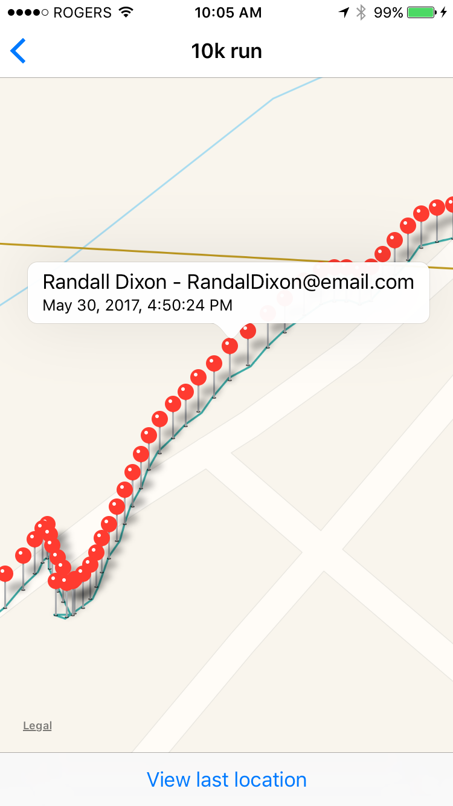

# Location Sharing App for iOS

The Location Sharing sample application demonstrates how to share a user's real-time location 
with others using Spark.
The application monitors the user's location updates using the iOS
CoreLocation APIs. The user's locations are then shared with other users in a
chat using chat messages. The application defines a custom message type that
includes the latitude and longitude coordinates of the user's location. The
application marks all of the the user's locations on a map with pins.

<p align="center">
<br>
    <a href="http://www.youtube.com/watch?feature=player_embedded&v=2p_Kevkljj4"
      target="_blank"></a>
</p>
<p align="center">
 <b>Demo video: Integrate location sharing into your Apps</b>
</p>

### Features

The following features are demonstrated:

* Starting a new chat and sharing a user's location using a chat message with custom type
* Extracting a user's location from a chat message and showing it on a map

<br>

<p align="center">
<a href="screenShots/LocationSharing_SignIn.png"></a>
<a href="screenShots/LocationSharing_SharedLocations.png"></a>
<a href="screenShots/LocationSharing_Contacts.png"></a>
<a href="screenShots/LocationSharing_Map.png"></a>
<a href="screenShots/LocationSharing_MapAllLocations.png"></a>
<a href="screenShots/LocationSharing_MapAnnotation.png"></a>
</p>

## Getting Started

This sample requires the Spark SDK, which you can find along with related resources at the location below.
    
* Getting started with the [Spark SDK](https://developers.blackberry.com/us/en/products/blackberry-bbm-enterprise-sdk.html)
* [Development Guide](https://developer.blackberry.com/files/bbm-enterprise/documents/guide/html/index.html)
* [API Reference](https://developer.blackberry.com/files/bbm-enterprise/documents/guide/reference/ios/index.html)

<p align="center">
    <a href="http://www.youtube.com/watch?feature=player_embedded&v=H1yiHSGsAIg"
      target="_blank"></a>
</p>
<p align="center">
 <b>Getting started video</b>
</p>

### Configuration

* [Sample application configuration using Google Sign-In](https://developer.blackberry.com/files/bbm-enterprise/documents/guide/html/googleSignInForiOSExamples.html)

## Walkthrough

The following explains how to use the SDK to send location information embedded in chat messages.

- [Getting started](#gettingStarted)
- [Starting a chat](#startChat)
- [Sharing current location](#sharingCurrentLocation)
- [Showing locations on a map](#showingLocations)

### <a name="gettingStarted"></a>Getting Started

The SDK is used to create chats and send chat messages with custom application data embedded in them. In this application, the location of each participant in
a chat is shared with other participants. As the user's location changes, a new chat messages is sent with the new location. These locations are then displayed on a map. Tapping on a location pin displays the time it was shared and the name of the user who shared it.

### <a name="startChat"></a>Starting a chat

To start a chat, the regIds of the participants are needed. The class ***BBMChatCreator*** is used to create a new chat.

```objective-c
- (void)startChatWithRegIds:(NSArray *)regIds subject:(NSString *)subject
{
    if(regIds.count <= 0) {
        return;
    }
    //User chat creator to start a chat with one or multiple contacts
    [self.chatCreator startConferenceWithRegIds:regIds subject:subject callback:^(NSString *chatId, BBMChatStartFailedMessageReason failReason) {
        if(chatId)
        {
            //If a chat with the given regId already exists there is no need to create a new one.
            self.lastChatId = chatId;
            //Show the chat screen
            [self performSegueWithIdentifier:@"ShowChatSegue" sender:self];
        }
        else {
            NSLog(@"Chat creation failed failReason = %d", failReason);
        }
    }];
}
```

### <a name="sharingCurrentLocation"></a>Sharing current location

The current location is obtained by using ***CLLocationManager***. When there is a location change, a new chat message that includes the latitude and longitude of the user is created and sent.

```objective-c
- (void)locationManager:(CLLocationManager *)manager didUpdateLocations:(NSArray *)locations
{
    CLLocation *location = [locations lastObject];
    NSDictionary *locationData = @{kLatitudeKey : [NSString stringWithFormat:@"%f", location.coordinate.latitude],
                                   kLongitudeKey : [NSString stringWithFormat:@"%f", location.coordinate.longitude]};
    if([locationData[kLatitudeKey] isEqualToString:self.previousLocationData[kLatitudeKey]] &&
       [locationData[kLongitudeKey] isEqualToString:self.previousLocationData[kLongitudeKey]]) {
        return;
    }
    // Send the new location data to all chats.
    for (NSString *chatId in self.chatIds) {
        [self sendLocation:locationData toChatId:chatId];
    }
    self.previousLocationData = locationData;
}
```

The location data is a dictionary that contains the latitude and the longitude. This is embedded in the [rawData](https://developer.blackberry.com/files/bbm-enterprise/documents/guide/reference/ios/interface_b_b_m_chat_message_send_message.html#a2e4b035e565a635b4f6d9df6b5a8f4be) field in a [BBMChatMessageSendMessage](https://developer.blackberry.com/files/bbm-enterprise/documents/guide/reference/ios/interface_b_b_m_chat_message_send_message.html) object and then sent. The tag for the messages is set to the custom value "Location".

```objective-c
- (void)sendLocation:(NSDictionary *)locationData toChatId:(NSString *)chatId
{
    BBMChatMessageSendMessage *msg = [[BBMChatMessageSendMessage alloc] initWithChatId:chatId tag:kMessageTag_Location];
    msg.rawData = locationData;
    [[BBMEnterpriseService service] sendMessageToService:msg];
}
```

### <a name="showingLocations"></a>Showing locations on a map

The first step to showing locations on a map is to load the location messages for a chat. This is done in the class ***LocationMessageLoader*** by creating an instance of [BBMChatMessageSendMessage](https://developer.blackberry.com/files/bbm-enterprise/documents/guide/reference/ios/interface_b_b_m_chat_message_criteria.html) and setting the tag and chatId properties. This is then passed to the model and a list containing the chat messages that match the criteria is returned. For this application we need to sort messages by user so the regId is used for that purpose. The sort operation is done inside a monitor so that changes are detected and the messages are sorted by user again.

```objective-c
-(void)observeMessages
{
    //We are only interested in messages whose tag is set to kMessageTag_Location. To fetch such
    //messages an instance of BBMChatMessageCriteria is created and the chatId and tag values are set.
    BBMChatMessageCriteria *chatMessageCriteria = [[BBMChatMessageCriteria alloc] init];
    chatMessageCriteria.tag = kMessageTag_Location;
    chatMessageCriteria.chatId = self.chat.chatId;

    self.chatMessageList = [[BBMAccess model] chatMessageWithCriteria:chatMessageCriteria];
    typeof(self) __weak weakSelf = self;
    __block NSUInteger messageCount = 0;
    self.messageMonitor = [ObservableMonitor monitorActivatedWithName:@"messageMonitor" block:^{
        //If the number of messages in the list changes, the monitor will trigger.
        if(messageCount != weakSelf .chatMessageList.count) {
            [weakSelf sortMessagesByRegId];
            messageCount = weakSelf.chatMessageList.count;
        }
     }];
}

-(void)sortMessagesByRegId {
    NSMutableDictionary *locationMessagesByRegId = [[NSMutableDictionary alloc] init];
    //Wait for the list to be current to avoid unnecessary processing.
    if(self.chatMessageList.bbmState == kBBMStatePending) {
        return;
    }
    for(BBMChatMessage *message in self.chatMessageList ) {
        //Timed message that have expired are marked as deleted so they are still displayed as expired messages.
        if([message.tag isEqualToString:kMessageTag_Location]) {
            NSNumber *regId = message.resolvedSenderUri.regId;
            NSMutableArray *locationMessagesForRegid = locationMessagesByRegId[regId];
            if(!locationMessagesForRegid) {
                locationMessagesForRegid = [[NSMutableArray alloc] init];
            }
            //Add message to array
            [locationMessagesForRegid addObject:message];
            locationMessagesByRegId[regId] = locationMessagesForRegid;
        }
    }
    if(self.callback) {
        self.callback(locationMessagesByRegId);
    }
}
```

Every time a new location is loaded the map view gets refreshed.

```objective-c
-(void)observeMessages
{
    typeof(self) __weak weakSelf = self;
    //This loads the location messages for this chat. Every time a new message arrives this
    //block will run.
    self.messageLoader = [LocationMessageLoader messageLoaderForConversation:self.chat callback:^(NSDictionary *locationMessagesByRegId) {
        //Update the map with the locations received from the message loader
        weakSelf.locationMessagesByRegId = locationMessagesByRegId;
        [weakSelf refreshMap];
    }];
}
```

The latitude and longitude are stored in the [rawData](https://developer.blackberry.com/files/bbm-enterprise/documents/guide/reference/ios/interface_b_b_m_chat_message.html#a4107b9c8feea30792181bcef87e8e918) property in every instance of [BBMChatMessage](https://developer.blackberry.com/files/bbm-enterprise/documents/guide/reference/ios/interface_b_b_m_chat_message.html).

```objective-c
- (void)setMessage:(BBMChatMessage *)message
{
    _message = message;
    
    if ([message.tag isEqualToString:kMessageTag_Location]) {
        [self willChangeValueForKey:@"coordinate"];
        self.locationData = message.rawData;
        [self didChangeValueForKey:@"coordinate"];
    }
    
    [self willChangeValueForKey:@"title"];
    self.user = [[LocationSharingApp application].userManager userForRegId:_message.resolvedSenderUri.regId];
    [self didChangeValueForKey:@"title"];
}

- (CLLocationCoordinate2D)coordinate
{
    CLLocationCoordinate2D coord;
    coord.latitude = [self.locationData[kLatitudeKey] doubleValue];
    coord.longitude = [self.locationData[kLongitudeKey] doubleValue];
    return coord;
}

```

There are two kinds of items drawn on the map: overlays and annotations. Overlays are used to draw lines connecting each of the locations of a user. Annotations are used to display a pin at each location. Tapping one of these pins will bring up the name and email address of the user as well as the time at which the location was generated.

```objective-c
- (void)refreshMap
{
    //Remove old overlays(lines) and annotations(pins)
    [self.mapView removeOverlays:self.mapView.overlays];
    [self.mapView removeAnnotations:self.mapView.annotations];

    for(NSNumber *regId in [self.locationMessagesByRegId allKeys]) {
        //The locations for each user will be connected by a line, each user has its own color.
        self.currentColor = [LocationMapAnnotation colorForRegId:regId];

        NSArray *locationMessages = self.locationMessagesByRegId[regId];
        //coordinates will be used to draw the lines.
        CLLocationCoordinate2D coordinates[locationMessages.count];
        for(int i=0; i < locationMessages.count; i++) {
            //Each message contains a latitude and longitude
            BBMChatMessage *message = locationMessages[i];
            coordinates[i] = CLLocationCoordinate2DMake(message.latitude, message.longitude);

            //Either a pin for each message is displayed or just for the most recent one.
            if(self.showAllLocations || i == locationMessages.count - 1) {
                LocationMapAnnotation *annotation  = [[LocationMapAnnotation alloc] init];
                [self.mapView addAnnotation:annotation];
                annotation.message = message;
            }
        }

        //Draw lines to connect each user's locations
        MKPolyline *polyLine = [MKPolyline polylineWithCoordinates:coordinates count:locationMessages.count];
        [self.mapView addOverlay:polyLine];
    }
}

- (MKOverlayRenderer *)mapView:(MKMapView *)mapView rendererForOverlay:(id<MKOverlay>)overlay
{
    if ([overlay isKindOfClass:[MKPolyline class]])
    {
        MKPolylineRenderer *renderer = [[MKPolylineRenderer alloc] initWithPolyline:overlay];
        renderer.strokeColor = self.currentColor;
        renderer.lineWidth   = 2;

        return renderer;
    }

    return nil;
}
```

There is a toggle option to display a pin for each location or just for the latest known location. 

```objective-c
- (IBAction)toggle:(id)sender
{
    self.showAllLocations = !self.showAllLocations;
    self.showAllLocationsBarButton.title = self.showAllLocations ? @"View last location" : @"View all locations" ;
    [self refreshMap];
}
```

## License

These samples are released as Open Source and licensed under the
[Apache 2.0 License](http://www.apache.org/licenses/LICENSE-2.0.html). 

These samples were created using SDKs from Apple Inc. and may contain code
licensed for use only with Apple products. Please review your Apple SDK
Agreement for additional details.

This page includes icons from: https://material.io/icons/ used under the [Apache 2.0 License](http://www.apache.org/licenses/LICENSE-2.0.html).

## Reporting Issues and Feature Requests

If you find a issue in one of the Samples or have a Feature Request, simply file an [issue](https://github.com/blackberry/bbme-sdk-ios-samples/issues).

