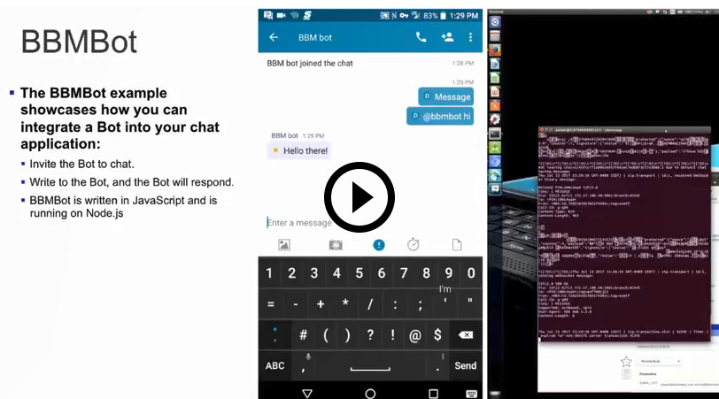

# BBMBot for JavaScript

The BBMBot example application demonstrates how to build a chat bot in Node.js
using BlackBerry Spark Communications Services.  The BBMbot uses the
[www.botlibre.com](https://www.botlibre.com) webservice as an example of how to
generate responses.

<p align="center">
<br>
    <a href="https://youtu.be/2K3y2UG0DE0"
      target="_blank"></a>
</p>
<p align="center">
 <b>Demo video: Integrate Chat Bots into your Apps</b>
</p>

### Features

With the BBMBot example, your application can do the following:

* Invite the bot to a 1:1 or multi-person chat.
* In a 1:1 chat, write to the bot, and the bot will respond.
* In a multi-person chat, the bot will respond only to messages which begin
  with `@bbmbot`.

<br/>
<p align="center">
  <a href="screenShots/BBMBot_chat.png"></a>
</p>

## Getting Started

This example requires the Spark Communications SDK, which you can find along
with related resources at the locations below.

* Instructions to
[Download and Configure](https://developer.blackberry.com/files/bbm-enterprise/documents/guide/html/gettingStarted.html)
the SDK.
* [Getting Started with Web](https://developer.blackberry.com/files/bbm-enterprise/documents/guide/html/gettingStarted-web.html)
instructions in the Developer Guide.
* [API Reference](https://developer.blackberry.com/files/bbm-enterprise/documents/guide/reference/javascript/index.html)

<p align="center">
    <a href="https://youtu.be/CSXZT2perqE"
      target="_blank"></a>
</p>
<p align="center">
 <b>Getting started video</b>
</p>

By default, this example application is configured to work in a domain with
user authentication disabled and the BlackBerry Key Management Service
enabled.  See the [Download & Configure](https://developer.blackberry.com/files/bbm-enterprise/documents/guide/html/gettingStarted.html)
section of the Developer Guide to get started configuring a
[domain](https://developer.blackberry.com/files/bbm-enterprise/documents/guide/html/faq.html#domain)
in the [sandbox](https://developer.blackberry.com/files/bbm-enterprise/documents/guide/html/faq.html#sandbox).

The bot uses the Bot Libre chatbot service to provide responses to messages.
An account can be created by going to https://botlibre.com

The bot can be created by choosing:
* Sign up (and complete sign up procedure)
* Create (and fill in bot information)
* Then choose 'Embed' and copy the application and instance information, it
  will be used below when configuring the example.

When you have a domain in the sandbox and a Bot Libre chat bot setup, edit
BBMBot's `config_mock.js` file to configure the example with your domain ID,
a key passcode, and your Bot Libre chat bot's information.

Set the `domain_id` property to your sandbox domain ID.

```javascript
  domain_id: 'your_domain_id',
```

Set the `key_passcode` property to a passcode of your choosing.  The passcode
is used to protect the bot's keys stored in the [BlackBerry Key Management
Service](https://developer.blackberry.com/files/bbm-enterprise/documents/guide/html/security.html). 

```javascript
  key_passcode: 'passcode',
```

Set the `botLibre` property to the object containing the application and
instance information that you copied earlier while setting up your Bot Libre
chat bot.

```javascript
  botLibre: {
    application: 'your_botlibre_application',
    instance: 'your_botlibre_instance'
  }
```

To setup the runtime dependencies of the BBMBot example application, you must
first install the bbm-enterprise Node.js bundle.
```shell
  yarn add <path/to/bbm-enterprise-*.tgz> --prod
```

To setup the remaining runtime dependencies, must run `yarn install --prod`.

Run `node BBMBot` in the BBMBot's application directory to run the BBMBot
example application.  By default, the BBMBot's user ID is
`SparkCommunicationsBot`.  If you want to change this, it can be changed in
the `config_mock.js` file.

You can use the [Rich Chat example
application](https://developer.blackberry.com/files/bbm-enterprise/documents/guide/html/examples/javascript/RichChat/README.html)
to start a chat with the `SparkCommunicationsBot` user.

## License

These examples are released as Open Source and licensed under the [Apache 2.0 License](http://www.apache.org/licenses/LICENSE-2.0.html).

This page includes icons from: https://material.io/icons/ used under the [Apache 2.0 License](http://www.apache.org/licenses/LICENSE-2.0.html).

## Reporting Issues and Feature Requests

If you find a issue in one of the Samples or have a Feature Request, simply file an [issue](https://github.com/blackberry/bbme-sdk-javascript-samples/issues).

