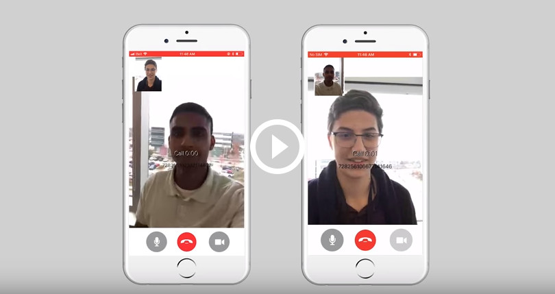

# BlackBerry Spark Communications Services
Spark Communications Services is an IP-based cloud communications platform that lets
you easily create powerful new experiences between your users, machines, and IoT
devices. Its enterprise-grade communication and data sharing functionality can
be integrated directly into your Android, iOS and web apps.
With end-to-end encryption, digitally signed messages, and guaranteed data
delivery, Spark Communications is a secure CPaaS (communications platform as a
service) solution that can enable you to build powerful connections
around the world, while keeping everything safe and secure in a
“private garden” communication system.

# Spark Communications Examples for iOS

This repository contains code for iOS example applications that you can use to
help build your messaging solution with Spark Communications.

| Example Application                      | Description                              |
| ---------------------------------------- | ---------------------------------------- |
| [Quick Start](QuickStart/README.md)      | Build a basic objective C app to initialize and authenticate|
| [Quick Start Swift](QuickStartSwift/README.md)     | Build a basic swift app to initialize and authenticate|
| [Simple Chat](SimpleChat/README.md) | Build a basic chat app|
| [Location Sharing](LocationSharing/README.md) | Build an app to share the user's location with other users|
| [Soft Phone](SoftPhone/README.md) | 	Build an app with voice and video calling|
| [Data Transfer](DataTransfer/README.md) | Build an app to send files over a secure peer-to-peer connection|
| [Chat Poll](ChatPoll/README.md) | Build an app that allows users to post polls within custom chat messages|
| [Raspberry Pi IoT Sample](RaspberryPi_IoTSample/README.md) |Build an iOS app that securely communicates with an IoT device (LED controlled by a Raspberry Pi |

For more details on all the Spark Communications examples see the online [Developer Guide](https://developer.blackberry.com/files/bbm-enterprise/documents/guide/html/examples.html).

# Getting Started

These samples require the Spark Communications SDK, which you can find along with related resources at the location below.

* Getting started with the [Spark Communications SDK](https://developers.blackberry.com/us/en/products/blackberry-bbm-enterprise-sdk.html)
* [Developer Guide](https://developer.blackberry.com/files/bbm-enterprise/documents/guide/html/index.html)
* [API Reference](https://developer.blackberry.com/files/bbm-enterprise/documents/guide/reference/ios/index.html)

    

 <b>Getting started video</b>

# License

These examples are released as Open Source and licensed under the [Apache 2.0 License](http://www.apache.org/licenses/LICENSE-2.0.html).

These examples were created using SDKs from Apple Inc. and may contain code licensed for use only with Apple products. 
Please review your Apple SDK Agreement for additional details.

This page includes icons from: https://material.io/icons/ used under the [Apache 2.0 License](http://www.apache.org/licenses/LICENSE-2.0.html).
