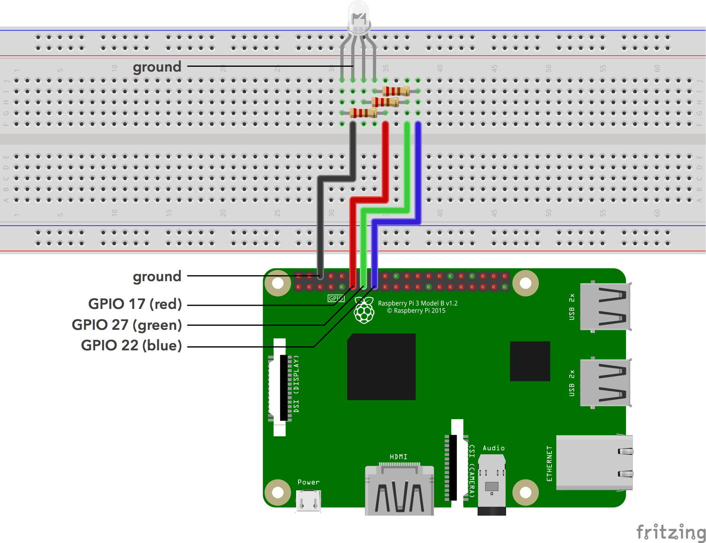

# **BlackBerry Spark Colour Picker**

The BlackBerry Spark Colour Picker provides an example of how to interface with a hardware peripheral device using the Node.js version of the BlackBerry Spark SDK. This sample reads the colour selected on a mobile application and displays it on an RGB LED connected to a Raspberry Pi.

If you would like to learn more about BlackBerry's CPaaS, be sure to head over to our [website](https://us.blackberry.com/enterprise/bbm-enterprise-sdk).

### BlackBerry Spark SDK Guide
For more details see the
[Quick Start Swift page in the BlackBerry Spark SDK Guide](https://developer.blackberry.com/files/bbm-enterprise/documents/guide/html/examples/ios/QuickStartSwift/README.html).


### Screenshots
[](screenShots/screen-shots.png)

### Features
- **Send and receive secure data** - using the BlackBerry Spark SDK to communicate between the mobile app and hardware peripheral device.
- **Build on** - using this sample, which can be used as a skeleton for more complex secure data transfer in your enterprise use case.


## Getting Started

These instructions will help you get this project up and running on your Raspberry Pi and iOS device. **Note that this project was built using the BBM-E SDK version 1.0.0-rc48 for Node.js**

### Prerequisites
**Important Note:** This project requires you have [this iOS sample](https://github.com/blackberry/bbme-sdk-ios-samples/RaspberryPi_IoTSample) running on an iOS device.
This project also requires that you have the following:
- Raspberry Pi 3 running Raspbian OS
- GPIO breakout board or equivilant jumper wires
- RGB LED
- 220 ohm 1/4W resistors (x3) (or similar)

### Installation
Make sure that Node and npm are successfully installed on your Raspberry Pi. **The project was built using Node version 9.5.0 and npm version 5.6.0.**

You will also need to [download the latest version of the BlackBerry Spark SDK for Node.js](https://developers.blackberry.com/us/en/products/blackberry-bbm-enterprise-sdk.html) on your Raspberry Pi.

To begin installing the required node libraries for this project, open your Terminal and cd into your project directory, containing the contents of this repository. Run the following command to begin package installation:
```
$ npm install
```

Once all of the packages are finished installing, you will need to install the BlackBerry Spark SDK in your project. Begin by unzipping the downloaded SDK file and renaming it 'bbm-enterprise'. Next, copy the unzipped SDK and paste it under <PROJECT_DIRECTORY_PATH>/node_modules. Finally, install the BlackBerry Spark SDK by running the following command in your project directory:
```
$ npm install <PATH_TO_YOUR_UNZIPPED_SDK_INSTANCE> --production
```
Note that PATH_TO_YOUR_UNZIPPED_SDK_INSTANCE should point towards the unzipped SDK that you copied in the previous step; it will likely be /home/pi/Downloads/bbm-enterprise.

### Hardware Setup

Using your RGB LED and the 3 resistors, set up your Raspberry Pi GPIO's as follows:
[](screenShots/rpi-setup.png)
###### This image was created with Fritzing (https://github.com/fritzing/fritzing-app) and is licensed under CC-BY-SA 3.0 (https://creativecommons.org/licenses/by-sa/3.0/)

### Configure
Your project must be configured with a BlackBerry BBME Domain, an OAuth provider, and an IdP. For this sample, we will use Google Sign-In.

Set up a new project with Google. Then open `config.js` and paste in the `client_id` and `client_secret` parameters found on [Google's Developer API Console](https://console.developers.google.com/apis/). Then head on over to your [Firebase Console](https://console.firebase.google.com/), add an new web project, and paste the configuration parameters in the `firebaseConfig` object. You will also need to paste these parameters in `node_modules/bbm-enterprise/examples/support/protect/firebase/config.js`.

Your Firebase database rules will need to be edited to allow the application the requireed access while keeping your data secure. Head to Database in your Firebase Console, then to Rules. Paste in the contents of rules.json (included in this repository).

You can find your `id_provider_domain` by logging into [BlackBerry PCE](http://account.good.com) and navigating to the application you are using for this project.


### Deploy
The app can be started with:
```
$ node BBMColourPicker.js
```
Note that this application was built for use between one iOS device and one Raspberry Pi. If multiple iOS devices are used and the application stops working, head over to  your [Firebase Console](https://console.firebase.google.com/) and delete all users from Authentication and all data from the Database.

## Authors

- **Connor Holowachuk** - Initial Work - [connor-holowachuk](https://github.com/connor-holowachuk)

## License

These samples are released as Open Source and licensed under [Apache 2.0 License](http://www.apache.org/licenses/LICENSE-2.0.html).

## Reporting Issues and Feature Requests

If you find a issue in one of the Samples or have a Feature Request, simply file an [issue](https://github.com/blackberry/bbme-sdk-ios-samples/issues).


