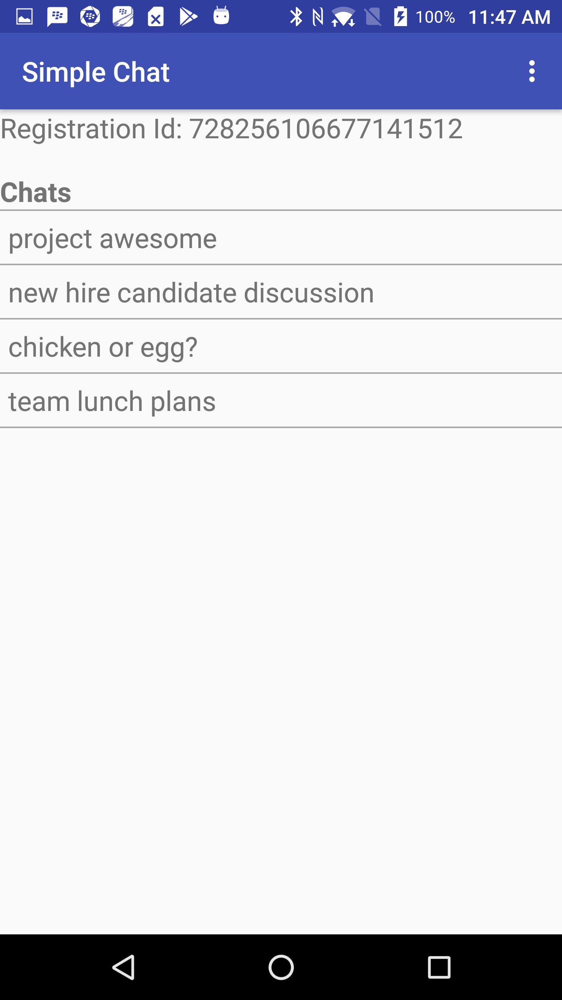
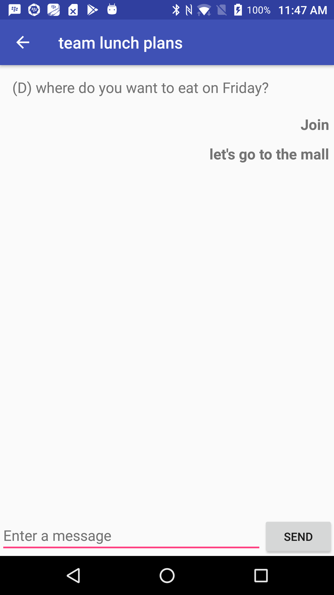

# SimpleChat for Android

The Simple Chat app demonstrates how you can build a simple chat application using the BlackBerry Spark Communications Platform.  This app demonstrates how easily messaging can be integrated into your application.  For a more rich chat app experience please see the [Rich Chat](https://developer.blackberry.com/files/bbm-enterprise/documents/guide/html/examples/android/RichChat/README.html) app provided with the Spark SDK. This example builds on the [Quick Start](../QuickStart/README.md) example that demonstrates how you can authenticate with the Spark SDK using the [Identity Provider](https://developer.blackberry.com/files/bbm-enterprise/documents/guide/html/identityManagement.html) of your application.

### Features

It allows the user to do the following:

- Create a chat
- View the chat list
- View all sent and received messages in a chat
- Send text-based messages
- Mark incoming messages as Read

<br>

<p align="center">
<a href="screenShots/chat_list.png"></a> 
<a href="screenShots/chat.png"></a> 
</p>

## Getting Started

This example requires the Spark SDK, which you can find along with related resources at the location below.

* Getting started with the [Spark SDK](https://developers.blackberry.com/us/en/products/blackberry-bbm-enterprise-sdk.html)
* [Development Guide](https://developer.blackberry.com/files/bbm-enterprise/documents/guide/html/index.html)
* [API Reference](https://developer.blackberry.com/files/bbm-enterprise/documents/guide/reference/android/index.html)

Visit the [Getting Started with Android](https://developer.blackberry.com/files/bbm-enterprise/documents/guide/html/gettingStarted-android.html) section to see the minimum requirements.

<p align="center">
    <a href="http://www.youtube.com/watch?feature=player_embedded&v=310UDOFCLWM"
      target="_blank"></a>
</p>
<p align="center">
 <b>Getting started video</b>
</p>

This example can be configured to use Google Sign-In or Azure Active Directory for authenticating your user with the Spark SDK.

* Configure this sample for [Google Sign-In](https://developer.blackberry.com/files/bbm-enterprise/documents/guide/html/googleSignInForAndroidExamples.html)
* Configure this sample for [Azure AD](https://developer.blackberry.com/files/bbm-enterprise/documents/guide/html/azureForAndroidExamples.html)

This application has been built using Gradle 4.2.1 (newer versions have not been validated).

## Walkthrough

Follow this guide for a walkthrough showing how the Spark SDK is used to demonstrate simple messaging in this sample application.

- [Spark SDK Initialization](#sdkSetup)
- [Getting chats](#gettingChats)
- [Starting a chat](#startingAChat)
- [Getting chat messages](#gettingChatMessages)
- [Displaying chat messages](#displayChatMessages)
- [Sending a chat message](#sendChatMessage)
- [Marking messages as read](#markAsRead)


### <a name="sdkSetup"></a>Spark SDK Initialization

To use the BlackBerry Spark Communications Platform SDK in our application we need to initialize and start the sdk.

```java
// Initialize BBMEnterprise SDK then start it
BBMEnterprise.getInstance().initialize(this);
BBMEnterprise.getInstance().start();
```
*MainActivity.java*

The Spark SDK will encrypt our messages for us. The SimpleChat example uses the BlackBerry Key Management System to store the security keys generated by the Spark SDK. The specifics of the key distribution are not described in this guide. For more information visit the [Protect](https://developer.blackberry.com/files/bbm-enterprise/documents/guide/html/security.html) guide and check out the example implementation in the [Spark SDK Support Library](https://developer.blackberry.com/files/bbm-enterprise/documents/guide/html/examples/android/Support/README.html).

```java
//Create a BlackBerryKMSSource as the source of the keys for the SDK
KeySource keySource = new BlackBerryKMSSource(new UserChallengePasscodeProvider(context));
KeySourceManager.setKeySource(keySource);
keySource.start();
```

Next we need to trigger the Google authentication to fetch a OAuth token. For more information see [Identity Management](https://developer.blackberry.com/files/bbm-enterprise/documents/guide/html/identityManagement.html) and the [Basic Setup Example](../QuickStart/README.md).

```java
//prompt the user to sign in with their Google account, and pass that data to our user manager when ready
GoogleAuthHelper.initGoogleSignIn(this, FirebaseUserDbSync.getInstance(), getString(R.string.default_web_client_id));
```

We monitor the [GlobalSetupState](https://developer.blackberry.com/files/bbm-enterprise/documents/guide/reference/android/com/bbm/sdk/bbmds/GlobalSetupState.html) to handle key states. First we add an [Observer](https://developer.blackberry.com/files/bbm-enterprise/documents/guide/reference/android/com/bbm/sdk/reactive/Observer.html) to the [GlobalSetupState](https://developer.blackberry.com/files/bbm-enterprise/documents/guide/reference/android/com/bbm/sdk/bbmds/GlobalSetupState.html) [ObservableValue](https://developer.blackberry.com/files/bbm-enterprise/documents/guide/reference/android/com/bbm/sdk/reactive/ObservableValue.html). When the GlobalSetupState changes our observers changed() method will be called. If the setup state is:

- *DeviceSwitchRequired* we will ask the Spark SDK to switch to this device by sending a [SetupRetry](https://developer.blackberry.com/files/bbm-enterprise/documents/guide/reference/android/com/bbm/sdk/bbmds/outbound/SetupRetry.html) message.
- *NotRequested* we will register the local device by sending a [EndpointUpdate](https://developer.blackberry.com/files/bbm-enterprise/documents/guide/reference/android/com/bbm/sdk/bbmds/outbound/EndpointUpdate.html).
- *Full* we will need to deregister a device using [EndpointDeregister](https://developer.blackberry.com/files/bbm-enterprise/documents/guide/reference/android/com/bbm/sdk/bbmds/outbound/EndpointDeregister.html). If successful then send a [SetupRetry](https://developer.blackberry.com/files/bbm-enterprise/documents/guide/reference/android/com/bbm/sdk/bbmds/outbound/SetupRetry.html) message to continue setup.

```java
//Listen to the setup events
final ObservableValue<GlobalSetupState> globalSetupState = BBMEnterprise.getInstance().getBbmdsProtocol().getGlobalSetupState();
mBbmSetupObserver = new Observer() {
    @Override
    public void changed() {
        final ObservableValue<GlobalSetupState> globalSetupState = BBMEnterprise.getInstance().getBbmdsProtocol().getGlobalSetupState();

        if (globalSetupState.get().exists != Existence.YES) {
            return;
        }

        GlobalSetupState currentState = globalSetupState.get();

        switch (currentState.state) {
            case NotRequested:
                SetupHelper.registerDevice("Simple Chat", "Simple Chat example");
                break;
            case DeviceSwitchRequired:
                //Ask the BBM Enterprise SDK to move the users profile to this device
                BBMEnterprise.getInstance().getBbmdsProtocol().send(new SetupRetry());
                break;
            case Full:
                SetupHelper.handleFullState();
                break;
            case Ongoing:
            case Success:
            case Unspecified:
                break;
        }
    }
};

//Add setup observer to the globalSetupStateObservable
globalSetupState.addObserver(mBbmSetupObserver);

//Call changed to trigger our observer to run immediately
mBbmSetupObserver.changed();
```


### <a name="gettingChats"></a>Getting chats

The [chats list](https://developer.blackberry.com/files/bbm-enterprise/documents/guide/reference/android/com/bbm/sdk/bbmds/BbmdsProtocol.html#getChatList--) is provided from the Spark SDK as an [ObservableList](https://developer.blackberry.com/files/bbm-enterprise/documents/guide/reference/android/com/bbm/sdk/bbmds/internal/lists/ObservableList). To track changes to the chat list we register an [IncrementalListObserver](https://developer.blackberry.com/files/bbm-enterprise/documents/guide/reference/android/com/bbm/sdk/bbmds/internal/lists/IncrementalListObserver) with the chats list. Our IncrementalListObserver will be informed when the chat list is modified. We pass those change notifications on to a RecyclerView.Adapter which displays the chat list.

```java
//This observer will be used to notify the adapter when chats have been changed or added.
private final IncrementalListObserver mChatListObserver = new IncrementalListObserver() {
    @Override
    public void onItemsInserted(int position, int itemCount) {
        mAdapter.notifyItemRangeInserted(position, itemCount);
    }

    @Override
    public void onItemsRemoved(int position, int itemCount) {
        mAdapter.notifyItemRangeRemoved(position, itemCount);
    }

    @Override
    public void onItemsChanged(int position, int itemCount) {
        mAdapter.notifyItemRangeChanged(position, itemCount);
    }

    @Override
    public void onDataSetChanged() {
        mAdapter.notifyDataSetChanged();
    }
};

//Get the chat list and keep a hard reference to it
mChatList = BBMEnterprise.getInstance().getBbmdsProtocol().getChatList();
//Add our incremental list observer to the chat list
mChatList.addIncrementalListObserver(mChatListObserver);

//Set the adapter in the recyclerview
final RecyclerView chatsRecyclerView = (RecyclerView)findViewById(R.id.chats_list);
chatsRecyclerView.setAdapter(mAdapter);
chatsRecyclerView.setLayoutManager(new LinearLayoutManager(MainActivity.this));
```
*MainActivity.java*


To display the chats we are using a simple RecyclerView.Adapter and ViewHolder. For this example each item in the list displays the subject of the [chat](https://developer.blackberry.com/files/bbm-enterprise/documents/guide/reference/android/com/bbm/sdk/bbmds/Chat.html). When a user clicks on one of the chats we launch the ChatActivity.

```java
//Our chats recycler view adapter
private final RecyclerView.Adapter<ChatViewHolder> mAdapter = new RecyclerView.Adapter<ChatViewHolder>() {
    @Override
    public ChatViewHolder onCreateViewHolder(ViewGroup parent, int viewType) {
        View chatView = LayoutInflater.from(MainActivity.this).inflate(R.layout.chat_item, parent, false);
        return new ChatViewHolder(chatView);
    }

    @Override
    public void onBindViewHolder(ChatViewHolder holder, int position) {
        if (!mChatList.isPending()) {
            holder.title.setText(mChatList.get(position).subject);
            holder.chat = mChatList.get(position);
        }
    }

    @Override
    public int getItemCount() {
        return mChatList.size();
    }
};

//Simple view holder to display a chat
private class ChatViewHolder extends RecyclerView.ViewHolder {

    TextView title;
    Chat chat;

    ChatViewHolder(View itemView) {
        super(itemView);
        title = (TextView)itemView.findViewById(R.id.chat_title);

        //when the chat is clicked open the chat in a new activity
        itemView.setOnClickListener(new View.OnClickListener() {
            @Override
            public void onClick(View view) {
                Intent intent = new Intent(MainActivity.this, ChatActivity.class);
                intent.putExtra("chat-id",  chat.chatId);
                startActivity(intent);
            }
        });
    }
}
```


### <a name="startingAChat"></a>Starting a chat

To start a chat we first need to indentify who we want to chat with. The Spark SDK provides a unique id for every user who registers. Your application must maintain a mapping between the identities of your users and the BBM registration id. See the [identity management](https://developer.blackberry.com/files/bbm-enterprise/documents/guide/html/identityManagement.html) guide for more information.

We display our own BBM registration id at the top of the main activity so we can provide it to another user of this application. Now, when we want to start a chat we can read the registration id from another device running this application. The registration id is a property of  [user](https://developer.blackberry.com/files/bbm-enterprise/documents/guide/reference/android/com/bbm/sdk/bbmds/User.html). So first we need to get our own user from the Spark SDK. To request a user we need to know the uri for that user.  To find our own uri we use the [GlobalLocalUri](https://developer.blackberry.com/files/bbm-enterprise/documents/guide/reference/android/com/bbm/sdk/bbmds/GlobalLocalUri.html).

```java
final TextView myRegIdTextView = (TextView)findViewById(R.id.my_registration_id);
//Observe the local user to get our registration id
mRegistrationIdObserver = new Observer() {
    @Override
    public void changed() {
        BbmdsProtocol bbmdsProtocol = BBMEnterprise.getInstance().getBbmdsProtocol();
        //Get the uri of the local user first
        GlobalLocalUri localUserUri = bbmdsProtocol.getGlobalLocalUri().get();
        if (localUserUri.getExists() == Existence.YES) {
            //Get the local user and add ourselves as an observer
            ObservableValue<User> localUser = bbmdsProtocol.getUser(localUserUri.value);
            localUser.addObserver(this);
            if (localUser.get().getExists() == Existence.YES) {
                myRegIdTextView.setText(getString(R.string.my_registration_id, localUser.get().regId));
            }
        }
    }
};
BBMEnterprise.getInstance().getBbmdsProtocol().getGlobalLocalUri().addObserver(mRegistrationIdObserver);
mRegistrationIdObserver.changed();
```
*MainActivity.java*


This sample adds a menu item which creates a dialog with input fields for a registration id and chat subject. This example only allows creating a chat with a single participant, but the Spark SDK supports chats with up to 250 participants. To start a chat we send a [ChatStart](https://developer.blackberry.com/files/bbm-enterprise/documents/guide/reference/android/com/bbm/sdk/bbmds/outbound/ChatStart.html) message to the Spark SDK.

```java
//Create a cookie to track the chat creation
final String cookie = UUID.randomUUID().toString();

//Create the invitee using the registration id
ChatStart.Invitees invitee = new ChatStart.Invitees();
invitee.regId(regId);

//Ask the BBM Enterprise SDK to start a new chat with the invitee and subject provided.
BBMEnterprise.getInstance().getBbmdsProtocol().send(new ChatStart(cookie, Lists.newArrayList(invitee), subject));
```


To track the creation of the chat we need to register a [ProtocolMessageConsumer](https://developer.blackberry.com/files/bbm-enterprise/documents/guide/reference/android/com/bbm/sdk/service/ProtocolMessageConsumer.html). The ProtocolMessageConsumer is notified of every message that the Spark SDK sends to the application. We use the cookie we sent with the ChatStart to process only the response to our request.

If the message was of type [ChatStartFailed](https://developer.blackberry.com/files/bbm-enterprise/documents/guide/reference/android/com/bbm/sdk/bbmds/inbound/ChatStartFailed.html) the Spark SDK was not able to start our chat. If the type was listAdd then the Spark SDK is returning us the chat that was created. We can parse the chat by using the [setAttributes()](https://developer.blackberry.com/files/bbm-enterprise/documents/guide/reference/android/com/bbm/sdk/bbmds/internal/JsonConstructable.html) method. Finally, we launch the chat activity and attach the chatId.

```java
//Add a ProtocolMessageConsumer to track the creation of the chat.
BBMEnterprise.getInstance().getBbmdsProtocolConnector().addMessageConsumer(new ProtocolMessageConsumer() {
    @Override
    public void onMessage(ProtocolMessage message) {
        final JSONObject json = message.getData();
        Logger.d("onMessage: " + message);
        //If the cookie in the incoming message matches the cookie we provided
        //we know this message is the response to our chatStart request.
        if (cookie.equals(json.optString("cookie",""))) {
            //this is for us, stop listening
            BBMEnterprise.getInstance().getBbmdsProtocolConnector().removeMessageConsumer(this);


            if ("chatStartFailed".equals(message.getType())) {
                //If the message type is chatStartFailed the BBM Enterprise SDK was unable to create the chat
                ChatStartFailed chatStartFailed = new ChatStartFailed().setAttributes(message.getJSON());
                Logger.i("Failed to create chat with " + regId);
                Toast.makeText(MainActivity.this, "Failed to create chat for reason " + chatStartFailed.reason.toString(), Toast.LENGTH_LONG).show();
            } else if ("listAdd".equals(message.getType())) {
                //The chat was created successfully
                try {
                    final JSONArray elementsArray = json.getJSONArray("elements");
                    Chat chat = new Chat().setAttributes((JSONObject) elementsArray.get(0));
                    //Start our chat activity
                    Intent intent = new Intent(MainActivity.this, ChatActivity.class);
                    intent.putExtra("chat-id", chat.chatId);
                    startActivity(intent);
                } catch (final JSONException e) {
                    Logger.e(e, "Failed to process start chat message " + message);
                }
            }
        }
    }

    @Override
    public void resync() {
    }
});
```


### <a name="gettingChatMessages"></a>Getting chat messages

Now that we've started a chat we need to populate the chat messages. Chat messages can be retrieved from the Spark SDK by providing a [ChatMessageKey](https://developer.blackberry.com/files/bbm-enterprise/documents/guide/reference/android/com/bbm/sdk/bbmds/ChatMessage.ChatMessageKey.html) to [getChatMessage](https://developer.blackberry.com/files/bbm-enterprise/documents/guide/reference/android/com/bbm/sdk/bbmds/BbmdsProtocol.html#getChatMessage-com.bbm.sdk.bbmds.ChatMessage.ChatMessageKey-). The ChatMessageKey is a combination of the chat id and message id and uniquely identifies a chat message. The valid set of message ids for a chat is given by [[Chat.lastMessage](https://developer.blackberry.com/files/bbm-enterprise/documents/guide/reference/android/com/bbm/sdk/bbmds/Chat.html#lastMessage) - [Chat.numMessages](https://developer.blackberry.com/files/bbm-enterprise/documents/guide/reference/android/com/bbm/sdk/bbmds/Chat.html#numMessages) , Chat.lastMessage).

In this example to load messages we are using ChatMessageList from the [Spark SDK Support Library](https://developer.blackberry.com/files/bbm-enterprise/documents/guide/html/examples/android/Support/README.html) library. ChatMessageList is a utility we've created which simplifies lazy loading of chat messages. We use ChatMessageList and the IncrementalListObserver to populate a RecyclerView.Adapter just like we did with the chats list. We do need to tell the ChatMessageList when to start and stop monitoring the chat for new messages. We only monitor messages while the activity is resumed.

```java
//This observer will notify the adapter when chat messages are added or changed.
private IncrementalListObserver mMessageListObserver = new IncrementalListObserver() {
    @Override
    public void onItemsInserted(int position, int count) {
        mAdapter.notifyItemRangeInserted(position, count);
    }

    @Override
    public void onItemsRemoved(int position, int count) {
        mAdapter.notifyItemRangeRemoved(position, count);
    }

    @Override
    public void onItemsChanged(int position, int count) {
        mAdapter.notifyItemRangeChanged(position, count);
    }

    @Override
    public void onDataSetChanged() {
        mAdapter.notifyDataSetChanged();
    }
};

//Create the ChatMessageList
mChatMessageList = new ChatMessageList(mChatId);

//Initialize the recycler view
final RecyclerView messageRecyclerView = (RecyclerView) findViewById(R.id.messages_list);
messageRecyclerView.setAdapter(mAdapter);
LinearLayoutManager layoutManager = new LinearLayoutManager(ChatActivity.this);
messageRecyclerView.setLayoutManager(layoutManager);

//Add our IncrementalListObserver to the ChatMessageList
mChatMessageList.addIncrementalListObserver(mMessageListObserver);

@Override
protected void onPause() {
    super.onPause();
    //Stop loading messages from the ChatMessageList
    mChatMessageList.stop();
    //Mark all the messages as read when closing the chat
    markMessagesAsRead();
}

@Override
protected void onResume() {
    super.onResume();
    //Start loading messages from the ChatMessageList
    mChatMessageList.start();
    //Mark all the messages as read when opening the chat
    markMessagesAsRead();
}
```
*ChatActivity.java*


### <a name="displayChatMessages"></a>Displaying chat messages

Our [ChatMessages](https://developer.blackberry.com/files/bbm-enterprise/documents/guide/reference/android/com/bbm/sdk/bbmds/ChatMessage.html) are text only in this example. But ChatMessage also supports file attachments, thumbnails, recall and custom data and types you can define.

To display the chat messages we provide our Adapter and ViewHolder. To left and right align outgoing and incoming messages we're providing two different types in our Adapter. Each chat message includes a set of [flags](https://developer.blackberry.com/files/bbm-enterprise/documents/guide/reference/android/com/bbm/sdk/bbmds/ChatMessage.Flags.html) we can check to find out if the message was incoming.
```java
@Override
public int getItemViewType(int position) {
    //Use the ChatMessage.Flag to determine if the message is incoming or outgoing and use the correct type
    ChatMessage message = mChatMessageList.get(position);
    return message.hasFlag(ChatMessage.Flags.Incoming) ? TYPE_INCOMING : TYPE_OUTGOING;
}

@Override
public MessageViewHolder onCreateViewHolder(ViewGroup parent, int viewType) {
    //The incoming message layout is right justified, outgoing left justified
    int layoutRes = viewType == TYPE_INCOMING ? R.layout.incoming_message_item : R.layout.outgoing_message_item;
    View chatView = LayoutInflater.from(ChatActivity.this).inflate(layoutRes, parent, false);
    return new MessageViewHolder(chatView);
}
```
*ChatActivity.java*


Messages have a [state](https://developer.blackberry.com/files/bbm-enterprise/documents/guide/reference/android/com/bbm/sdk/bbmds/ChatMessage.State.html) which is used to notify users if their message has been sent, delivered or read. Incoming messages that are unread are bolded and outgoing messages have their state prepended. Finally, we add the content of the text message, or if the message not a Text message then display the name of the message type.
```java
@Override
public void onBindViewHolder(MessageViewHolder holder, int position) {
    //Get the message to display
    ChatMessage message = mChatMessageList.get(position);
    if (message.getExists() == Existence.MAYBE) {
        return;
    }
    String prefix = "";
    if (message.hasFlag(ChatMessage.Flags.Incoming)) {
        if (message.state != ChatMessage.State.Read) {
            //instead of displaying sent status like BBM, just show bold until it is read
            holder.messageText.setTypeface(null, Typeface.BOLD);
        } else {
            holder.messageText.setTypeface(null, Typeface.NORMAL);
        }
    } else {
        //show the state of the outgoing message
        switch (message.state) {
            case Sending:
                prefix = "(...) ";
                break;
            case Sent:
                prefix = "(S) ";
                break;
            case Delivered:
                prefix = "(D) ";
                break;
            case Read:
                prefix = "(R) ";
                break;
            case Failed:
                prefix = "(F) ";
                break;
            default:
                prefix = "(?) ";
        }
    }
    if (message.tag.equals(ChatMessage.Tag.Text)) {
        holder.messageText.setText(prefix + message.content);
    } else {
        //For non-text messages just display the message type Tag
        holder.messageText.setText(message.tag);
    }
}
```


### <a name="sendChatMessage"></a>Sending a chat message

Sending a new message in the chat is easy. We create a [ChatMessageSend](https://developer.blackberry.com/files/bbm-enterprise/documents/guide/reference/android/com/bbm/sdk/bbmds/outbound/ChatMessageSend.html) and the text the user typed as the content. You can also set a file, thumbnail and custom JSON data to the chat message.

```java
sendButton.setOnClickListener(new View.OnClickListener() {
    @Override
    public void onClick(View v) {
        String text = inputText.getText().toString();
        if (!text.isEmpty()) {
            //Send a new outgoing text message, setting the content to the input text
            BBMEnterprise.getInstance().getBbmdsProtocol().send(new ChatMessageSend(mChatId, ChatMessageSend.Tag.Text).content(text));
            inputText.setText("");
        }
    }
});
```
*ChatActivity.java*


### <a name="markAsRead"></a>Marking messages as read

We need to notify the Spark SDK of when a user has read a message. The Spark SDK will propagate the status change to the other participants in the chat. To mark a message as read we send a [ChatMessageRead](https://developer.blackberry.com/files/bbm-enterprise/documents/guide/reference/android/com/bbm/sdk/bbmds/outbound/ChatMessageRead.html) to the Spark SDK. All messages which are older than the message id provided are automatically marked as read. To keep this example simple, we are just sending a ChatMessageRead change with the lastMessage id. This example only sends message status changes when the chat activity is paused or resumed. You might want to choose a different action, like a marking a message as read when it becomes visible in the chat.

```java
/**
 * Mark all messages in the chat as read
 */
private void markMessagesAsRead() {
    final ObservableValue<Chat> obsChat = BBMEnterprise.getInstance().getBbmdsProtocol().getChat(mChatId);
    mMarkMessagesReadObserver = new Observer() {
        @Override
        public void changed() {
            final Chat chat = obsChat.get();
            if (chat.exists == Existence.YES) {
                //remove ourselves as an observer so we don't get triggered again
                obsChat.removeObserver(this);
                if (chat.numMessages == 0 || chat.lastMessage == 0) {
                    return;
                }

                //Ask the BBM Enterprise SDK to mark the last message in the chat as read.
                //All messages older then this will be marked as read.
                BBMEnterprise.getInstance().getBbmdsProtocol().send(
                        new ChatMessageRead(mChatId, chat.lastMessage)
                );
            }
        }
    };
    //Add the chatObserver to the chat
    obsChat.addObserver(mMarkMessagesReadObserver);
    //Run the changed method
    mMarkMessagesReadObserver.changed();
}
```
*ChatActivity.java*

## License

These samples are released as Open Source and licensed under the [Apache 2.0 License](http://www.apache.org/licenses/LICENSE-2.0.html).

The Android robot is reproduced or modified from work created and shared by Google and used according to terms described in the [Creative Commons 3.0 Attribution License](https://creativecommons.org/licenses/by/3.0/).

This page includes icons from: https://material.io/icons/ used under the [Apache 2.0 License](http://www.apache.org/licenses/LICENSE-2.0.html).

## Reporting Issues and Feature Requests

If you find an issue in one of the Samples or have a Feature Request, simply file an [issue](https://github.com/blackberry/bbme-sdk-android-samples/issues).

