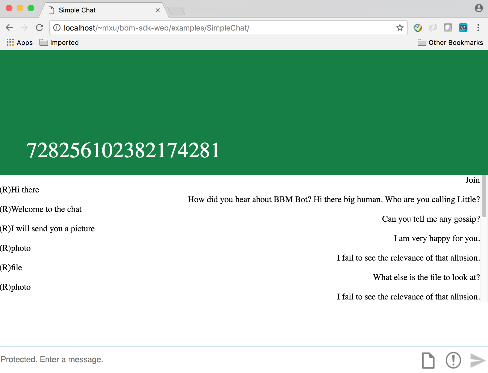

# Simple Chat for JavaScript

The Simple Chat app demonstrates how you can build a simple chat application 
using the Spark SDK for JavaScript.  This app demonstrates how easily messaging can be integrated into your application.  For a more rich chat app experience please see the [Rich Chat](https://developer.blackberry.com/files/bbm-enterprise/documents/guide/html/examples/javascript/RichChat/README.html) app provided with the SDK. This example builds on the 
[Quick Start](../QuickStart/README.md) example that demonstrates how you can 
authenticate with the Spark SDK using the [Identity Provider](https://developer.blackberry.com/files/bbm-enterprise/documents/guide/html/identityManagement.html) of your application.

### Features

It allows the user to do the following:

- Create a chat
- View the chat list
- View all sent and received messages in a chat
- Send text-based messages
- Mark incoming messages as Read

<br>

<p align="center">
<a href="screenShots/SimpleChat.png"></a>
</p>

## Getting Started

This samples requires the Spark SDK, which you can find along with related resources at the location below.
    
* Getting started with the [Spark SDK](https://developers.blackberry.com/us/en/products/blackberry-bbm-enterprise-sdk.html)
* [Development Guide](https://developer.blackberry.com/files/bbm-enterprise/documents/guide/html/index.html)
* [API Reference](https://developer.blackberry.com/files/bbm-enterprise/documents/guide/reference/javascript/index.html)

<p align="center">
    <a href="https://www.youtube.com/watch?v=LAbxok2EQtI"
      target="_blank"></a>
</p>
<p align="center">
 <b>Getting started video</b>
</p>

### Prerequisites

Run "yarn install" in the SimpleChat application directory to install the required packages.

Visit the [Getting Started with Web](https://developer.blackberry.com/files/bbm-enterprise/documents/guide/html/gettingStarted-web.html) section to see the minimum requirements.

To use the SimpleChat example, you must set up the following elements in js/config.js:

- Oauth2 configuration (AUTH_CONFIGURATION)
- Your Spark user domain (ID_PROVIDER_DOMAIN)
- Firebase configuration (FIREBASE_CONFIG)
- User passcode (USER_SECRET)


## Walkthrough

Follow this guide for a walkthrough of how to display a list of chats and a list of messages in one chat.

- [Import the bbmChatList UI widget into your web application](#importChatList)
- [Import the bbmChatMessageList UI widget into your web application](#importChatMessageList)
- [Initialize the Spark SDK for JavaScript](#init)

### <a name="importChatList"></a>Import the bbmChatList UI widget into your web application

Your web application needs to import the bbmChatList widget in order to display a list of chats.

```html
  <link rel="import" href="node_modules/bbmChatList/bbmChatList.html">
```

The element is initialized with a template to give the appearance for each chat.

```html
<bbm-chat-list id="chatList" style="height:100%">
  <template>
    <button id="[[chat.chatId]]" onclick="enterChat(this)">[[getChatName(chat)]]</button>
  </template>
</bbm-chat-list>
```

The bbmChatList widget only needs the messenger object and it will do the rest. It optionally takes a context object as well, which can be used to resolve the names of functions, as in the above getChatName.

```javascript
chatList.setBbmMessenger(messenger);
chatList.setContext({
  // Get the name to use for the chat. This is the other participant's
  // registration ID for a 1:1 chat, otherwise it is the chat's
  // subject.
  getChatName: function(chat) {
    if(chat.isOneToOne) {
      if(chat.participants[0].regId ===
          bbmsdk.getRegistrationInfo().regId) {
        return chat.participants[1].regId.toString();
      } else {
        return chat.participants[0].regId.toString();
      }
    } else {
      return chat.subject;
    }
  }
});
```

### <a name="importChatMessageList"></a>Import the bbmChatMessageList UI widget into your web application

Your web application needs to import the bbmChatMessageList widget in order to display the messages in a chat.

```html
  <link rel="import" href="node_modules/bbmChatMessageList/bbmChatMessageList.html">
```

The chatMessageList element is initialized with a template to give the appearance for each message. The richChatMessageList element may be used in place of the chatMessageList element. It does not require a template, instead it provides a default appearance for each message.

```html
<bbm-chat-message-list id="chatMessageList" style="display: none; height:100%">
  <template id="bubbleTemplate">
    <div style="text-align:[[getMessageAlignment(message)]]">[[getMessageStatus(message)]][[getMessageContent(message)]]</div>
  </template>
</bbm-chat-message-list>
```

The bbmChatMessageList widget only needs the messenger object and it will do the rest. It optionally takes a context object as well, which can be used to resolve the names of functions, as in the above getChatName.

```javascript
chatMessageList.setBbmMessenger(messenger);
chatMessageList.setContext({
   /**
    * A function to retrieve the status indicator to use for a message.
    *
    * @param {BBMEnterprise.ChatMessage} message
    *   The message to retrieve status for.
    * @returns {string}
    *   (R) for read messages, (D) for delivered messages, nothing
    *   otherwise.
    */
  getMessageStatus: function(message) {
    if(message.isIncoming) {
      return '';
    }

    switch(message.state.value) {
      case 'Sending':
        return '(...)';
      case 'Sent':
        return '(S)';
      case 'Delivered':
        return '(D)';
      case 'Read':
        return '(R)';
      case 'Failed':
        return '(F)';
      default:
        return '(?)';
    }
  },


   /**
    * A function to retrieve the content to use for a message.
    *
    * @param {BBMEnterprise.Messenger.ChatMessage} message
    *   The message to retrieve content for.
    * @returns {string}
    *   The content for a Text message, and other appropriate values
    *   for other types of messages.
    */
  getMessageContent: function(message) {
    if(message.tag === 'Text') {
      return message.content;
    } else {
      return message.tag;
    }
  },

  /**
   * A function to retrieve the alignment to use for a message.
   *
   * @param {BBMEnterprise.ChatMessage} message
   *   The message to retrieve alignment for.
   * @returns {string}
   *   The alignment for the message.
   */
  getMessageAlignment: function(message) {
    return message.isIncoming ? 'right' : 'left';
  }
});

```

### <a name="init"></a>Initialize the Spark SDK for JavaScript

```javascript
  // Create a BBMEnterprise instance.
  bbmeSdk = new BBMEnterprise({
    domain: ID_PROVIDER_DOMAIN,
    environment: ID_PROVIDER_ENVIRONMENT,
    userId: authUserInfo.userId,
    getToken: authManager.getBbmSdkToken,
    description: navigator.userAgent,
    messageStorageFactory: BBMEnterprise.StorageFactory.SpliceWatcher,
    kmsArgonWasmUrl: KMS_ARGON_WASM_URL
  });
```

For more information about setting up the Spark SDK for JavaScript, visit the [Getting Started with Web](https://developer.blackberry.com/files/bbm-enterprise/documents/guide/html/gettingStarted-web.html) section of the guide.

## License

These samples are released as Open Source and licensed under the [Apache 2.0 License](http://www.apache.org/licenses/LICENSE-2.0.html).

## Reporting Issues and Feature Requests

If you find a issue in one of the Samples or have a Feature Request, simply file an [issue](https://github.com/blackberry/bbme-sdk-javascript-samples/issues).
