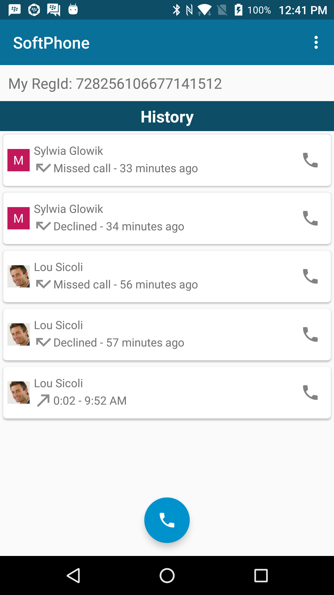

# Soft Phone for Android

The SoftPhone app demonstrates how voice and video calling can be integrated into your application using the BlackBerry Spark Communications Platform. This example builds on the [Quick Start](../QuickStart/README.md) example that demonstrates how you can authenticate with the Spark SDK using the [Identity Provider](https://developer.blackberry.com/files/bbm-enterprise/documents/guide/html/identityManagement.html) of your application.

<br>

<p align="center">
    <a href="http://www.youtube.com/watch?feature=player_embedded&v=InEfjPafPas"
      target="_blank"></a>
</p>
<p align="center">
 <b>Demo video: Integrate voice and video into your apps</b>
</p>

### Features

The SoftPhone sample app allows the user to do the following:

- Start a call by typing in a regId
- Accept/Decline incoming calls
- View a call history list
- Enable video in a call

<br>
<p align="center"> 
<a href="screenShots/SoftPhone_call_history.png"></a>
<a href="screenShots/SoftPhone_incoming.png"></a>
<a href="screenShots/SoftPhone_call.png"></a>
</p>

## Getting Started

This example requires the Spark SDK, which you can find along with related resources at the location below.

* Getting started with the [Spark SDK](https://developers.blackberry.com/us/en/products/blackberry-bbm-enterprise-sdk.html)
* [Development Guide](https://developer.blackberry.com/files/bbm-enterprise/documents/guide/html/index.html)
* [API Reference](https://developer.blackberry.com/files/bbm-enterprise/documents/guide/reference/android/index.html)

Visit the [Getting Started with Android](https://developer.blackberry.com/files/bbm-enterprise/documents/guide/html/gettingStarted-android.html) section to see the minimum requirements.

<p align="center">
    <a href="http://www.youtube.com/watch?feature=player_embedded&v=310UDOFCLWM"
      target="_blank"></a>
</p>
<p align="center">
 <b>Getting started video</b>
</p>

This example can be configured to use Google Sign-In or Azure Active Directory for authenticating your user with the Spark SDK.

* Configure this sample for [Google Sign-In](https://developer.blackberry.com/files/bbm-enterprise/documents/guide/html/googleSignInForAndroidExamples.html)
* Configure this sample for [Azure AD](https://developer.blackberry.com/files/bbm-enterprise/documents/guide/html/azureForAndroidExamples.html)

This application has been built using Gradle 4.2.1 (newer versions have not been validated).

## Walkthrough

Follow this guide for a walkthrough explaining how the Spark SDK is used to add voice and video calling in this sample application.

- [Getting started](#gettingStarted)
- [Observing a call](#observing)
- [Audio routing](#audio)
- [Adding video](#video)
- [Building a call log](#history)


### <a name="gettingStarted"></a>Getting Started

The Spark SDK makes it easy to add VOIP calling into your application. This tutorial will walk through the SoftPhone sample code to explain the voice and video APIs in the Spark SDK.


#### Permissions for Voice and Video

To enable calling in our application we first have to add the required permissions into our Manifest. The CAMERA permissions is required only if your application will be using video calls.

```xml
<!-- Voice and video calling -->
<uses-permission android:name="android.permission.BLUETOOTH" />
<uses-permission android:name="android.permission.RECORD_AUDIO" />
<uses-permission android:name="android.permission.CAMERA" />
<uses-permission android:name="android.permission.MODIFY_AUDIO_SETTINGS" />
```


#### Starting a call

Starting a call is as easy as using the [startCall()](https://developer.blackberry.com/files/bbm-enterprise/documents/guide/reference/android/com/bbm/sdk/media/BBMEMediaManager.html#startCall-long-boolean-com.bbm.sdk.media.BBMECallCreationObserver-) method. If your application compiles with Android M+, we also need to ask for the RECORD_AUDIO permission before we can start a voice call. If you wish to start a video call directly we also need to ask for the CAMERA permission.

```java
/**
 * Starts a call with the registration id provided. If RECORD_AUDIO permission has not be granted it will prompt the user first.
 */
@SuppressWarnings("MissingPermission")
public static void makeCall(final Activity activity, Fragment fragment, final long regId) {

    sRegIdToCall = regId;
    //Check for permission to access the microphone before starting an outgoing call
    if (PermissionsUtil.checkOrPromptSelfPermission(activity, fragment,
            Manifest.permission.RECORD_AUDIO,
            PermissionsUtil.PERMISSION_RECORD_AUDIO_FOR_VOICE_CALL,
            R.string.rationale_record_audio, PermissionsUtil.sEmptyOnCancelListener)) {

        //Ask the media service to start a call with the specified regId and include an observer to be notified of the result
        BBMEnterprise.getInstance().getMediaManager().startCall(regId, false, new BBMECallCreationObserver() {
            @Override
            public void onCallCreationSuccess(int callId) {
                addObserverToCall(callId);

                //The call was started successfully. Open our call activity
                Intent inCallIntent = new Intent(activity, InCallActivity.class);
                inCallIntent.putExtra(InCallActivity.EXTRA_CALL_ID, callId);
                activity.startActivity(inCallIntent);
            }

            @Override
            public void onCallCreationFailure(@NonNull BBMEMediaManager.Error error) {
                //The call wasn't able to be started, provide an error to the user
                Toast.makeText(activity, activity.getString(R.string.error_starting_call, error.name()), Toast.LENGTH_LONG).show();
            }
        });
    }
}
```
*CallUtils.java*


We add a [BBMECallCreationObserver](https://developer.blackberry.com/files/bbm-enterprise/documents/guide/reference/android/com/bbm/sdk/media/BBMECallCreationObserver.html) to take action when the call has been created, or handle errors if the call could not be started. In this example we will launch our call activity when the call has been created.

```java
@SuppressWarnings("MissingPermission")
private static void startCall(final Activity activity, long regId) {
    //Ask the media service to start a call with the specified regId and include an observer to be notified of the result
    BBMEnterprise.getInstance().getMediaManager().startCall(regId, false, new BBMECallCreationObserver() {
        @Override
        public void onCallCreationSuccess(int callId) {
            addObserverToCall(callId);

            //The call was started successfully. Open our call activity
            Intent inCallIntent = new Intent(activity, InCallActivity.class);
            inCallIntent.putExtra(InCallActivity.EXTRA_CALL_ID, callId);
            activity.startActivity(inCallIntent);
        }

        @Override
        public void onCallCreationFailure(@NonNull BBMEMediaManager.Error error) {
            //The call wasn't able to be started, provide an error to the user
            Toast.makeText(activity, activity.getString(R.string.error_starting_call, error.name()), Toast.LENGTH_LONG).show();
        }
    });
}
```
*CallUtils.java*


#### Listen for incoming calls

Now that we've started a call, what about when someone is calling us? To be notified of incoming calls we need to add a [BBMEIncomingCallObserver](https://developer.blackberry.com/files/bbm-enterprise/documents/guide/reference/android/com/bbm/sdk/media/BBMEIncomingCallObserver.html) with the media manager.

```java
//Add incoming call observer
BBMEnterprise.getInstance().getMediaManager().
addIncomingCallObserver(new IncomingCallObserver(SoftPhoneApplication.this));
```
*SoftPhoneApplication.java*


Our incoming call observer will launch an activity to prompt the user to answer or decline the call. Optionally, we can choose to [accept()](https://developer.blackberry.com/files/bbm-enterprise/documents/guide/reference/android/com/bbm/sdk/media/BBMEMediaManager.html#acceptCall-int-l) an incoming call before answering. Accepting the call allows the Spark SDK to start negotiating the audio for the call early, which can help prevent any audio delay when the call is answered.


```java
//If we have audio permissions we can accept the call immediately
if (ContextCompat.checkSelfPermission(mContext, Manifest.permission.RECORD_AUDIO) == PackageManager.PERMISSION_GRANTED) {
    BBMEnterprise.getInstance().getMediaManager().acceptCall(callId);
}

VoiceVideoUtils.addObserverToCall(callId);

Intent incomingCallIntent = new Intent(mContext, IncomingCallActivity.class);
incomingCallIntent.putExtra(IncomingCallActivity.INCOMING_CALL_ID, callId);
incomingCallIntent.setFlags(Intent.FLAG_ACTIVITY_NEW_TASK);
mContext.startActivity(incomingCallIntent);
```
*IncomingCallObserver.java*


#### Answer or decline an incoming call

Before answering a call we need RECORD_AUDIO permission. To answer or decline a call, use [answer()](https://developer.blackberry.com/files/bbm-enterprise/documents/guide/reference/android/com/bbm/sdk/media/BBMEMediaManager.html#answerCall-int-l) or [endCall()](https://developer.blackberry.com/files/bbm-enterprise/documents/guide/reference/android/com/bbm/sdk/media/BBMEMediaManager.html#endCall-int-l).

```java
if (mediaManager.answerCall(getIncomingCall().getCallId()) == BBMEMediaManager.Error.NO_ERROR) {
    //Start our call activity
    Intent inCallIntent = new Intent(IncomingCallActivity.this, InCallActivity.class);
    inCallIntent.putExtra(InCallActivity.EXTRA_CALL_ID, mCallId);
    startActivity(inCallIntent);
}
```

***Tip: if your application needs to allow calls to appear above a lock screen use these  window flags.***
```java
//Set window flags to allow our activity to appear above the device lock screen
getWindow().addFlags(WindowManager.LayoutParams.FLAG_DISMISS_KEYGUARD |
        WindowManager.LayoutParams.FLAG_SHOW_WHEN_LOCKED |
        WindowManager.LayoutParams.FLAG_TURN_SCREEN_ON |
        WindowManager.LayoutParams.FLAG_KEEP_SCREEN_ON);
```
*IncomingCallActivity.java*


#### Determine if a call is in progress

To find out if a call is currently in progress, we get the id of the active call with [getActiveCallId()](https://developer.blackberry.com/files/bbm-enterprise/documents/guide/reference/android/com/bbm/sdk/media/BBMEMediaManager.html#getActiveCallId--). Once we have the active call id we can fetch the [call](https://developer.blackberry.com/files/bbm-enterprise/documents/guide/reference/android/com/bbm/sdk/media/BBMECall.html) object using [getCall()](https://developer.blackberry.com/files/bbm-enterprise/documents/guide/reference/android/com/bbm/sdk/media/BBMEMediaManager.html#getCall-int-). The call state can be checked with [getCallState()](https://developer.blackberry.com/files/bbm-enterprise/documents/guide/reference/android/com/bbm/sdk/media/BBMECall.html#getCallState--). This code will display a banner in the main activity allowing the user to reopen the call activity if a call is in progress.


```java
/**
 * Track if a call is currently in progress
 */
private ObservableMonitor InACallMonitor = new ObservableMonitor() {
    @Override
    protected void run() {
        int callId = BBMEnterprise.getInstance().getMediaManager().getActiveCallId().get();
        BBMECall activeCall = BBMEnterprise.getInstance().getMediaManager().getCall(callId).get();
        if (activeCall.getExists() == Existence.YES && activeCall.getCallState() != BBMECall.CallState.CALL_STATE_DISCONNECTED) {
            AppUser user = UserManager.getInstance().getUser(activeCall.getRegId()).get();
            String displayName = user.getExists() == Existence.YES ? user.getName() : Long.toString(activeCall.getRegId());
            mActiveCallText.setText(getString(R.string.in_active_call, displayName));
            mActiveCallBar.setVisibility(View.VISIBLE);
        } else {
            mActiveCallBar.setVisibility(View.GONE);
        }
    }
};
```
*MainActivity.java*


### <a name="observing"></a>Observing Calls

You may find it useful to observe the state of an active call. We can add our [BBMECallObserver](https://developer.blackberry.com/files/bbm-enterprise/documents/guide/reference/android/com/bbm/sdk/media/BBMECallObserver.html) using [addObserver()](https://developer.blackberry.com/files/bbm-enterprise/documents/guide/reference/android/com/bbm/sdk/media/BBMECall.html#addObserver-com.bbm.sdk.media.BBMECallObserver-). In this example we are using our observer to play a ringtone when the call starts ringing on the receivers device. The observer must be registered with each new call that is started.


```java
//Add a call observer
BBMECall call = BBMEnterprise.getInstance().getMediaManager().getCall(callId).get();
call.addObserver(mCallObserver);
```
When we get the call back telling us that the call has started ringing on the remote end we start the ringer on the local device.

```java
@Override
public void onOutgoingCallRinging(@NonNull BBMECall bbmeCall) {
    //When the call starts ringing on the other side start playing our ringer.
    if (mOutgoingRingPlayer == null) {
        try {
            mOutgoingRingPlayer = new MediaPlayer();
            mOutgoingRingPlayer.setAudioStreamType(AudioManager.STREAM_VOICE_CALL);
            AssetFileDescriptor afd = SoftPhoneApplication.getAppContext().getResources().openRawResourceFd(R.raw.bbm_outgoing_call);
            if (afd == null) {
                Logger.e("Outgoing call resource not found");
                return;
            }
            mOutgoingRingPlayer.setDataSource(afd.getFileDescriptor(), afd.getStartOffset(), afd.getLength());
            afd.close();
            mOutgoingRingPlayer.setLooping(true);

            mOutgoingRingPlayer.setOnPreparedListener(new MediaPlayer.OnPreparedListener() {
                @Override
                public void onPrepared(MediaPlayer mp) {
                    mOutgoingRingPlayer.start();
                }
            });
            mOutgoingRingPlayer.prepare();
        } catch (final IOException ioe) {
            Logger.e(ioe, "Error playing outgoing call ringtone");
            mOutgoingRingPlayer = null;
        } catch (final Resources.NotFoundException nfe) {
            Logger.e(nfe, "Error loading outgoing call ringtone");
            mOutgoingRingPlayer = null;
        }
    }
}
```
*CallUtils.java*

### <a name="audio"></a>Audio Routing

The Spark SDK allows you to choose the audio routing path for your call. The audio output can be routed to the handset speaker, speaker phone, wired headset or Bluetooth.

#### Changing the audio routing

To get the active audio device we can use [getActiveAudioDevice()](https://developer.blackberry.com/files/bbm-enterprise/documents/guide/reference/android/com/bbm/sdk/media/BBMEMediaManager.html#getActiveAudioDevice--). We can also get the list of available audio devices using [getAvailableAudioDevices()](https://developer.blackberry.com/files/bbm-enterprise/documents/guide/reference/android/com/bbm/sdk/media/BBMEMediaManager.html#getAvailableAudioDevices--) and set a new audio device with [setActiveAudioDevice()](https://developer.blackberry.com/files/bbm-enterprise/documents/guide/reference/android/com/bbm/sdk/media/BBMEMediaManager.html#setActiveAudioDevice-com.bbm.sdk.media.BBMEMediaManager.AudioDevice-). You may wish to display the list of audio devices to the user, in our example we are looping through the audio devices one at a time.


```java
/**
 * Monitor the muted state and the active audio device
 */
private final ObservableMonitor mControlsActionMonitor = new ObservableMonitor() {
    @Override
    public void run() {

        BBMECall call = getCall();

        if (call.getCallState() == BBMECall.CallState.CALL_STATE_IDLE) {
            //In case this monitor gets triggered after the call is completed
            return;
        }

        //Display the appropriate mute icon
        boolean muted = call.isMuted();
        mMuteButton.setImageResource(muted ? R.drawable.ic_mute_on : R.drawable.ic_mute_off);

        if (mAudioSelectorItem != null) {
            //Get the active audio device and find the right icon for that device
            BBMEMediaManager mediaManager = BBMEnterprise.getInstance().getMediaManager();
            BBMEMediaManager.AudioDevice activeAudioDevice = mediaManager.getActiveAudioDevice().get();
            switch (activeAudioDevice) {
                case SPEAKER:
                    mAudioSelectorItem.setIcon(R.drawable.ic_speaker);
                    break;
                case HEADSET:
                    mAudioSelectorItem.setIcon(R.drawable.ic_wired_headset);
                    break;
                case BLUETOOTH:
                    mAudioSelectorItem.setIcon(R.drawable.ic_bluetooth);
                    break;
                case HANDSET:
                default:
                    mAudioSelectorItem.setIcon(R.drawable.ic_handset);
                    break;
            }
        }
    }
};
```

Here is how to change the active audio state using the media manager.

```java
Logger.gesture("Audio selector clicked", InCallActivity.class);
BBMEMediaManager mediaManager = BBMEnterprise.getInstance().getMediaManager();

//Get a list of available audio devices
List<BBMEMediaManager.AudioDevice> devices = mediaManager.getAvailableAudioDevices().get();

//Cycle the list to the next available audio device
int nextIndex = (devices.indexOf(mediaManager.getActiveAudioDevice().get()) + 1) % devices.size();
mediaManager.setActiveAudioDevice(devices.get(nextIndex));
```
*InCallActivity.java*


#### Muting the microphone

To mute the local users microphone just use [muteMicrophone()](https://developer.blackberry.com/files/bbm-enterprise/documents/guide/reference/android/com/bbm/sdk/media/BBMEMediaManager.html#muteMicrophone-int-boolean-).


```java
/**
 * Mute microphone click listener
 */
private View.OnClickListener mMuteClickListener = new View.OnClickListener() {
    @Override
    public void onClick(View view) {
        Logger.gesture("Mute clicked", InCallActivity.class);
        BBMECall call = getCall();
        //Flip the mute state
        BBMEnterprise.getInstance().getMediaManager().muteMicrophone(call.getCallId(), !call.isMuted());
    }
};
```
*InCallActivity.java*


### <a name="video"></a>Video

Calls in the Spark SDK can have video added at any point if both users support it. To support video both users must have a device with KitKat (API 19)+. Video may not be possible if the data connection is poor. To determine if a user supports video use [isVideoCapable()](https://developer.blackberry.com/files/bbm-enterprise/documents/guide/reference/android/com/bbm/sdk/media/BBMEMediaManager.html#isVideoCapable--), to determine if the call supports video use [isVideoSupported()](https://developer.blackberry.com/files/bbm-enterprise/documents/guide/reference/android/com/bbm/sdk/media/BBMECall.html#isVideoSupported--).


#### Starting video

Video is started on the call by enabling the camera with [setCameraEnabled()](https://developer.blackberry.com/files/bbm-enterprise/documents/guide/reference/android/com/bbm/sdk/media/BBMEMediaManager.html#setCameraEnabled-boolean-com.bbm.sdk.media.BBMECameraOperationCallback-). Remember to get the CAMERA permission before attempting to start the camera. Stopping the camera is also done with setCameraEnabled. You can include a [BBMECameraOperationCallback](https://developer.blackberry.com/files/bbm-enterprise/documents/guide/reference/android/com/bbm/sdk/media/BBMECameraOperationCallback.html) to be notified when the operation has completed.

```java
@SuppressWarnings("MissingPermission")
/**
 * Utility method to start or stop the camera.
 * The setCameraEnabled method is asynchronous.
 * A BBMECameraOperationCallback can be included to be notified when the action is completed.
 */
private void startStopCamera() {
    //If we dont' have a local viewport then enable the camera (true), otherwise disable the camera (false)
    BBMEnterprise.getInstance().getMediaManager().setCameraEnabled(mLocalVideoRenderer == null, mCameraOnCallback);
    //Disable the button until the current camera operation has completed
    //This avoids the user pressing the button multiple times and the service potentially being overloaded.
    mEnableCameraButton.setEnabled(false);
    //Show a progress spinner over the camera icon, when the action is completed we will remove the spinner
    mVideoProgessBar.setVisibility(View.VISIBLE);
}
```
*InCallActivity.java*

#### Displaying the video

The call will be updated when video content is available or has been removed. The video is provided via the [BBMEVideoRenderer](https://developer.blackberry.com/files/bbm-enterprise/documents/guide/reference/android/com/bbm/sdk/media/BBMEVideoRenderer.html) class. You can get the video renderers by using [getLocalVideoRenderer()](https://developer.blackberry.com/files/bbm-enterprise/documents/guide/reference/android/com/bbm/sdk/media/BBMECall.html#getLocalVideoRenderer--) and [getRemoteVideoRenderer()](https://developer.blackberry.com/files/bbm-enterprise/documents/guide/reference/android/com/bbm/sdk/media/BBMECall.html#getRemoteVideoRenderer--). Each [BBMEVideoRenderer](https://developer.blackberry.com/files/bbm-enterprise/documents/guide/reference/android/com/bbm/sdk/media/BBMEVideoRenderer.html) includes a surface view where the video is drawn. The application can choose to add the surface view as desired to their layout hierarchy. The video surface view can be obtained with [getView()](https://developer.blackberry.com/files/bbm-enterprise/documents/guide/reference/android/com/bbm/sdk/media/BBMEVideoRenderer.html#getView--).

***Tip: if your surface views for local and remote video overlap (picture in picture) make sure to use setZOrderMediaOverlay(true) on the view being display above the other***


```java
/**
 * Monitor the video renderers.
 * When a local or remote video renderer is added or removed we will add or remove the video surface views.
 */
private final ObservableMonitor mVideoRenderersMonitor = new ObservableMonitor() {
    @Override
    protected void run() {
        BBMECall call = getCall();

        mLocalVideoRenderer = call.getLocalVideoRenderer();
        if (mLocalVideoRenderer != null) {
            if (mLocalVideoSurface != mLocalVideoRenderer.getView()) {
                if (mLocalVideoSurface != null) {
                    //Make sure the existing surface view is removed
                    removeViewFromParent(mLocalVideoSurface);
                }
                mLocalVideoSurface = mLocalVideoRenderer.getView();
                mLocalVideoRenderer.setScalingType(BBMEVideoRenderer.SCALE_ASPECT_FIT, BBMEVideoRenderer.SCALE_ASPECT_FIT);
                mLocalVideoSurface.setZOrderMediaOverlay(true);
                FrameLayout.LayoutParams layoutParams = new FrameLayout.LayoutParams(FrameLayout.LayoutParams.WRAP_CONTENT, FrameLayout.LayoutParams.WRAP_CONTENT);
                layoutParams.gravity = Gravity.CENTER;
                mLocalVideoSurface.setLayoutParams(layoutParams);
                mLocalVideoLayout.addView(mLocalVideoSurface);
            }
        } else {
            removeViewFromParent(mLocalVideoSurface);
        }
        mEnableCameraButton.setImageResource(mLocalVideoRenderer == null ? R.drawable.ic_video_off : R.drawable.ic_video_on);

        BBMEVideoRenderer remoteVideoRenderer = call.getRemoteVideoRenderer();
        if (remoteVideoRenderer != null) {
            if (mRemoteVideoSurface != remoteVideoRenderer.getView()) {
                if (mRemoteVideoSurface != null) {
                    //Make sure the existing surface view is removed
                    removeViewFromParent(mRemoteVideoSurface);
                }
                mRemoteVideoSurface = remoteVideoRenderer.getView();
                remoteVideoRenderer.setScalingType(BBMEVideoRenderer.SCALE_ASPECT_BALANCED, BBMEVideoRenderer.SCALE_ASPECT_BALANCED);
                FrameLayout.LayoutParams layoutParams = new FrameLayout.LayoutParams(FrameLayout.LayoutParams.WRAP_CONTENT, FrameLayout.LayoutParams.WRAP_CONTENT);
                layoutParams.gravity = Gravity.CENTER;
                mRemoteVideoSurface.setLayoutParams(layoutParams);
                mRemoteVideoLayout.addView(mRemoteVideoSurface, 0);
            }
        } else {
            removeViewFromParent(mRemoteVideoSurface);
        }
    }
};
```
*InCallActivity.java*

#### Scaling video

The Spark SDK supports several scaling types for the video content. The scaling types effect how the video is displayed within the view. You should decide which aspect scaling type best fits the needs of your UI. Changes to the video scaling will only take effect after a layout is preformed. The scaling can be changed for each video renderer by using [setScalingType()](https://developer.blackberry.com/files/bbm-enterprise/documents/guide/reference/android/com/bbm/sdk/media/BBMEVideoRenderer.html#setScalingType-int-int-).

When setting the scaling you can choose a different scaling to use when the video orientation matches your layout orientation and when it doesn't match. For example you may wish to use SCALE_ASPECT_FILL if the orientation matches and SCALE_ASPECT_BALANCE if it does not.

```java
/**
 * Set the scaling method for the video content within the view.
 * Changes to the scaling type will only take effect after a layout occurs.
 * If the measureSpec of the surfaceView is EXACTLY {@link BBMEVideoRenderer#SCALE_ASPECT_FILL} will be used regardless of the scaling type set.
 * @param matchingOrientationScaling the scaling type to use when the video source orientation matches the surface view orientation
 * @param mismatchOrientationScaling the scaling type to use when the video source orientation and surface view orientation do not match
 * @since R4
 */
public void setScalingType(@ScaleType int matchingOrientationScaling, @ScaleType int mismatchOrientationScaling)

/**
 * Video is scaled to fill the size of the view by maintaining the aspect ratio.
 * Some portion of the video frame may be clipped.
 * @since R4
 */
public static final int SCALE_ASPECT_FILL = 0;

/**
 * Compromise between FIT and FILL. Video will fill as much as possible of the view while maintaining aspect ratio.
 * @since R4
 */
public static final int SCALE_ASPECT_BALANCED = 1;

/**
 * Video is scaled to fit the size of the view by maintaining the aspect ratio (black borders may be displayed).
 * SCALE_ASPECT_FIT is the default scaling used.
 * @since R4
 */
public static final int SCALE_ASPECT_FIT = 2;
```
*BBMEVideoRenderer.java*

#### Switching the camera

You can swap between the available cameras using [switchCamera()](https://developer.blackberry.com/files/bbm-enterprise/documents/guide/reference/android/com/bbm/sdk/media/BBMEMediaManager.html#switchCamera-com.bbm.sdk.media.BBMECameraOperationCallback-).


```java
BBMEnterprise.getInstance().getMediaManager().switchCamera(new BBMECameraOperationCallback() {
    @Override
    public void onSuccess() {
        //Re-enable button
        mHandler.postDelayed(new Runnable() {
            public void run() {
                mSwitchCameraItem.setEnabled(true);
            }
        }, VIDEO_BUTTON_RENABLE_DELAY);
    }

    @Override
    public void onError() {
        //Unable to switch cameras, inform the user with a toast
        mHandler.postDelayed(new Runnable() {
            public void run() {
                AlertDialog.Builder builder = new AlertDialog.Builder(InCallActivity.this);
                builder.setMessage(R.string.video_chat_cannot_switch_cameras);
                builder.show();
                mSwitchCameraItem.setEnabled(true);
            }
        }, VIDEO_BUTTON_RENABLE_DELAY);
    }
});
```
*InCallActivity.java*

### <a name="history"></a> Building a call log

When a call has completed [getCallLog()](https://developer.blackberry.com/files/bbm-enterprise/documents/guide/reference/android/com/bbm/sdk/media/BBMECall.html#getCallLog--) will be populated with the reason the call ended. For example [BBMECall.CallLog.ENDED](https://developer.blackberry.com/files/bbm-enterprise/documents/guide/reference/android/com/bbm/sdk/media/BBMECall.CallLog.html#ENDED) for calls that ended normally, or [BBMECall.CallLog.UNAVAILABLE](https://developer.blackberry.com/files/bbm-enterprise/documents/guide/reference/android/com/bbm/sdk/media/BBMECall.CallLog.html#UNAVAILABLE) for a  user that couldn't be reached. In this example we are using the call log values and the BBM chat to build a visual call log. When a call ends the caller will send a chat message with the time, duration and log reason. The caller and the callee can display those chat messages as a call history. This makes the call history cloud based instead of local, and identity based rather than tied to the device endpoint.

#### Sending a Call log message

When the call ends, we will generate a new CALL_EVENT_TAG type [chat message](https://developer.blackberry.com/files/bbm-enterprise/documents/guide/reference/android/com/bbm/sdk/bbmds/ChatMessage.html). The [ChatMessage.data](https://developer.blackberry.com/files/bbm-enterprise/documents/guide/reference/android/com/bbm/sdk/bbmds/ChatMessage.html#data) will hold the meta data about the call. The time, duration and log reason.


```java
if (bbmeCall.isIncomingCall()) {
    //Only outgoing caller will generate a call log entry
    return;
}

//Start a new chat (or find the existing chat) and add a new call entry message
ChatStartHelper.startNewChat(new long[]{bbmeCall.getRegId()}, "", new ChatStartHelper.ChatStartedCallback() {
    @Override
    public void onChatStarted(@NonNull String chatId) {
        //Create a CallHistoryEvent using the meta data from the call
        CallHistoryEvent callHistoryEvent = new CallHistoryEvent()
                .setCallEndTime(callEndTime)
                .setCallLogReason(bbmeCall.getCallLog())
                .setCallDuration(System.currentTimeMillis() - bbmeCall.getCallStartTime());

        //Send the call log chat message
        //We are creating the chat message with a custom tag "CALL_EVENT"
        //This will allow us to retrieve only the CALL_EVENT chat messages to create a call history
        ChatMessageSend callMessage = new ChatMessageSend(chatId, CALL_EVENT_TAG);
        //Attach the call history event data to the chat message.
        callMessage.data(callHistoryEvent.getJSONObject());
        BBMEnterprise.getInstance().getBbmdsProtocol().send(callMessage);
    }

    @Override
    public void onChatStartFailed(ChatStartFailed.Reason reason) {
        //Ignoring the chat start failure
    }
});
```
*CallUtils.java*


#### Building the combined call history

To create our call log we need to find all of the call event messages matching our custom type CALL_EVENT_TAG. To do this we are going to compute a list by [asking](https://developer.blackberry.com/files/bbm-enterprise/documents/guide/reference/android/com/bbm/sdk/bbmds/BbmdsProtocol.html#getChatMessageList-com.bbm.sdk.bbmds.ChatMessageCriteria-) for the chat messages with [ChatMessageCriteria](https://developer.blackberry.com/files/bbm-enterprise/documents/guide/reference/android/com/bbm/sdk/bbmds/ChatMessageCriteria.html) tag=CALL_EVENT_TAG. We are combining the messages from all of the chats into one single call history list.


```java
/**
 * This monitor gets all of the chat messages from all users with the "CALL_EVENT" tag.
 * These messages are added to a SortedList which is attached to a RecyclerView adapter
 */
private ObservableMonitor mCallHistoryEventMonitor = new ObservableMonitor() {
    @Override
    protected void run() {
        BbmdsProtocol protocol = BBMEnterprise.getInstance().getBbmdsProtocol();
        //Iterate through all of the chats
        for (Chat chat : protocol.getChatList().get()) {

            //Skip chats without keys or messages
            if (chat.keyState != Chat.KeyState.Synced && chat.numMessages <= 0) {
                continue;
            }

            //Get the list of chat messages where the Tag = CALL_EVENT
            ChatMessageCriteria criteria = new ChatMessageCriteria().tag(CallUtils.CALL_EVENT_TAG).chatId(chat.chatId);
            final ObservableList<ChatMessage> callEventMessages = protocol.getChatMessageList(criteria);

            //Check if the matching list of messages is pending
            if (!callEventMessages.isPending()) {
                //Loop through all of the messages
                for (ChatMessage message : callEventMessages.get()) {
                    //Checking here to make sure that these messages are valid call events.
                    if (!message.hasFlag(ChatMessage.Flags.Deleted) && message.data != null && !mEventsMap.containsKey(message.getPrimaryKey())) {
                        //Add the registration ID of the caller to the call event
                        ChatParticipantCriteria participantCriteria = new ChatParticipantCriteria().chatId(chat.chatId);
                            ObservableList<ChatParticipant> participants = protocol.getChatParticipantList(participantCriteria);
                        if (!participants.isPending() && participants.size() > 0) {
                            User user = BBMEnterprise.getInstance().getBbmdsProtocol().getUser(participants.get(0).userUri).get();
                            if (user.exists == Existence.YES) {
                                //Create a call history event and set the attributes from the message.data
                                final CallHistoryEvent event = new CallHistoryEvent();
                                event.setAttributes(message.data);
                                //Set the call as incoming if the chat message is incoming
                                event.setIsIncomingCall(message.hasFlag(ChatMessage.Flags.Incoming));
                                event.setParticipantRegId(user.regId);
                                //Add the call history event to the list
                                mEventsMap.put(message.getPrimaryKey(), event);
                                mSortedHistoryEvents.add(event);
                            }
                        }
                    }
                }
            }
        }
    }
};
```
*CallHistoryFragment.java*


#### Displaying the call log

Displaying the call log is easy, we can observe the call history event list we've made and notify our adapter when items have changed in the list. Then all we need is a RecyclerView to display the call history list.


```java
//This sorted list informs the adapter when items have changed
private SortedList<CallHistoryEvent> mSortedHistoryEvents = new SortedList<>(
        CallHistoryEvent.class, new SortedList.Callback<CallHistoryEvent>() {

    @Override
    public void onInserted(int position, int count) {
        mCallHistoryAdapter.notifyItemRangeInserted(position, count);
    }

    @Override
    public void onRemoved(int position, int count) {
        mCallHistoryAdapter.notifyItemRangeRemoved(position, count);
    }

    @Override
    public void onMoved(int fromPosition, int toPosition) {
        mCallHistoryAdapter.notifyItemMoved(fromPosition, toPosition);
    }

    @Override
    public int compare(CallHistoryEvent left, CallHistoryEvent right) {
        if (left.getCallEndTime() < right.getCallEndTime()) {
            return 1;
        } else if (left.getCallEndTime() == right.getCallEndTime()) {
            return 0;
        }
        return -1;
    }

    @Override
    public void onChanged(int position, int count) {
        mCallHistoryAdapter.notifyItemRangeChanged(position, count);
    }

    @Override
    public boolean areContentsTheSame(CallHistoryEvent oldItem, CallHistoryEvent newItem) {
        return (oldItem == null && newItem == null)
                || oldItem != null && oldItem.equals(newItem);
    }

    @Override
    public boolean areItemsTheSame(CallHistoryEvent item1, CallHistoryEvent item2) {
        return areContentsTheSame(item1, item2);
    }
});

/**
 * Create an adapter using the call history event list.
 */
private RecyclerView.Adapter<CallHistoryEventViewHolder> mCallHistoryAdapter = new RecyclerView.Adapter<CallHistoryEventViewHolder>() {

    @Override
    public CallHistoryEventViewHolder onCreateViewHolder(ViewGroup parent, int viewType) {
        LayoutInflater inflater = LayoutInflater.from(parent.getContext());
        View itemView = inflater.inflate(R.layout.call_history_item, parent, false);

        final CallHistoryEventViewHolder holder = new CallHistoryEventViewHolder(itemView);
        itemView.findViewById(R.id.call_history_item_call_button).setOnClickListener(new View.OnClickListener() {
            @Override
            public void onClick(View view) {
                if (holder.mRegId != 0) {
                    CallUtils.makeCall(getActivity(), CallHistoryFragment.this, holder.mRegId);
                } else {
                    Toast.makeText(getContext(), R.string.error_no_regid, Toast.LENGTH_LONG).show();
                }
            }
        });

        return holder;
    }

    @Override
    public void onBindViewHolder(CallHistoryEventViewHolder holder, int position) {
        holder.bindHolder(position);
    }

    @Override
    public int getItemCount() {
        return mCallHistoryEvents.size();
    }

    @Override
    public void onViewRecycled(CallHistoryEventViewHolder holder) {
        holder.onRecycled();
    }
};
```
*CallHistoryFragment.java*

## License

These samples are released as Open Source and licensed under the [Apache 2.0 License](http://www.apache.org/licenses/LICENSE-2.0.html).

The Android robot is reproduced or modified from work created and shared by Google and used according to terms described in the [Creative Commons 3.0 Attribution License](https://creativecommons.org/licenses/by/3.0/).

This page includes icons from: https://material.io/icons/ used under the [Apache 2.0 License](http://www.apache.org/licenses/LICENSE-2.0.html).

## Reporting Issues and Feature Requests

If you find an issue in one of the Samples or have a Feature Request, simply file an [issue](https://github.com/blackberry/bbme-sdk-android-samples/issues).
