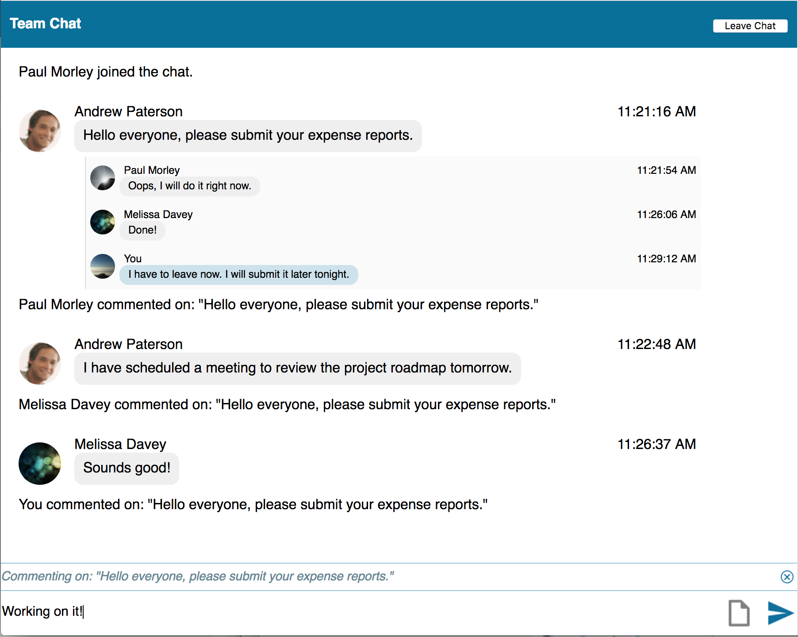
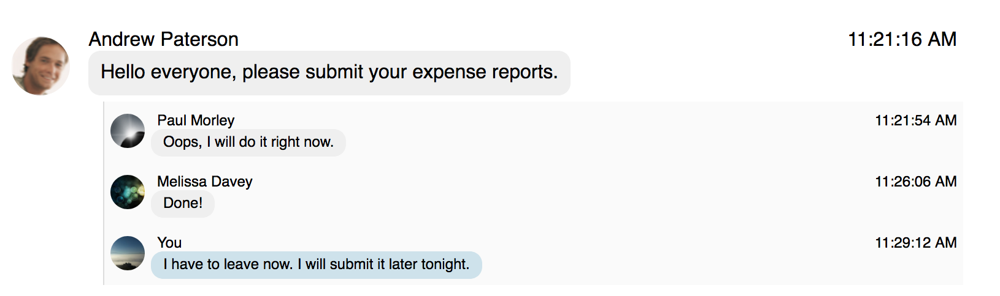

# Threaded Chat Sample for JavaScript

The Threaded Chat sample application demonstrates how a user can post comments
on other messages in a chat to create threaded conversations using the [Chat
Message
References](https://developer.blackberry.com/files/bbm-enterprise/documents/guide/html/messages.html#references)
feature of BlackBerry Spark Communications Services.

This example utilizes the
[Support](https://developer.blackberry.com/files/bbm-enterprise/documents/guide/html/examples/javascript/support/README.html)
library to quickly create a basic chat application.  For a more rich chat
application experience, please see the [Rich
Chat](https://developer.blackberry.com/files/bbm-enterprise/documents/guide/html/examples/javascript/RichChat/README.html)
app provided with the SDK.

This example builds on the [Simple Chat](../SimpleChat/README.md) example that
demonstrates how you can create a basic chat application in a domain with
user authentication disabled and with the BlackBerry Key Management Service
enabled.

### Features

This example expands on the functionality of the [Simple
Chat](../SimpleChat/README.md) example to allow the logged-in user to:

* Post a comment on a message in a chat
* View comments on a message as a threaded conversation
* View inline notification when someone makes a comment on a message

<br/>
<p align="center">
  <a href="screenShots/ThreadedChat.png"></a>
</p>


## Getting Started

This example requires the Spark Communications SDK, which you can find along
with related resources at the locations below.

* Instructions to
[Download and Configure](https://developer.blackberry.com/files/bbm-enterprise/documents/guide/html/gettingStarted.html)
the SDK.
* [Getting Started with Web](https://developer.blackberry.com/files/bbm-enterprise/documents/guide/html/gettingStarted-web.html)
instructions in the Developer Guide.
* [API Reference](https://developer.blackberry.com/files/bbm-enterprise/documents/guide/reference/javascript/index.html)

<p align="center">
    <a href="https://youtu.be/CSXZT2perqE"
      target="_blank"></a>
</p>
<p align="center">
  <b>Getting started video</b>
</p>

By default, this example application is configured to work in a domain with
user authentication disabled and the BlackBerry Key Management Service
enabled.  See the [Download & Configure](https://developer.blackberry.com/files/bbm-enterprise/documents/guide/html/gettingStarted.html)
section of the Developer Guide to get started configuring a
[domain](https://developer.blackberry.com/files/bbm-enterprise/documents/guide/html/faq.html#domain)
in the [sandbox](https://developer.blackberry.com/files/bbm-enterprise/documents/guide/html/faq.html#sandbox).

When you have a domain in the sandbox, edit Threaded Chat's `config_mock.js`
file to configure the example with your domain ID and a key passcode.

Set the `DOMAIN_ID` parameter to your sandbox domain ID.

```javascript
const DOMAIN_ID = 'your_domain_id';
```

Set the `KEY_PASSCODE` parameter to the string used to protect the logged-in
user's keys stored in the [BlackBerry Key Management Service](https://developer.blackberry.com/files/bbm-enterprise/documents/guide/html/security.html).
Real applications should not use the same passcode for all users.   However,
it allows this example application to be smaller and focus on demonstrating
its call functionality instead of passcode management.

```javascript
const KEY_PASSCODE = 'passcode';
```

Run `yarn install` in the Threaded Chat application directory to install the
required packages.

When you run the Threaded Chat application, it will prompt you for a user ID.
Because you've configured your domain to have user authentication disabled, you
can enter any string you like for the user ID and an SDK identity will be
created for it.  Other applications that you run in the same domain will be
able to find this identity by this user ID.

The Threaded Chat example application cannot initiate a chat.  Configure the
[Rich
Chat](https://developer.blackberry.com/files/bbm-enterprise/documents/guide/html/examples/javascript/RichChat/README.html)
example application to use your domain and initiate a chat with the user
logged into Threaded Chat.

## Walkthrough

Before interaction with the user's chats can begin, the user must be
[authenticated](https://developer.blackberry.com/files/bbm-enterprise/documents/guide/html/gettingStarted-web.html#authentication)
and the [SDK
started](https://developer.blackberry.com/files/bbm-enterprise/documents/guide/html/gettingStarted-web.html#start-sdk).

Follow this guide for a walkthrough of how the threaded message list component
defined for this example builds on the `bbmChatMessageList` and `bbmChatInput`
components from the
[Support](https://developer.blackberry.com/files/bbm-enterprise/documents/guide/html/examples/javascript/support/README.html)
library to:

- [Extend the bbmChatMessageList component](#extendChatMessageList)
- [Display a threaded conversation](#displayThreadedConversation)
- [Make a comment on a message](#makeComment)

### <a name="extendChatMessageList"></a>Extend the bbmChatMessageList component

The threaded message list component uses the `bbmChatMessageList` component's
template to customize how each message in the chat should appear.

The top-level messages are messages that do not themselves reference another
message.  These are displayed without any special indentation or decoration.
Each top-level message may be referenced by clicking on the chevron that
appears when your mouse hovers over the message and selecting 'Comment' from
the menu that appears.

The comment messages are messages that reference one of the top-level
messages.  These are listed beneath the top-level message that they reference
in the order that they were received.

```html
  <!--
    This defines the contents of the menu that appears when clicking on the
    chevron associated with any given top-level chat message.
  -->
  <div class="chevronDropdown" id="chevronDropdown"
       style="margin-left:9px;margin-top:9px;">
    <div class="bbmChatMenuButton" on-click="commentMessage">Comment</div>
  </div>

  <!--
    Extend the bbmChatmessageList component so that we can display a
    top-level message in a chat with any messages that reference it nested
    beneath it.
  -->
  <bbm-chat-message-list id="list" items="[]" as="message">
    <template id="bubbleTemplate">
      <!-- Visible if this is a status message. -->
      <div class="messageRow">
        <div class="status
             " style$="display:[[message.isStatus]]">[[message.content]]</div>
        <div class="messageRow" style$="display:[[message.isText]]">
          <!--
            The main bubble wrapper for a top-level message that does not
            reference another message.
          -->
          <div class="bubble-wrapper" style$="display:[[message.isBubble]]">
            <!-- Avatar -->
            
            <!-- Bubble content with header -->
            <div class="bubble">
              <!-- First row -->
              <div class="firstRow">
                <div>[[message.username]]</div>
                <div>[[message.timestamp.formattedTime]]</div>
              </div>
              <!-- Second row -->
              <div class="secondRowWithChevron" on-mouseenter="showChevron"
                   on-mouseleave="hideChevron">
                <div class="secondRow"
                     style$="margin-left: [[message.indent]]; background-color: [[message.backgroundColor]]">
                  <!-- Text content -->
                  <div style="flex-direction: column; margin: 0px 5px 0px 5px;">
                    <div style$="display:[[message.isText]];">
                      <div class="bubble-content">
                        [[message.content]]
                      </div>
                    </div>
                  </div>
                </div>
                <!--
                  The chevron menu icon that will appear when the user's
                  mouse hovers over the message.  When clicked, the
                  chevronDropDown menu will be shown.
                -->
                <div class="chevronPlaceholder">
                  <div class="chevron"
                    style$="background-image: url('[[getChevronImage()]]')"
                    on-click="showChevronDropdown">
                  </div>
                </div>
              </div>
            </div>
          </div>
           <!--
             The container for the messages that reference the above
             top-level message.
           -->
          <template is="dom-repeat" items="{{message.refBys}}">
            <div class="refMessageRow"
                 style$="margin-left: [[message.childIndent]]; background-color: [[message.childBackgroundColor]]">
              <div class="child-bubble-wrapper">
                <!-- Avatar -->
                
                <!-- Bubble content with header -->
                <div class="child-bubble">
                  <!-- First row -->
                  <div class="child-firstRow">
                    <div>[[item.childMessageUsername]]</div>
                    <div>[[item.timestamp.formattedTime]]</div>
                  </div>
                  <!-- Second row -->
                  <div class="child-secondRow"
                       style$="background-color: [[item.bubbleBackgroundColor]]">
                    <!-- Text content -->
                    <div style="flex-direction: column; margin: 0px 5px 0px 5px;">
                      <div class="child-bubble-content">
                        [[item.childMessageContent]]
                      </div>
                    </div>
                  </div>
                </div>
              </div>
            </div>
          </template>
        </div>
      </div>
    </template>
  </bbm-chat-message-list>

```

### <a name="displayThreadedConversation"></a>Display a threaded conversation

Please refer to the Developer Guide for an overview of [Chat Message
References](https://developer.blackberry.com/files/bbm-enterprise/documents/guide/html/messages.html#references).

Each
[`BBMEnterprise.Messenger.ChatMessage`](https://developer.blackberry.com/files/bbm-enterprise/documents/guide/reference/javascript/BBMEnterprise.Messenger.ChatMessage.html)
instance contains a list of
outgoing and incoming references.

All top-level messages that are not referenced will be displayed in their own
message bubble.

The
[`BBMEnterprise.Messenger.ChatMessage.ref`](https://developer.blackberry.com/files/bbm-enterprise/documents/guide/reference/javascript/BBMEnterprise.Messenger.ChatMessage.html#ref)
property, when present, indicates that the message references another message
in the chat.  In this example, the reference will be for one of the top-level
messages.  When a message arrives that references a top-level message, a
'system' message will be injected into the chat indicating who commented on
what message.

The following code snippet can be found in the `js/threadedChat.js` file in
the `format` function of the threaded chat message list component.

```javascript
  if(message.ref) {
    // The message being formatted references a top-level message.  This
    // example only references a single message at a time.
    //
    // We format this message as a 'system' message to be injected into
    // the chat message list.
    if(message.ref && message.ref[0]
        && message.ref[0].tag === REFERENCE_TAG_THREADED) {
     this.formatCommentSystemMessage(message.ref[0].messageId, ret);
    }
  }
```

<p align="center">
  <a href="screenShots/ThreadedMessage.png"></a>
</p>

The
[`BBMEnterprise.Messenger.ChatMessage.refBy`](https://developer.blackberry.com/files/bbm-enterprise/documents/guide/reference/javascript/BBMEnterprise.Messenger.ChatMessage.html#refBy)
property, when present, indicates that the message is referenced by another
message in the chat.  In this example, only top-level messages are referenced
by other messages.  So, the messageIds of the comments associated with a
top-level message can be obtained by looking at the `messageIds` array of the
reference with the `Threaded` tag.

The following code snippet can be found in the `js/threadedChat.js` file in
the `format` function of the threaded chat message list component.

```javascript
  if(message.refBy) {
    // The message being formatted is referenced by at least one other
    // message.  Format each of the messages that reference this messages
    // as 'comment' messages.
    ret.refBys = [];
    for (const ref of message.refBy) {
      if (ref.tag === REFERENCE_TAG_THREADED) {
        for (const messageId of ref.messageIds) {
          this.formatCommentMessage(messageId, ret);
        }
        // We've handled the only reference tag type we care about, so we
        // can exit the loop early.
        break;
      }
      // Ignore all other reference tag types.
    }
  }
```

<p align="center">
  <a href="screenShots/ThreadedMessageList.png"></a>
</p>

### <a name="makeComment"></a>Make a commment on a message

The function for sending a source message that refers to a target message is
integrated into the `bbmChatInput` component.  Your application needs to
provide the `bbmChatInput` component with the details of the message being
referenced.

The `commentMessage()` function on the threaded chat message list component is
called when the 'Comment' option is selected from the chevron drop down menu.
This will trigger the `messageReference` event to be fired and the
`bbmChatInput` component to gain focus.

```javascript
  /**
   * Dispatch an event to notify listeners that a message is being commented
   * on.
   */
  commentMessage() {
    // Dispatch the 'messageReference' event.
    this.dispatchEvent(new CustomEvent('messageReference', {
      'detail': {
        // The messageId of the message being referenced.
        targetMessageId: this.selectedMessage.message.messageId,
        // The reference tag to use when referencing the message.
        refTag: REFERENCE_TAG_THREADED,
        // What text to show when we are composing a comment on the
        // referenced message.
        content:
          `${REFERENCE_COMMENT_FIELD_TEXT} "${this.selectedMessage.content}"`,
        // What text to show as the comment.
        textMessage: ""
      }
    }));
    chatInput.focus();
  }
```

In order for the `bbmChatInput` component to reference the message identified
in the `messageReference` event, an event listener must be configured on the
threaded chat message list component.

```javascript
  // When a message is referenced, we will show the referenced message
  // information in the bbmChatInput component.
  chatMessageList.addEventListener('messageReference', e => {
    chatInput.showRefField(e);
  });
```

When the user enters their comment and presses `Enter` or clicks the Send
button, the top-level message will be referenced by the message that sends the
comment.

<p align="center">
  <a href="screenShots/Input.png"></a>
</p>

## License

These examples are released as Open Source and licensed under the [Apache 2.0 License](http://www.apache.org/licenses/LICENSE-2.0.html).

## Reporting Issues and Feature Requests

If you find a issue in one of the Samples or have a Feature Request, simply file an [issue](https://github.com/blackberry/bbme-sdk-javascript-samples/issues).
