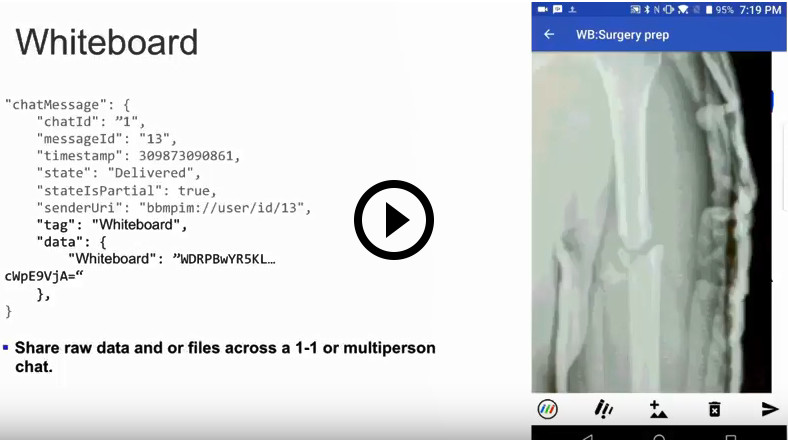
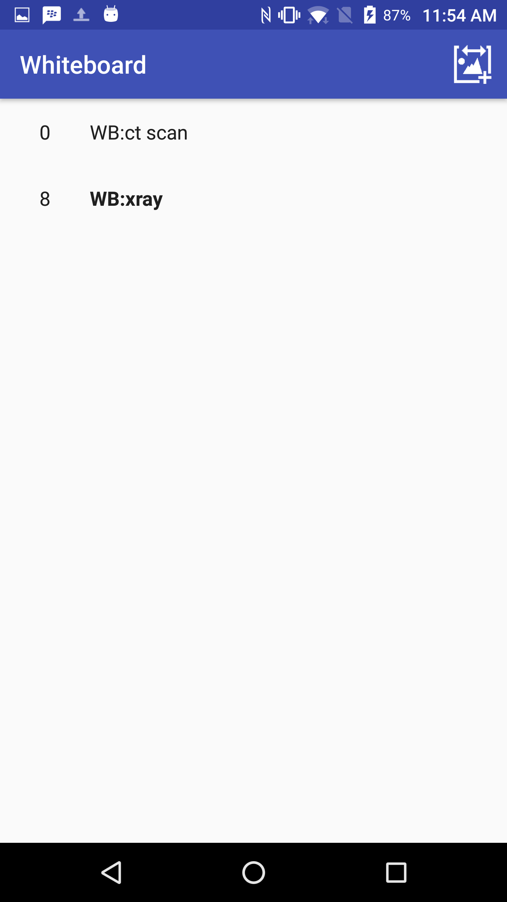
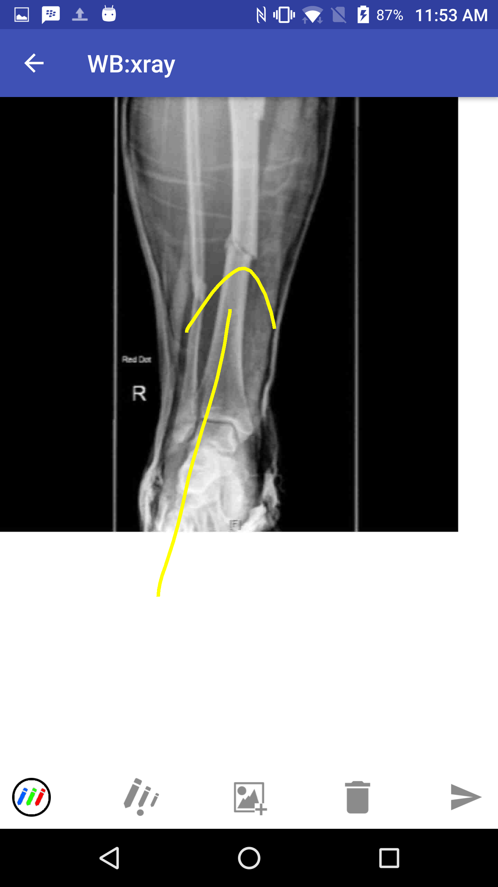

# Whiteboard for Android

The Whiteboard example demonstrations how you can share arbitrary data in a
BlackBerry Spark Communications Services chat. This example builds on the
[Quick Start](../QuickStart/README.md) example that demonstrates how you can
authenticate the BlackBerry Spark Communications Services with user
authentication disabled while using the BlackBerry Key Management Service.

<br>

<p align="center">
    <a href="https://youtu.be/SXdCR838pvI"
      target="_blank"></a>
</p>
<p align="center">
       <b>Demo video: Integrate whiteboard and data sharing into your Apps</b>
</p>

### Features

The Whiteboard example application allows the user to do the following:

* Create new whiteboards with one or more users
* Share pictures and markup
* Clear the whiteboard

<br>
<p align="center">
<a href="screenShots/whiteboard_list.png"></a>
<a href="screenShots/whiteboard.png"></a>
</p>

## Getting Started

This example requires the Spark Communications SDK, which you can find along with related resources at the locations below.

* Instructions to
[Download and Configure](https://developer.blackberry.com/files/bbm-enterprise/documents/guide/html/gettingStarted.html)
the SDK.
* [Android Getting Started](https://developer.blackberry.com/files/bbm-enterprise/documents/guide/html/gettingStarted-android.html)
instructions in the Developer Guide.
* [API Reference](https://developer.blackberry.com/files/bbm-enterprise/documents/guide/reference/android/index.html)

<p align="center">
    <a href="https://youtu.be/3OOJMNF7sjs"
      target="_blank"></a>
</p>
<p align="center">
 <b>Getting started video</b>
</p>

By default, this example application is configured to work in a domain with user
authentication disabled and the BlackBerry Key Management Service enabled.
See the [Download & Configure](https://developer.blackberry.com/files/bbm-enterprise/documents/guide/html/gettingStarted.html)
section of the Developer Guide to get started configuring a
[domain](https://developer.blackberry.com/files/bbm-enterprise/documents/guide/html/faq.html#domain)
in the [sandbox](https://developer.blackberry.com/files/bbm-enterprise/documents/guide/html/faq.html#sandbox).

Once you have a domain in the sandbox, edit Whiteboard's `app.properties` file
to configure the example with your domain ID.

```
# Your Spark Domain ID
user_domain="your_spark_domain"
```

When you run the Whiteboard application it will prompt you for a user ID and a password. Since you've configured your domain to have user authentication disabled, you can enter any string you like for the user ID and an SDK identity will be created for it. Other applications that you run in the same domain will be able to find this identity by this user ID. The password is used to protected the keys stored in the [BlackBerry Key Management Service](https://developer.blackberry.com/files/bbm-enterprise/documents/guide/html/security.html).

Notes:

* To complete a release build you must create your own signing key. To create your own signing key, visit https://developer.android.com/studio/publish/app-signing.html.
  * After creating your signing key set the key store password, key password, key alias and path to the keystore file in the 'app.properties' file.
* This application has been built using gradle 4.2.1 (newer versions have not been validated).

## Walkthrough

Follow this guide for a walkthrough showing how to use the SDK to send images and markup to create a shared whiteboard.

* [Getting started](#gettingStarted)
* [Sending a Doodle](#sendingADoodle)
* [Populating the Whiteboard](#populateWhiteboard)
* [Clearing the Whiteboard](#clearing)


### <a name="gettingStarted"></a>Getting Started

The SDK can be used to send more then just text messages. The SDK supports sending opaque JSON content within a chat message. This example sends pictures and simple markup to create a shared whiteboard experience.

### <a name="sendingADoodle"></a>Sending a Doodle

Doodles drawn by the user are sent in the [`data`](https://developer.blackberry.com/files/bbm-enterprise/documents/guide/reference/android/com/bbm/sdk/bbmds/ChatMessage.html#data) section of a [`ChatMessage`](https://developer.blackberry.com/files/bbm-enterprise/documents/guide/reference/android/com/bbm/sdk/bbmds/ChatMessage.html). To send the doodle we convert the bitmap into a base 64 encoded string. The encoded image content, size and position are written into a JSON object. The JSON object is set in the [`ChatMessageSend`](https://developer.blackberry.com/files/bbm-enterprise/documents/guide/reference/android/com/bbm/sdk/bbmds/outbound/ChatMessageSend.html).

***Tip ChatMessages can be up to 70KB in size, See [`ChatMessageSend`](https://developer.blackberry.com/files/bbm-enterprise/documents/guide/reference/android/com/bbm/sdk/bbmds/outbound/ChatMessageSend.html#data-JSONObject-)***

First compress the bitmap we captured of the users input and encode it as a base64 string. The bitmap is always compressed as a PNG first, if the size is still outside our bounds its compressed as a JPEG.
```java
baos = new ByteArrayOutputStream();
Bitmap.CompressFormat format;
if (shrinkCount == 0) {
    format = Bitmap.CompressFormat.PNG;
} else {
    format = Bitmap.CompressFormat.JPEG;
}
bmp.compress(format, imgQuality, baos);

//before doing the base 64 first check the compressed bytes to avoid wasted effort creating larger base 64 copy
if (baos.size() < maxSize) {
    dataBytes = baos.toByteArray();
    dataEnc = Base64.encodeToString(dataBytes, Base64.DEFAULT);
    tooBig = dataEnc.length() > (68 * 1024);
}
```

Create a JSON object that includes the encoded image data and the size and position in the canvas.
```java
jsonObject.put(CHAT_MESSAGE_DATA_KEY_DOODLE_PNG_BYTES, dataEnc);
//send the width to allow UI to determine size quicker than loading image
jsonObject.put(CHAT_MESSAGE_DATA_KEY_DOODLE_WIDTH, bmp.getWidth());
jsonObject.put(CHAT_MESSAGE_DATA_KEY_DOODLE_HEIGHT, bmp.getHeight());
if (bmp.getWidth() != startWidth || bmp.getHeight() != startHeight) {
    jsonObject.put(CHAT_MESSAGE_DATA_KEY_SCALE_TO_WIDTH, startWidth);
    jsonObject.put(CHAT_MESSAGE_DATA_KEY_SCALE_TO_HEIGHT, startHeight);
}

//for whiteboard let it know where to position
jsonObject.put(CHAT_MESSAGE_DATA_KEY_DOODLE_LEFT, (int) event.leftMostX);
jsonObject.put(CHAT_MESSAGE_DATA_KEY_DOODLE_TOP, (int) event.highestY);

jsonObject.put(CHAT_MESSAGE_DATA_KEY_DOODLE_AVAILABLE_WIDTH, viewWidth);
jsonObject.put(CHAT_MESSAGE_DATA_KEY_DOODLE_AVAILABLE_HEIGHT, viewHeight);
```

Attach the JSON data we created and send the chat message with a custom tag.
```java
ChatMessageSend messageSend = new ChatMessageSend(chatId, WhiteboardUtils.CHAT_MESSAGE_TAG_WHITEBOARD);
//Attach our custom data to the chat message
messageSend.data(jsonObject);
BBMEnterprise.getInstance().getBbmdsProtocol().send(messageSend);
```
*WhiteboardActivity.java*


### <a name="populateWhiteboard"></a>Populating the Whiteboard

To populate the whiteboard with the doodle messages we iterate over the list of received [`chat messages`](https://developer.blackberry.com/files/bbm-enterprise/documents/guide/reference/android/com/bbm/sdk/bbmds/ChatMessage.html) in reverse creating a draw list. To avoid re-drawing chat messages we keep track of the last message drawn and only draw messages new messages. If we encounter a message with the tag CHAT_MESSAGE_TAG_CLEAR we can stop since earlier images would not be visible after the clear.

```java
//build list to display
ArrayList<ChatMessage> toDisplay = new ArrayList<>();
int size = chatMessageList.size();
boolean rememberLastDisplayed = true;
int pendingChatMessages = 0;
//start at last, go until find last displayed or control message
for (int i=size - 1; i >= 0; --i) {
    ObservableValue<ChatMessage> observableChatMessage = chatMessageList.get(i);
    ChatMessage chatMessage = observableChatMessage.get();
    observableChatMessage.addObserver(this);
    if (chatMessage.exists == Existence.MAYBE) {
        rememberLastDisplayed = false;
        ++pendingChatMessages;
        if (pendingChatMessages > 3) {
            //when the chat is first loaded all messages except the last one will be loading
            //if we continue we would process all previous messages, causing them to all load which
            //would display starting to draw recent messages, so stop after a reasonable amount to
            //give the most recent ones a chance to load so we can look for the last reset
            break;
        }
    } else {
        if (Equal.isEqual(chatMessage, mChatMessageListLastDisplayed)) {
            //we already displayed this one, stop
            break;
        } else {
            String tag = chatMessage.tag;
            if (WhiteboardUtils.CHAT_MESSAGE_TAG_WHITEBOARD.equals(tag) || WhiteboardUtils.CHAT_MESSAGE_TAG_PICTURE.equals(tag)) {
                toDisplay.add(chatMessage);
            } else if (WhiteboardUtils.CHAT_MESSAGE_TAG_CLEAR.equals(tag)) {
                toDisplay.add(chatMessage);
                //last one
                break;
            }
            //ignore others
        }
    }
}
```
*WhiteboardView.java*


Drawing the doodles or pictures requires us to recreate a bitmap from the base64 encoded data in the [`chat message`](https://developer.blackberry.com/files/bbm-enterprise/documents/guide/reference/android/com/bbm/sdk/bbmds/ChatMessage.html). The size and position metadata included in the message are used to position the bitmap within the canvas.

```java
if (WhiteboardUtils.CHAT_MESSAGE_TAG_WHITEBOARD.equals(tag) || WhiteboardUtils.CHAT_MESSAGE_TAG_PICTURE.equals(tag)) {
    if (chatMessage.data == null) {
        Logger.w("missing data for ID="+chatMessage.messageId+" tag="+tag+" ");
        continue;
    }

    Bitmap bmp = WhiteboardUtils.createBitmap(chatMessage);

    if (bmp == null) {
        Logger.e("Failed to create bitmap from "+chatMessage);
        continue;
    }

    //figure out if need to scale it
    int remoteWidth = chatMessage.data.optInt(WhiteboardUtils.CHAT_MESSAGE_DATA_KEY_DOODLE_AVAILABLE_WIDTH, -1);
    int remoteHeight = chatMessage.data.optInt(WhiteboardUtils.CHAT_MESSAGE_DATA_KEY_DOODLE_AVAILABLE_HEIGHT, -1);

    Rect toRect;
    float scaleX = 1;
    float scaleY = 1;
    if (remoteWidth > 0 && remoteWidth != w) {
        //remote is different size
        scaleX = (float)w / (float)remoteWidth;
    }
    if (remoteHeight > 0 && remoteHeight != h) {
        //remote is different size
        scaleY = (float)h / (float)remoteHeight;
    }

    int left = chatMessage.data.optInt(WhiteboardUtils.CHAT_MESSAGE_DATA_KEY_DOODLE_LEFT, 0);
    int top = chatMessage.data.optInt(WhiteboardUtils.CHAT_MESSAGE_DATA_KEY_DOODLE_TOP, 0);

    int rectX = (int)(scaleX * left);
    int rectY = (int)(scaleY * top);
    toRect = new Rect(rectX, rectY, rectX + (int)(scaleX * bmp.getWidth()), rectY + (int)(scaleY * bmp.getHeight()));

    canvas.drawBitmap(bmp, null, toRect, null);
}
```
*WhiteboardView.java*


### <a name="clearing"></a>Clearing the whiteboard

To clear the whiteboard of any existing doodles we send another [`chat message`](https://developer.blackberry.com/files/bbm-enterprise/documents/guide/reference/android/com/bbm/sdk/bbmds/ChatMessage.html) with the tag "ClearScreen". When we encounter a clear tag we'll wipe the canvas.

```java
} else if (WhiteboardUtils.CHAT_MESSAGE_TAG_CLEAR.equals(tag)) {
    //clear canvas
    int color = Color.WHITE;
    if (chatMessage.data != null) {
        color = chatMessage.data.optInt(WhiteboardUtils.CHAT_MESSAGE_DATA_KEY_BACKGROUND_COLOR, color);
    }

    canvas.drawColor(color);
}
```
*WhiteboardView.java*


## License

These examples are released as Open Source and licensed under the [Apache 2.0 License](http://www.apache.org/licenses/LICENSE-2.0.html).

The Android robot is reproduced or modified from work created and shared by Google and used according to terms described in the [Creative Commons 3.0 Attribution License](https://creativecommons.org/licenses/by/3.0/).

This page includes icons from: https://material.io/icons/ used under the [Apache 2.0 License](http://www.apache.org/licenses/LICENSE-2.0.html).

## Reporting Issues and Feature Requests

If you find an issue in one of the Samples or have a Feature Request, simply file an [issue](https://github.com/blackberry/bbme-sdk-android-samples/issues).
