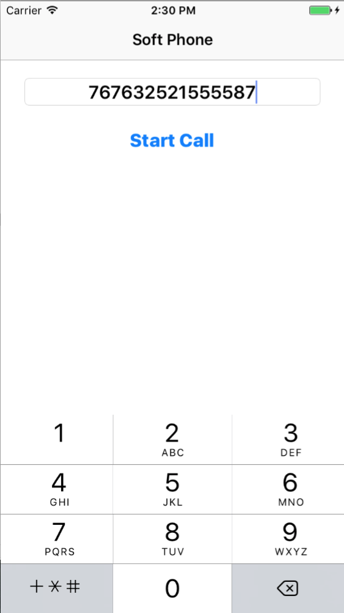
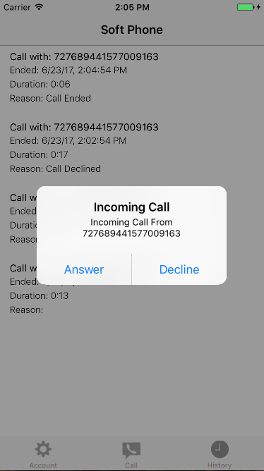
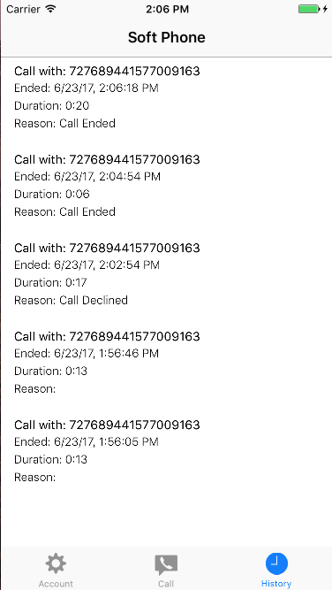

# SoftPhone for iOS

The SoftPhone example application is a Swift application that demonstrates how voice and video calling can be
integrated into your application using the BlackBerry Spark Communications
Services SDK.  This example builds on the [Quick Start Swift](../QuickStartSwift/README.md)
example.

<p align="center">
<br>
    <a href="https://youtu.be/NT1-vcldMRc"
      target="_blank"></a>
</p>
<p align="center">
 <b>Demo video: Integrate voice and video into your apps</b>
</p>

## Features

SoftPhone allows the user to do the following:

* Start a call by typing in a regId
* Accept/Decline incoming calls
* View a call history list
* Enable video in a call

This sample can interact with the [Rich Chat](https://developer.blackberry.com/files/bbm-enterprise/documents/guide/html/examples/ios/RichChat/README.html) and [Quick Start Swift](../QuickStartSwift/README.md) samples so it may utilize the same configuration.

<br>

<p align="center">
<a href="screenShots/SoftPhone_PlaceCall.png"></a>
<a href="screenShots/SoftPhone_IncomingCall.png"></a>
<a href="screenShots/SoftPhone_InCall.png"></a>
<a href="screenShots/SoftPhone_CallLog.png"></a>
</p>

## Getting Started
This example requires the Spark Communications SDK, which you can find along with related resources at the location below.

* Instructions to
[Download and Configure](https://developer.blackberry.com/files/bbm-enterprise/documents/guide/html/gettingStarted.html)
the SDK.
* [iOS Getting Started](https://developer.blackberry.com/files/bbm-enterprise/documents/guide/html/gettingStarted-ios.html)
instructions in the Developer Guide.
* [API Reference](https://developer.blackberry.com/files/bbm-enterprise/documents/guide/reference/ios/index.html)

<p align="center">
    <a href="https://youtu.be/tDfXsifzPA4"
      target="_blank"></a>
</p>
<p align="center">
 <b>Getting started video</b>
</p>

### Configuration
By default, this example application is configured to work in a domain with user
authentication disabled and the BlackBerry Key Management Service enabled.
See the [Download & Configure](https://developer.blackberry.com/files/bbm-enterprise/documents/guide/html/gettingStarted.html)
section of the Developer Guide to get started configuring a
[domain](https://developer.blackberry.com/files/bbm-enterprise/documents/guide/html/faq.html#domain)
in the [sandbox](https://developer.blackberry.com/files/bbm-enterprise/documents/guide/html/faq.html#sandbox).

Once you have a domain in the sandbox, edit SoftPhone's `ConfigSettings.plist` file
to configure the example with your domain ID.

```
<!DOCTYPE plist PUBLIC "-//Apple//DTD PLIST 1.0//EN" "http://www.apple.com/DTDs/PropertyList-1.0.dtd">
<plist version="1.0">
<dict>
	<key>authProvider</key>
	<string>testAuth</string>
	<key>useBlackBerryKMS</key>
	<true/>
	<key>testAuth</key>
	<dict>
		<key>clientId</key>
		<string>not_used</string>
		<key>domain</key>
		<string>UPDATE_WITH_YOUR_DOMAIN</string>
		<key>environment</key>
		<string>sandbox</string>
	</dict>
</dict>
</plist>
```

When you run SoftPhone, it will prompt you for a user ID and a password. Since
you've configured your domain to have user authentication disabled, you can
enter any string you like for the user ID and an SDK identity will be created
for it. Other applications that you run in the same domain will be able to find
this identity by this user ID. The password is used to protected the keys stored
in the
[BlackBerry Key Management Service](https://developer.blackberry.com/files/bbm-enterprise/documents/guide/html/security.html).

## Walkthrough

- [Camera and Micphone Permissions](#camMicPerms)
- [Calling and Push](#callingPush)
- [Support Library](#supportLib)
- [Configuring BBMEMediaManager](#configBBMMediaManager)
- [Listening for Calls](#listeningForCalls)
- [Starting a Call](#startingCall)
- [Rendering a Call](#renderingCall)

### <a name="camMicPerms"></a> Camera and Microphone Permissions

To enable voice and video, you must include the privace usage descriptions for the camera and microphone in your `Info.plist` file.
* NSMicrophoneUsageDescription
* NSCameraUsageDescription

The [`BBMEMediaManager`](https://developer.blackberry.com/files/bbm-enterprise/documents/guide/reference/ios/interface_b_b_m_media_manager.html) will automatically request the required access from the user on first usage.


### <a name="callingPush"></a> Calling & Push

If you enable Voice and Video in your app, push should be implemented via PushKit.  When a PushKit message is received, it should be sent to [`BBMEntperiseService`](https://developer.blackberry.com/files/bbm-enterprise/documents/guide/reference/ios/interface_b_b_m_enterprise_service.html) via `BBMEnteprirseService.shared().pushRecieved(pushJSON)`.  If the push includes call data, this will then invoke the incomignCallDidArrive(_ call:) callback on any delegates registered with [`BBMMediaManager`](https://developer.blackberry.com/files/bbm-enterprise/documents/guide/reference/ios/interface_b_b_m_media_manager.html).  If the application is in the background state, you should prompt the user to answer the call with a `UILocalNotification`.

For PushKit integration to work, you must enable the "Voice over IP" background mode under your projects capabilities.

**Note:** Legacy APNS is not suitable for Voice and Video integration as the incoming push will not always wake the application.  See the [Rich Chat](https://developer.blackberry.com/files/bbm-enterprise/documents/guide/html/examples/ios/RichChat/README.html) 
sample for how to integrate PushKit with your application.

### <a name="supportLib"></a>Support Library

Common code for authenticating users, synchronizing keys and performing common tasks can be found in `examples/Support/Source`.  Much of the heavy lifting can be found in these classes and they should be referenced before implementing a custom key management or authentication scheme.

`BBMAuthController` and `BBMKeyManager` can be instantiated with classes/instances that allow you to substitute your own user authentication or key management scheme while handling all of the SDK related functionality.

`BBMAccess` provides wrappers around common outgoing messages and the SDK data model.

### <a name="configBBMMediaManager"></a> Configuring BBMMediaManager

`SoftPhoneApp` is responsible for setting up the SDK media services.  To start the media services call `mediaManager.start(withLogPath: path)`.  You can optionally specify ring tone files that will play at the appropriate times if set.  You may opt to handle the ring tone notifications from your own code as well.

```swift
private func startMediaManager() {
    //Start the media manager
    let mediaManager = BBMEnterpriseService.shared().mediaManager()!
    mediaManager.start(withLogPath: nil)

    //Set the ring tones
    let endTonePath = Bundle.main.path(forResource: "endTone", ofType: "caf")
    let endToneURL = NSURL.fileURL(withPath: endTonePath!)
    mediaManager.callEndTone = endToneURL

    let incTonePath = Bundle.main.path(forResource: "incoming_call_ringtone", ofType: "caf")
    let incToneURL = NSURL.fileURL(withPath: incTonePath!)
    mediaManager.incomingRingtone = incToneURL

    let outTonePath = Bundle.main.path(forResource: "outgoing_call_ringtone", ofType: "caf")
    let outToneURL = NSURL.fileURL(withPath: outTonePath!)
    mediaManager.outgoingRingtone = outToneURL
}
```

###<a name="listeningForCalls"></a>Listening For Calls

`CallListener` registers with the shared [`BBMMediaManager`](https://developer.blackberry.com/files/bbm-enterprise/documents/guide/reference/ios/interface_b_b_m_media_manager.html) singleton as a [BBMMediaDelegate](https://developer.blackberry.com/files/bbm-enterprise/documents/guide/reference/ios/protocol_b_b_m_media_delegate_01-p.html), listens for incoming and outgoing calls and presents the appropriate user interface(s).

To show the `MediaViewController` we listen for the [BBMMediaDelegate](https://developer.blackberry.com/files/bbm-enterprise/documents/guide/reference/ios/protocol_b_b_m_media_delegate_01-p.html) callConnected(_ call:) callback:

```swift
func callConnected(_ call: BBMCall!) {
    let storyboard = UIStoryboard(name: "Main", bundle: nil)
    let controller = storyboard.instantiateViewController(withIdentifier: "mediaViewController")

    let keyWindow : UIWindow = UIApplication.shared.keyWindow!
    keyWindow.rootViewController?.present(controller, animated: true, completion: nil)
}
```

To show the incoming call (which is done via an `UIAlertController`) we listen for the [`BBMMediaDelegate`](https://developer.blackberry.com/files/bbm-enterprise/documents/guide/reference/ios/protocol_b_b_m_media_delegate_01-p.html) `incomignCallDidArrive(_ call:)` callback.  In this case, we accept all incoming calls but you may wish to accept calls only from certain users, at certain times, etc. `mediaManager.acceptCall()` will begin the ringing phase.

```swift
func incomingCallDidArrive(_ call: BBMCall!) {
    //At this point we can either accept the call or silently decline it
    mediaManager.acceptCall()
    notifyOfIncomingCall(call)
}
```

When the call is complete, the `CallListener` also inserts a call event message into the the 1-1 chat between the two callers.

###<a name="startingCall"></a>Starting A Call

The `PlaceCallViewController` is used to initiate calls between two users.  Users are addressed using their respective registration IDs.  To place a call:

```swift
mediaManager.callRegId(regId, mediaMode: kVoice) {
    (error) -> Void in
    //Deal with the result
}
```

The `PlaceCallViewController` does not handle any of the UI transitions. That is done via the `CallListener`.

In order to place a call, we must first have a valid chat with the other user.  `BBMChatCreator` in the Support library handles this task for you and returns the correct chatId in its callback:

```Swift
self.chatCreator.startChat(withRegId: regId, subject: "") {
    [weak self] (chatId, failReason) -> Void in
    //Place call
}
```

We place the call inside of an [`ObservableMonitor`](https://developer.blackberry.com/files/bbm-enterprise/documents/guide/reference/ios/interface_observable_monitor.html) which waits for the chat keys to exchange (which is done via the keyMonitor in `SoftPhoneApp`).  Keys must be exchanged before a call can be placed or the call will fail with `kMediaFailureKeyError`.

### <a name="renderingCall"></a>Rendering A Call

The `MediaViewController` handles the presentation of the actual call.

To update the UI components, we observe several properties on the call and the
shared
[`BBMMediaManager`](https://developer.blackberry.com/files/bbm-enterprise/documents/guide/reference/ios/interface_b_b_m_media_manager.html)
and update the UI elements based on their values inside of an
[`ObservableMonitor`](https://developer.blackberry.com/files/bbm-enterprise/documents/guide/reference/ios/interface_observable_monitor.html).
Note that it's not necessary, but improves the user experience to disable the
buttons when they will have no effect.
[`BBMMediaManager`](https://developer.blackberry.com/files/bbm-enterprise/documents/guide/reference/ios/interface_b_b_m_media_manager.html)
exposes several observable properties you can use to determine if camera and
video operations are currently possible.  Switching the camera (for example) can
take a second or two, during which time mediaManager.toggleCameraAllowed will be
false and a request to toggle the camera will fail.


```Swift
controlsMonitor = ObservableMonitor(activatedWithName: "controlsMonitor") {
    [weak self] () -> Void in

    guard let weakSelf = self else { return }

    //Update the mute button based on the mute state of the call
    if let call: BBMCall = BBMEnterpriseService.shared().mediaManager().currentCallInfo {
        let isMuted = call.muted
        let muteTitle = isMuted ? "UNMUTE" : "MUTE"
        weakSelf.muteButton.setTitle(muteTitle, for: UIControlState.normal)
        weakSelf.remotePartyField.text = "Call With: " + call.peerRegId

        //The mediaManager tells us when we are able to start/stop our camera.  If camera commands
        //are issued when enableCameraAllowed, videoSupport or isVideoCallingSupported are false
        //they will fail
        weakSelf.videoButton.isEnabled = weakSelf.mediaManager.enableCameraAllowed &&
                                         call.videoSupported &&
                                         weakSelf.mediaManager.isVideoCallingSupported
    }else{
        weakSelf.muteButton.setTitle("MUTE", for: UIControlState.normal)
        weakSelf.videoButton.isEnabled = false
    }

    //Update the video button state based on whether we have an outgoing video stream
    let hasOutGoingVideo = weakSelf.mediaManager.outgoingVideoView != nil;
    let vidTitle = hasOutGoingVideo ? "STOP VIDEO" : "START VIDEO"
    weakSelf.videoButton.setTitle(vidTitle, for: UIControlState.normal)

    //Camera toggling can take a second or two.  the toggleCameraAllowed property will
    //transition telling us when we are able to toggle the camera
    weakSelf.camButton.isEnabled = hasOutGoingVideo &&
                                   weakSelf.mediaManager.toggleCameraAllowed
}
```

The `MediaViewController` also registers as a [`BBMMediaVideoPresenter`](https://developer.blackberry.com/files/bbm-enterprise/documents/guide/reference/ios/protocol_b_b_m_media_video_presenter_01-p.html) with the shared [`BBMMediaManager`](https://developer.blackberry.com/files/bbm-enterprise/documents/guide/reference/ios/interface_b_b_m_media_manager.html).  The [BBMMediaVideoPresenter](https://developer.blackberry.com/files/bbm-enterprise/documents/guide/reference/ios/protocol_b_b_m_media_video_presenter_01-p.html) protocol is implemented as follows:

```swift
func incomingVideoContainer() -> UIView! {
    //Return a container into which the incoming video will be painted
    return incomingVideoContainerView
}

func outgoingVideoContainer() -> UIView! {
    return outgoingVideoContainerView
}

func videoPresenterPriority() -> Int {
    //We only have a single presenter so this value is arbitrary.  If you have multiple views
    //consuming the video feeds, then the presenter that is registered with the highest priority
    //will get the feeds.
    return 100
}

//There is no need to add/remove views from their containers, this is done automatically
//for you.  However, you may want to hide/show the video conatiners when a feed is added
//or removed.  You can do so in these callbacks.
func incomingVideoDisabled() {
    incomingVideoView = nil;
    incomingVideoContainerView.isHidden = true
}

func outgoingVideoDisabled() {
    outgoingVideoView = nil;
    outgoingVideoContainerView.isHidden = true;
}

func incomingVideoReady(_ view: UIView!) {
    incomingVideoView = view
    incomingVideoContainerView.isHidden = false
}

func outgoingVideoReady(_ view: UIView!) {
    outgoingVideoView = view;
    outgoingVideoContainerView.isHidden = false
}

//We need to monitor size changes to the video feed.  This will allow us to
//properly set the frame of the video feed with respect to our container.
//The function AVMakeRect(aspectRatio:, insideRect:) is provided by AVFoundation for
//just this purpose.

//For rotation, you may need to cache the sizes of the feeds and update the frames
//on a rotation event.

func videoView(_ view: UIView!, didChangeVideoSize size: CGSize) {
    updateAspectRatioForView(view, size: size)
}
```
Multiple [`BBMMediaVideoPresenter`](https://developer.blackberry.com/files/bbm-enterprise/documents/guide/reference/ios/protocol_b_b_m_media_video_presenter_01-p.html)s may be registered simultaneously with shared [`BBMMediaManager`](https://developer.blackberry.com/files/bbm-enterprise/documents/guide/reference/ios/interface_b_b_m_media_manager.html).  This allows you to implement something like a floating video window without having to worry about moving the views between containers.  You simply register and deregister presenters.  The presenter with the highest priority will be automatically assigned the video feeds.  Changing the priority of a previously registered presenter has no effect until you re-register the presenter.

It is up to the application to correctly fit the video feed into the container.  By default the video will fill the container.  You must update the video feed frame manually in order to ensure the aspect ratio is properly preserved.  This allows you to clip, letterbox or resize the feeds to any given preference.  `AVMakeRect(aspectRatio: size, insideRect: bounds)` is provided in `AVFoundation` to do this automatically for you for the simple aspect-fit case.

```swift
func updateAspectRatioForView(_ view: UIView!, size: CGSize) {
    if(size.width == 0 || size.height == 0) {
        //Invalid video sizes
        return;
    }

    //Determine which container we're dealing with
    var container : UIView?
    if(view == outgoingVideoView) {
        container = outgoingVideoContainerView
    }
    else if(view == incomingVideoView) {
        container = incomingVideoContainerView
    }

    //Fit the video video to the container
    if let container = container {
        let bounds = container.bounds;
        let frame = AVMakeRect(aspectRatio: size, insideRect: bounds);
        view.frame = frame;
    }else{
        NSLog("Update size requested for an unknown video view");
    }
}
```

Manipulating the call is done via the shared [`BBMMediaManager`](https://developer.blackberry.com/files/bbm-enterprise/documents/guide/reference/ios/interface_b_b_m_media_manager.html).  Enabling or disabling of the buttons is done above in an [`ObservableMonitor`](https://developer.blackberry.com/files/bbm-enterprise/documents/guide/reference/ios/interface_observable_monitor.html) so no checking is required on any of these callbacks.:

```swift
@IBAction func switchCamPressed(_ sender: UIButton) {
    mediaManager.toggleCamera()
}

@IBAction func startVideoPressed(_ sender: UIButton) {
    mediaManager.toggleOutgoingVideo(true)
}


@IBAction func speakerPressed(_ sender: UIButton) {
    mediaManager.setSpeakerPhoneEnabled(!mediaManager.isOnSpeakerPhone)
}

@IBAction func mutePressed(_ sender: UIButton) {
    if let call: BBMCall = BBMEnterpriseService.shared().mediaManager().currentCallInfo {
        mediaManager.setMutingEnabled(!call.muted)
    }
}

@IBAction func hangupPressed(_ sender: UIButton) {
    mediaManager.hangup()
}
```

### Posting and Rendering Call Log Events

When calls are ended, the party that originated the call places a message with the "Call_Event" tag into the 1-1 chat with the remote party.  The `CallLogViewContoller` uses criteria matching on chats to display a list of all calls that have taken place.  In this case, the call events include an end time, duration, and reason, but like all other [`BBMChatMessage`](https://developer.blackberry.com/files/bbm-enterprise/documents/guide/reference/ios/interface_b_b_m_chat_message.html)s, may include any arbitrary data.  The [`BBMCall`](https://developer.blackberry.com/files/bbm-enterprise/documents/guide/reference/ios/interface_b_b_m_call.html) object has a logType property that you can use to query the type of call log (ie: Ended, Missed, Disconnected, Busy) to add context to the call event messages.  The chat is shared, so you should ensure the call event is inserted by only one of the parties in the call.

To create a list of all call event messages, we can observe the list of chats inside an [`ObservableMonitor`](https://developer.blackberry.com/files/bbm-enterprise/documents/guide/reference/ios/interface_observable_monitor.html):

```swift
callEventMonitor = ObservableMonitor(activatedWithName: "callEventMonitor") {
    [weak self] () -> Void in

    let chatsList = BBMAccess.model().chat!
    let chats = chatsList.observableArray as! Array<BBMChat>
    var allCallEvents = Array<BBMChatMessage>()
    for chat in chats {
        //We can use BBMChatMessageCriteria to get a set list for each chat that includes
        //only the messages with the "Call_Event" tag.
        let criteria = BBMChatMessageCriteria()
        criteria.tag = kCallEventTag
        criteria.chatId = chat.chatId
        let callEventMessagMap = BBMAccess.model().chatMessage(with: criteria)
        if(callEventMessagMap?.bbmState == kBBMStatePending) {
            continue
        }
        let callEvents = callEventMessagMap?.observableArray as! Array<BBMChatMessage>
        for callEvent in callEvents {
            allCallEvents.append(callEvent)
        }
    }

    //Sort the call events and reload the table...
}
```

## License

These samples are released as Open Source and licensed under the
[Apache 2.0 License](http://www.apache.org/licenses/LICENSE-2.0.html). 

These samples were created using SDKs from Apple Inc. and may contain code
licensed for use only with Apple products. Please review your Apple SDK
Agreement for additional details.

This page includes icons from: https://material.io/icons/ used under the [Apache 2.0 License](http://www.apache.org/licenses/LICENSE-2.0.html).

## Reporting Issues and Feature Requests

If you find a issue in one of the Samples or have a Feature Request, simply file an [issue](https://github.com/blackberry/bbme-sdk-ios-samples/issues).
