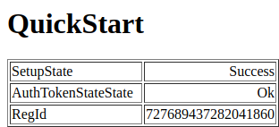
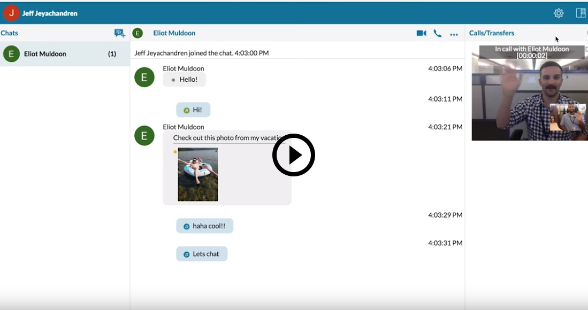

# Quick Start for JavaScript

The Quick Start example application demonstrates how you can get started with
the BlackBerry Spark Communications Services.

<br/>
<p align="center">
  <a href="screenShots/quickstart.png"></a>
</p>

### Features

The Quick Start example application demonstrates the following functionality:

* Ensure that the JavaScript environment can run the SDK
* Authenticate a user and get an access token
* Instantiate the SDK.
* Setup the SDK instance.

## Getting Started

This example requires the Spark Communications SDK, which you can find along
with related resources at the locations below.

* Instructions to
[Download and Configure](https://developer.blackberry.com/files/bbm-enterprise/documents/guide/html/gettingStarted.html)
the SDK.
* [Getting Started with Web](https://developer.blackberry.com/files/bbm-enterprise/documents/guide/html/gettingStarted-web.html)
instructions in the Developer Guide.
* [API Reference](https://developer.blackberry.com/files/bbm-enterprise/documents/guide/reference/javascript/index.html)

<p align="center">
    <a href="https://youtu.be/CSXZT2perqE"
      target="_blank"></a>
</p>
<p align="center">
  <b>Getting started video</b>
</p>

This example application works in a sandbox domain with user authentication
disabled and the BlackBerry Key Management Service enabled.  See the
[Download & Configure](https://developer.blackberry.com/files/bbm-enterprise/documents/guide/html/gettingStarted.html)
section of the Developer Guide to get started configuring a
[domain](https://developer.blackberry.com/files/bbm-enterprise/documents/guide/html/faq.html#domain)
in the [sandbox](https://developer.blackberry.com/files/bbm-enterprise/documents/guide/html/faq.html#sandbox).

When you have a domain in the sandbox, edit Quick Starts's `config_mock.js`
file to configure the example with your domain ID and a key passcode.

Set the `SDK_CONFIG.domain` parameter to your sandbox domain ID.

```javascript
const SDK_CONFIG = {
  domain: 'your_domain_id'
};
```

Set the `USER_ID` parameter to the user ID that will be associated with the
SDK instance being set up in this example.

```javascript
const USER_ID = 'user1';
```

Set the `KEY_PASSCODE` parameter to the string used to protect the configured
user's keys stored in the [BlackBerry Key Management Service](https://developer.blackberry.com/files/bbm-enterprise/documents/guide/html/security.html).
Real applications should not use the same passcode for all users.   However,
it allows this example application to be smaller and focus on demonstrating
its call functionality instead of passcode management.

```javascript
const KEY_PASSCODE = 'passcode';
```
## Walkthrough

Follow this guide for a walkthrough showing how to authenticate with the SDK using Google Sign-in for Web.

- [Verify the JavaScript environment can run the SDK](#verifyEnvironment)
- [Authentication and access tokens](#authentication)
- [Instantiate the SDK](#instatiation)
- [Monitor the setup state](#monitorSetup)
- [Monitor for setup errors](#monitorSetupErrors)
- [Start setup](#startSetup)


### <a name="verifyEnvironment"></a>Verify the JavaScript environment can run the SDK

You can call
[`BBMEnterprise.validateBrowser()`](https://developer.blackberry.com/files/bbm-enterprise/documents/guide/reference/javascript/BBMEnterprise.html#.validateBrowser)
to verify that the JavaScript environment supports the necessary functionality
to run the SDK.

There are some asynchronous checks performed as part of this validation, so
you must wait for those to complete before proceeding.

When validation fails, an error will be thrown.  Errors may be thrown
synchronously or asynchronously.

If your JavaScript environment cannot run the SDK, you may not be able to
instantiate or set up the SDK.

```javascript
  try {
    // Set the Argon2 WASM file location if it has not already been set.
    // If you have put the argon2.wasm file in a custom location, you can
    // override this option in the imported SDK_CONFIG.
    const kmsArgonWasmUrl =
      SDK_CONFIG.kmsArgonWasmUrl || '../../sdk/argon2.wasm';

    // Make sure that the browser supports all of the necessary functionality,
    // including support for interacting with the BlackBerry Key Management
    // Service (KMS).
    await BBMEnterprise.validateBrowser({
      kms: { argonWasmUrl: kmsArgonWasmUrl }
    });
  }
  catch(error) {
    // Display any error that was encountered.
    $('#error').text(error);
    console.error(`QuickStart encountered an error; error=${error}`);
  }
```

### <a name="authentication"></a>Authentication and access tokens

The `AuthenticationManager` in this example is the `MockAuthManager` from the
support library.  The `MockAuthManager` does not interact with a real identity
provider, and so, has a function that can be overridden to provide the user's
ID.

When `AuthManager.authenticate()` is called, asynchronous interaction with the
identity provider is started.  When control is returned to the example
application, the authorized user's identity will be known.

Asynchronous errors can be thrown during authentication, so they must be
handled accordingly.  This example displays the error and emits it to the
console.

Please refer to the Developer Guide for more information on [Identity
Providers](https://developer.blackberry.com/files/bbm-enterprise/documents/guide/html/identityManagement.html).

The support library also provides the `GoogleAuthManager` and the
`AzureAuthManager` classes that interact with real identity providers.

```javascript
  try {
    // Setup the authentication manager for the application.
    const authManager = new AuthenticationManager(AUTH_CONFIGURATION);
    if (AuthenticationManager.name === 'MockAuthManager') {
      // We are using the MockAuthmanager, so we need to override how it
      // acquires the local user's user ID.
      authManager.getUserId = () => (
        USER_ID
        ? Promise.resolve(USER_ID)
        : Promise.reject(new Error('USER_ID is not defined'))
      );
    }

    // Authenticate the user.  Configurations that use a real identity
    // provider (IDP) will redirect the browser to the IDPs authentication
    // page.
    const authUserInfo = await authManager.authenticate();
    if (!authUserInfo) {
      console.warn('Redirecting for authentication.');
      return;
    }
  }
  catch(error) {
    // Display any error that was encountered.
    $('#error').text(error);
    console.error(`QuickStart encountered an error; error=${error}`);
  }
```

The authentication manager provides a `getBbmSdkToken()` API that will perform
the necessary interaction with the identity provider to get an access token
suitable for use with the SDK.

### <a name="instantiation"></a>Instantiate the SDK

To create an instance of the BBMEnterprise object, you must call its
[`constructor`](https://developer.blackberry.com/files/bbm-enterprise/documents/guide/reference/javascript/BBMEnterprise.html)
and specify the `configuration` to be used.

The `domain` and `environment` properties are taken directly from the
example's configuration file.

The `userId` property is taken from the user information object that was
created during authentication.  This is the ID assigned by the identity
provider for the logged in user.

The `getToken` property provides the SDK with a way to get a current access
token associated with the logged-in user.  This token will be verified by the
BlackBerry Infrastructure.

The `description` property describes the type of client that is using the SDK.

The `kmsArgonWasmUrl` property is only required if the `argon2.wasm` module is
not in the same directory as your application.  If you followed the [Exploring
the
Examples](https://developer.blackberry.com/files/bbm-enterprise/documents/guide/html/gettingStarted-web.html#exploring-the-examples)
section of the Developer Guide, then the default value set by the example will
already be set correctly.

```javascript
  // Instantiate the SDK.
  //
  // We use the SDK_CONFIG imported from the example's configuration
  // file to override some of the options used to configure the SDK.
  //
  // This example might not work if your SDK_CONFIG specifies any of the
  // parameters assigned below.
  const sdk = new BBMEnterprise(Object.assign(
    {
      // You must specify your domain in the SDK_CONFIG.

      // This example requires user authentication to be disabled, which is
      // not supported in production.
      sandbox: true,

      // The user ID to use when connecting to the BlackBerry
      // Infrastructure.  We use the value returned by our identity
      // provider.
      userId: authUserInfo.userId,

      // The access token to use when connecting to the BlackBerry
      // Infrastructure.  We use the value returned by our identity
      // provider.
      getToken: () => authManager.getBbmSdkToken(),

      // We just use the browser's userAgent string to describe this
      // endpoint.
      description: navigator.userAgent,

      // Use the same kmsArgonWasmUrl that was used to to validate our
      // browser environment above.
      kmsArgonWasmUrl
    },
    SDK_CONFIG
  ));
```

### <a name="monitorSetup"></a>Monitor the setup state

When setup is started, the SDK will emit the
[`setupState`](https://developer.blackberry.com/files/bbm-enterprise/documents/guide/reference/javascript/BBMEnterprise.html#event:setupState)
event when ever the
[`BBMEnterprise.setupState`](https://developer.blackberry.com/files/bbm-enterprise/documents/guide/reference/javascript/BBMEnterprise.html#setupState)
property changes.  Use this event to track the SDK's progress through setup.

When using the the [BlackBerry Key Management
Service](https://developer.blackberry.com/files/bbm-enterprise/documents/guide/html/security.html),
the `setupState` will transition to `SyncRequired` when the SDK is ready to
sync the user's keys.  These keys are protected, and the SDK requires a
passcode so that it can protect newly generated keys or unprotect existing
keys.

You can tell if the user needs to generate new keys or if they have existing
keys by looking at the
[`BBMEnterprise.syncPasscodeState`](https://developer.blackberry.com/files/bbm-enterprise/documents/guide/reference/javascript/BBMEnterprise.html#syncPasscodeState)
while the `setupState` is `SyncRequired`.

Once in the `SyncRequired` setup state, you must tell the SDK how to proceed
by calling
[`BBMEnterprise.syncStart()`](https://developer.blackberry.com/files/bbm-enterprise/documents/guide/reference/javascript/BBMEnterprise.html#syncStart).
When `syncStart()` is called, the `setupState` will advance to to
`SyncStarted`.  The followign table describes the behavior of `syncStart()`
based on the different possible combinations of `SyncPasscodeState` and
`SyncStartAction`.

| SyncPasscodeState | SyncStartAction | Behavior |
| ----------------- | --------------- | -------- |
| `New`             | `New`           | New keys will be generated and the passcode will be used to protect the keys before exporting them to the BlackBerry Key Management Service. |
| `New`             | `Existing`      | Error.  This is not a valid combination. |
| `Existing`        | `New`           | The existing keys will be ignored.  New keys will be generated and the passcode will be used to protect the keys before exporting them to the BlackBerry Key Management Service. |
| `Existing`        | `Existing`      | The passcode will be used to unprotect the keys being imported from the BlackBerry Key Management Service.  If the passcode fails to unprotect the keys, the `setupState` will regress to `SyncRequired` so that you can try again with a new passcode or generate new keys.

The SDK setup will be complete when the `setupState` transitions to `Success`.
After this has occurred, you can begin using the SDK's messaging and media
APIs.

When setup has completed, the SDK will remain setup until
[`BBMEnterprise.shutdown()`](https://developer.blackberry.com/files/bbm-enterprise/documents/guide/reference/javascript/BBMEnterprise.html#shutdown)
is called or a fatal error occurs.  When the SDK is shutdown or encounters a
fatal error, the `setupState` will regress to `NotInitiated`.  You can monitor
for `setupState` events after setup has completed to learn when the SDK is no
longer set up.

```javascript
  // Handle changes to the SDK's setup state.
  let isSyncStarted = false;
  sdk.on('setupState', async state => {
    // As setup progresses, update the display with the current setup
    // state.
    $('#setupState').text(state.value);
    console.log(`QuickStart: BBMEnterprise setup state: ${state.value}`);

    switch (state.value) {
      case BBMEnterprise.SetupState.Success: {
        // Setup was successful.
        resolve();
        break;
      }
      case BBMEnterprise.SetupState.SyncRequired: {
        if (isSyncStarted) {
          // We have already tried to sync the user's keys using the
          // given passcode.  For simplicity in this example, we don't
          // try to recover when the configured passcode cannot be
          // used.
          reject(new Error(
            'Failed to get user keys using provided KEY_PASSCODE.'));
          return;
        }

        // We need to provide the SDK with the user's key passcode.
        sdk.syncStart(
          // For simplicity in this example, we always use the
          // configured passcode.
          KEY_PASSCODE,

          // Does the user have existing keys?
          sdk.syncPasscodeState === BBMEnterprise.SyncPasscodeState.New
          // No, we must create new keys.  The key passcode will be
          // used to protect the new keys.
          ? BBMEnterprise.SyncStartAction.New
          // Yes, we have existing keys.  The key passcode will be
          // used to unprotect the keys.
          : BBMEnterprise.SyncStartAction.Existing
        );
        break;
      }
      case BBMEnterprise.SetupState.SyncStarted: {
        // Syncing of the user's keys has started.  We remember this so
        // that we can tell if the setup state regresses.
        isSyncStarted = true;
        break;
      }
    }
  });
```

### <a name="monitorSetupErrors"></a>Monitor for setup errors

When an error occurs that will cause the SDK setup to fail, a
[`setupError`](https://developer.blackberry.com/files/bbm-enterprise/documents/guide/reference/javascript/BBMEnterprise.html#event:setupError)
event will be emitted.

When setup has completed, the SDK may still emit a `setupError` event if a
fatal error occurs.  You can monitor for `setupError` events after setup has
completed to know when a fatal error occurs.

When a setup error occurs, whether before or after setup completes, the
`setupState` will regress to `NotInitiated`.

```javascript
  // Any setup error received will fail the SDK setup promise.
  sdk.on('setupError', error => {
   reject(new Error(`Endpoint setup failed: ${error.value}`));
  });
```

### <a name="startSetup"></a>Start setup

Call
[`BBMEnterprise.setupStart()`](https://developer.blackberry.com/files/bbm-enterprise/documents/guide/reference/javascript/BBMEnterprise.html#setupStart)
to begin setting up the SDK.

```javascript
  // Start the SDK setup.
  sdk.setupStart();
```

## License

These examples are released as Open Source and licensed under the [Apache 2.0 License](http://www.apache.org/licenses/LICENSE-2.0.html).

## Reporting Issues and Feature Requests

If you find a issue in one of the Samples or have a Feature Request, simply file an [issue](https://github.com/blackberry/bbme-sdk-javascript-samples/issues).
